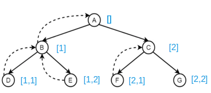
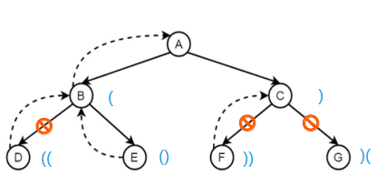

# Backtracking

Backtracking typically implements with DFS (Depth First Search) that spans a tree node of next level all feasible solutions.

This algo is useful in dealing with finding combinations and permutations such as below.

First, add a terminal condition to `return`, usually proportional to the length of input vector.
During the `return`, push back the found results. 

Then, write a `for` loop where `i < len` means the number of spanned nodes (indicating the number of permutations).
In each `for` loop, perform the next level permutation and go on.
`first + 1` is used to move to the next level permutation.

```cpp
class Solution {
public:
    void backtrack(vector<vector<int>>& results, vector<int>& nums, int first, int len){
        // when all elements are filled
        if (first == len) {
            results.emplace_back(nums);
            return;
        }
        for (int i = first; i < len; ++i) {
            swap(nums[i], nums[first]);
            backtrack(results, nums, first + 1, len);
            swap(nums[i], nums[first]);
        }
    }
    vector<vector<int>> permute(vector<int>& nums) {
        vector<vector<int> > results;
        backtrack(results, nums, 0, (int)nums.size());
        return results;
    }
};
```

<div style="display: flex; justify-content: center;">
      
</div>
</br>

Depending on branch validity, trimming might be required such as in the case of finding parentheses where every `(` must see a matching `)`.


<div style="display: flex; justify-content: center;">
      
</div>
</br>
