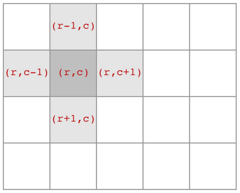

# Difference Between BFS and DFS

```bash
Input:
        A
       / \
      B   C
     /   / \
    D   E   F

Output: 
A, B, C, D, E, F
```

```bash
Input:
        A
       / \
      B   D
     /   / \
    C   E   F

Output:
A, B, C, D, E, F
```

## DFS Basic Logic

Below is an example of binary tree DFS.

```cpp
void traverse(TreeNode* root) {
    // base case
    if (root == null) {
        return;
    }
    // visit two neighbor nodes
    traverse(root->left);
    traverse(root->right);
}
```

In island problem, there are four neighbor nodes such as below.

<div style="display: flex; justify-content: center;">
      
</div>
</br>

Typically, should have the below implementation
```cpp
void dfs(int[][] grid, int r, int c) {
    // return if not in grid
    if (!inArea(grid, r, c)) {
        return;
    }
    // return if not being a land
    if (grid[r][c] != 1) {
        return;
    }
    grid[r][c] = 2; // marked as visited
    
    // visit the four neighbors
    dfs(grid, r - 1, c);
    dfs(grid, r + 1, c);
    dfs(grid, r, c - 1);
    dfs(grid, r, c + 1);
}

// judge if the cell is in the grid
boolean inArea(int[][] grid, int r, int c) {
    return 0 <= r && r < grid.length 
        	&& 0 <= c && c < grid[0].length;
}
```