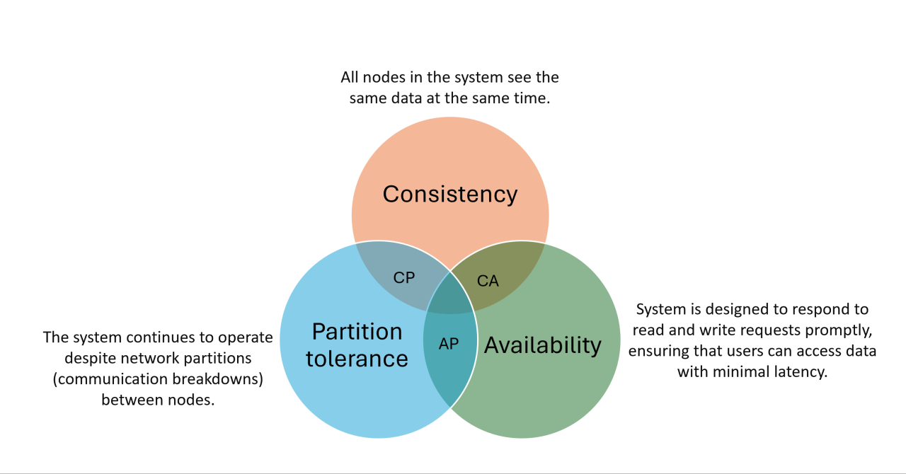

# DB Cluster

## The CAP Theory

CAP theory, also known as Brewer's theorem, states that in a distributed system, it is impossible to simultaneously guarantee all three of the following properties:

* Consistency (C):

Every read receives the most recent write or an error.
All nodes see the same data at the same time.

* Availability (A):

A distributed database system should always be able to respond to clients requests

* Partition Tolerance (P):

Sometimes due to some disruption in the network , nodes get separated into groups such that they cannot communicate with each other.
This is called network partition, In the CAP Theorem, partition tolerance means: A distributed database system should continue to work even if there is a network partition.

      

 

A DB cluster could only favor/totally satisfy two dimensions of the three, or by config to tune the behavior in between, e.g., minimal nodes to sync before a write/read operation to balance the three dimensions.

* CA Category: allow network temp failure on partitioning
* CP Category: to make sure data consistency during partitioning, temporarily mark the service unavailable
* AP Category: to make sure service availability during partitioning, there is likely some nodes not yet done data sync in partitioning, hence data consistency is not guaranteed (might send stale data)

### DB CAP Examples

#### Redis (CP system)

Redis typically favors Consistency (C) and Partition Tolerance (P) (CP system).

* Redis Cluster ensures strong consistency by requiring a majority of nodes to agree on writes.
* During a network partition, Redis may become unavailable if a quorum cannot be reached.

##### Redis Config Considerations

* `min-replicas-to-write`: Specifies the minimum number of replicas that must acknowledge a write before it is considered successful. Increasing this value improves consistency but reduces availability.
* `min-replicas-max-lag`: Defines the maximum lag (in seconds) allowed for replicas to participate in writes. Lower values improve consistency but may reduce availability during network issues.

#### Elasticsearch (AP system)

Elasticsearch favors Availability (A) and Partition Tolerance (P) (AP system).

* Elasticsearch prioritizes availability by allowing reads and writes even during network partitions, which may result in stale or inconsistent data.
* Consistency is eventually achieved through background synchronization.

##### Elasticsearch Config Considerations

* `write_consistency`: Controls the number of shard copies that must be available for a write operation. Options include:

`one`: Write to one primary shard (favor availability).

`quorum`: Write to a majority of shards (favor consistency).

`all`: Write to all shards (strong consistency but reduced availability).

* `read_consistency`: Similar to write_consistency, but for read operations.

#### RDBMS, e.g., PostgreSQL, MySQL (CA system for single node; CP system for cluster)

RDBMS (Relational Database Management System) such as PostgreSQL and MySQL are

* In a single-node deployment, both MySQL and PostgreSQL are CA systems for no partition tolerance (P) because there's only one node, so network partitions are irrelevant.
* in a cluster deployment, RDBMS are often CP systems that deny/queue requests until partitioning and data sync are done
