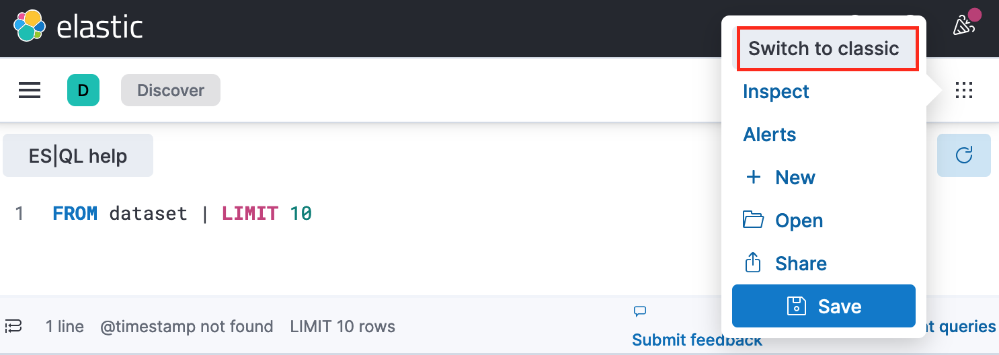

# Kibana

* Nested Document Query on Kibana

Nested Data Type: Elasticsearch treats nested fields as separate documents internally, associated with the parent document. This requires special handling when querying.

Kibana's index patterns don't automatically display nested fields for flat querying.

To check all sub-documents, try classic view.

      

 
