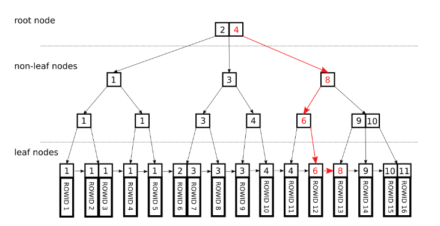

# Indexing

Rule of thumb: always remember to make most selective columns as keys.

## Summary

* `PRIMARY KEY (a)`: The partition key is a.
* `PRIMARY KEY (a, b)`: The partition key is a, the clustering key is b.
* `PRIMARY KEY (a, b, c)`: The partition key is a, the composite clustering key is (b, c).
* `PRIMARY KEY ((a, b), c)`: The composite partition key is (a, b), the clustering key is c.


## Foreign Key vs Primary Key

*PRIMARY KEY* is used to identify a row entry, that must contain *UNIQUE* values, and cannot contain NULL values.

A *FOREIGN KEY* is a field (or collection of fields) in one table, that refers to the PRIMARY KEY in another table.

*FOREIGN KEY* requires server to do a lookup in another table when change happens such as `UPDATE`, to locate row entry addresses of the another table.

```sql
CREATE TABLE Persons (
    ID INT NOT NULL,
    LastName VARCHAR(255) NOT NULL,
    FirstName VARCHAR(255),
    Age INT,
    PRIMARY KEY (ID)
); 

CREATE TABLE Orders (
    OrderID int NOT NULL,
    OrderNumber int NOT NULL,
    PersonID int,
    PRIMARY KEY (OrderID),
    FOREIGN KEY (PersonID) REFERENCES Persons(PersonID)
); 
```

`KEY` and `INDEX` are synonyms, though `INDEX` should be preferred (as `INDEX` is ISO SQL compliant, while `KEY` is MySQL-specific)

## B-Tree Indexing

MYSQL engine uses *B-Tree* indexing, where key/index columns are used as the reference to sort data entries in order.

Indexing does not work when non-indexed columns are used as search condition (e.g., by `WHERE`)

### B+ Tree

In the case of B-Tree each key is stored once, either in a non-leaf node or in a leaf node. 
In the case of B+ Trees all keys are present in the leaf nodes and the non-leaf nodes contain duplicates.

* Leaf nodes: actual data
* Non-leaf nodes: sorted index values

<div style="display: flex; justify-content: center;">
      
</div>
</br>

The multi-index version of B+ tree is by representing indexes as tuples.

<div style="display: flex; justify-content: center;">
      
</div>
</br>

## Index Types 

### Hash Indexing

Engine may compute a hash value for one or a set of keys and store it into a hash table. The hash value maps to a pointer to the row entry.

It only supports lookup (value match), does not work for range search or complex 

Declared as
```sql
CREATE TABLE testhash (
    firstname VARCHAR(50) NOT NULL,
    lastname VARCHAR(50) NOT NULL,
    KEY USING HASH(firstname)
) ENGINE=MEMORY;
```

### Clustered/Non-clustered index

* clustered index

A clustered index defines the order in which data is physically stored in a table (by which column it constructs a tree). 
Table data can be sorted in only way, therefore, there can be only one clustered index per table.

For example, given a B-tree physical storage structure below, entry rows have individual index column (marked as shadow rectangle), which is a pointer linked to relevant `WHERE` condition rows (as specified in `KEY`).


<div style="display: flex; justify-content: center;">
      
</div>
</br>

* non-clustered index

A non-clustered index is stored at one place (separately as a reference list (also a tree with nodes storing key-address pairs) to where corresponding rows are addressed) and table data is stored in another place.

Query over non-clustered indices needs to first look over a reference list then to fetch row data, hence slower than clustered indexed query.

### Covered index

In contrast to non-clustered index that uses a lookup table to find the memory addresses of rows then further locate the `WHERE` column values, covered index has `WHERE` columns values directly attached to the lookup table, saving the time of performing additional row data access.

### Multi Indexing

The `UNION` operator is used to combine the result-set of two or more SELECT statements. Columns being `SELECT`ed should have same name and similar datatype across tables.

For example, both Customers and Suppliers have a column named City: 
```sql
SELECT City FROM Customers
UNION
SELECT City FROM Suppliers
ORDER BY City;
```

Multi-indexing works similar as `UNION` by combining multiple indices's results. Each query from a `UNION` results runs independently by a thread. 

It is created via 
```sql
CREATE TABLE t (
    c1 INT,
    c2 INT,
    c3 INT,
    KEY(c1),
    KEY(c2),
    KEY(c3)
);
```

### Composite Indexing (Multiple-Column Index)

```sql
CREATE TABLE table_name (
    c1 data_type PRIMARY KEY,
    c2 data_type,
    c3 data_type,
    c4 data_type,
    INDEX index_name (c2,c3,c4)
);
```

There are a total of three indexes created `(c1)`, `(c1,c2)`, `(c1,c2,c3)` 


### Packed (Prefix-Compressed) Indexes

For example, if the first value is
“perform” and the second is “performance,” the second value will be stored analogously to “7,ance”.

`SHOW INDEX FROM <tablename>;` can show defined indices in a table. 

## Index Failure Cases

* Full string match against partial match

Index search success case:
```sql
SELECT * FROM Person
WHERE PersonName = 'Jack'
```
Index search failure case:
```sql
SELECT * FROM Person
WHERE PersonName LIKE '%Jack%'
```

* Implicit Type Conversion

For example, set an index `userId varchar(32) NOT NULL`.
Only string type index would use the index.

Below search would fail:
```sql
SELECT * FROM USER WHERE userId = 123;
```
Below search would succeed:
```sql
SELECT * FROM USER WHERE userId = '123';
```

Another scenario is encoding.

For example, GB2312 is a popular Chinese character encoding, JIS is for Japanese.
The below SQL fails indexing even if `NAME`s are set index for both tables but having diff encodings.
A good solution is using UTF8.
```SQL
SELECT * FROM CHINESE_USER, JAPANESE_USER
WHERE CHINESE_USER.NAME = JAPANESE_USER.NAME
```

* `OR` or `IN (...)`

If there are non-index `OR` columns or too items in `IN (...)`, indexing fails.

For sequential/range read, use `BETWEEN` such as
```sql
SELECT id FROM t WHERE num BETWEEN 1 AND 5；
```

* Composite Index by Left Match Rule

For a composite index such as `(a,b,c)`, SQL compiler actually creates three composite indecies `(a)`, `(a,b)` and `(a,b,c)`.
They should be referenced as a whole, otherwise failed (e.g., by just referencing the `b` column, there will be no applied indexing).

For example, `KEY idx_userid_name (user_id,name)` is a composite index, that should be referenced as a whole.

```sql
CREATE TABLE user (
  id int(11) NOT NULL AUTO_INCREMENT,
  user_id varchar(32) NOT NULL,
  age  varchar(16) NOT NULL,
  name varchar (255) NOT NULL,
  PRIMARY KEY (id),
  KEY idx_userid_name (user_id,name) USING BTREE
) ENGINE=InnoDB DEFAULT CHARSET=utf8;
```

If by only referencing one column, the indexing fails.
```sql
SELECT * FROM user WHERE name ='Jack';
```

* Additional Operations Such As `+`, `-`, `<>`, `=` and Functions on Index Columns

Failure case:
```sql
SELECT * FROM USER WHERE DATE_ADD(login_time, INTERVAL 1 DAY) = '2023-10-01 00:00:00';
```