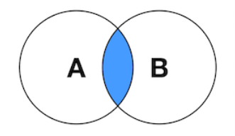
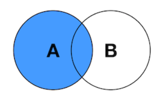
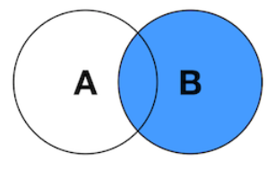
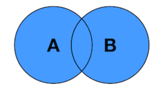

# MYSQL

## Quick Start

Download by `sudo apt-get install mysql-server`

By default, mysql has a root user with no password, so that after started mysql server by `sudo service mysql start`, login by `sudo mysql -u root --skip-password`.

Then set up privilege access: 
constrain `root` by setting up a password
```sql
USE mysql;
UPDATE USER set authentication_string=PASSWORD("") where USER='root';
UPDATE USER set plugin="caching_sha2_password" where USER='root';

FLUSH PRIVILEGES;
MYSQL_PASSWORD
ALTER USER 'root'@'localhost' IDENTIFIED BY 'RootP@ssw0rd';

QUIT
```

Restart mysql server: `sudo service mysql stop; sudo service mysql start`

From now on, login mysql db requires password: `mysql -u root -p`, the old login method without password would fail.

Create a new user (keeping using root privileges is dangerous)
```sql
CREATE USER 'userMe' IDENTIFIED WITH caching_sha2_password BY 'P@ssw0rdMe';
GRANT CREATE, ALTER, DROP, INSERT, UPDATE, DELETE, SELECT, REFERENCES, RELOAD on *.* TO 'userMe' WITH GRANT OPTION;

FLUSH PRIVILEGES;

-- verify user grants
SHOW GRANTS FOR 'userMe';
```

### C++ MySql Client

Run `mysql --version`

```
git clone https://github.com/mysql/mysql-connector-cpp.git
mkdir build
cd build
cmake ..
make
sudo make install
```

### MySql Docker


```yml
version: '3.7'

services:

    mysqldb:
        name: mysqldb
        image: mysql:latest
        command: --default-authentication-plugin=caching_sha2_password
        restart: always
        environment:
            MYSQL_ROOT_PASSWORD: 'P@ssw0rd'
            MYSQL_DATABASE: 'mysql'
            MYSQL_PASSWORD: 'P@ssw0rdMe'
            MYSQL_USER: 'userMe'
        volumes:
            - mysqldb-data:/home/yuqi/mysql_db
        ports:
            - '3306:3306'
        expose:
            - '3306'

    adminer:
        image: adminer
        restart: always
        ports:
            - 8081:8080

volumes:
    mysqldb-data:
```

* `MYSQL_DATABASE` - The name of a database schema to be created when the container starts.
* `MYSQL_USER` and `MYSQL_PASSWORD` - Create a new ordinary user when the container starts.
* `MYSQL_RANDOM_ROOT_PASSWORD` - Set this instead of MYSQL_ROOT_PASSWORD if you’d like MySQL to generate a secure root password for you. If you enable this setting, the password will be emitted to the container’s logs (accessible via the docker logs command) during the first start. It will not be possible to retrieve the password afterward.
* `MYSQL_ALLOW_EMPTY_PASSWORD` - Setting this will create the root user with an empty password. Only use this option for throwaway database instances. It is insecure and would let anyone connect to MySQL with superuser privileges.

To check the docker:
```bash
docker inspect example_mysqldb_1
```

## MySQL vs Oracle

MySQL and Oracle SQL are both RDBMSs (relational database management systems) owned by Oracle Corporation. MySQL is built to be primarily free and open-source, while Oracle is primarily built to be commercial and paid.

Oracle provides better performance in general.

## MYSQL Engines

InnoDB is the default transactional storage engine for MySQL.

MyISAM is the default storage engine for MySQL.

### InnoDB Overview

InnoDB is by default the **transaction engine**.

InnoDB stores its data in a series of one or more data files that are collectively known as a *tablespace*.

It defaults to the REPEATABLE READ isolation level, and it has a
next-key locking strategy that prevents phantom reads in this isolation level (InnoDB locks gaps in the index structure)

### MyISAM Overview

MyISAM is by default the **storage engine**.

MyISAM typically stores each table in two files: a data file and an index file.

It provides data redundancy backup, repair, logging, etc.

## Profiling

`SHOW STATUS` and `SHOW PROFILEs` to see query execution results, alternatively, same results can be obtained from `INFORMATION_SCHEMA.PROFILING`

### SHOW PROFILES

It returns query process total and sub-task durations:

```
mysql> SHOW PROFILES;
+----------+------------+---------------+
| Query_ID | Duration | Query           |
+----------+------------+---------------+
| 1 | 0.167679 | SELECT * FROM db.table |
+----------+------------+---------------+
```

then
```
mysql> SHOW PROFILE FOR QUERY 1;
+----------------------+----------+
| Status               | Duration |
+----------------------+----------+
| starting             | 0.000082 |
| Opening tables       | 0.000459 |
| System lock          | 0.000010 |
| Table lock           | 0.000020 |
| checking permissions | 0.000005 |
...
```

### SHOW STATUS

It returns a number of process counters:

```
mysql> SHOW STATUS WHERE Variable_name LIKE 'Handler%'
OR Variable_name LIKE 'Created%';
+----------------------------+-------+
| Variable_name              | Value |
+----------------------------+-------+
| Created_tmp_disk_tables    | 2     |
| Created_tmp_files          | 0     |
| Created_tmp_tables         | 3     |
| Handler_commit             | 1     |
| Handler_delete             | 0     |
...
```

### SHOW PROCESSLIST

This shows the number of running threads with respects to various functionalities.

### EXPLAIN

`EXPLAIN` runs after a SQL query to find detail engine operations.

## SQL Insights

### `ALTER TABLE`: 

Make an empty table with the desired new structure, inserting all the data from the old table into the new one, and deleting the old table. Locks are applied to a varied degree.

### `WHERE`

• Apply the conditions to the index lookup operation to eliminate non-matching
rows. This happens at the storage engine layer.

• Use a covering index (“Using index” in the Extra column) to avoid row accesses,
and filter out non-matching rows after retrieving each result from the index. This
happens at the server layer, but it doesn’t require reading rows from the table.

• Retrieve rows from the table, then filter non-matching rows (“Using where” in the Extra column). This happens at the server layer and requires the server to read rows from the table before it can filter them.

### `JOIN`'s Coverage and Merge Fashions

Given two tables, that `PK = 1` is a row both `Table_A` and `Table_B`, and `PK = 2` only exists in `Table_A` while `PK = 3` only exists in `Table_B`.
Different `JOIN` fashions see joining `ON A.PK = B.PK;` having diff results.

```sql
SELECT * FROM Table_A ORDER BY PK ASC;
```
```txt
+----+----------------+     
| PK | Value          |
+----+----------------+
|  1 | both ab from a |
|  2 |         only a |
+----+----------------+  
```
and
```sql
SELECT * FROM Table_B ORDER BY PK ASC;
```
```txt
+----+----------------+     
| PK | Value          |
+----+----------------+
|  1 | both ab from b |
|  3 |         only b |
+----+----------------+  
```

* `INNER JOIN` 

<div style="display: flex; justify-content: center;">
      
</div>
</br>

Only `ON PK = 1` rows exist in both tables are returned.

```txt
+------+------+----------------+----------------+
| A_PK | B_PK |        A_Value |        B_Value |
+------+------+----------------+----------------+
|    1 |    1 | both ab from a | both ab from b |
+------+------+----------------+----------------+
```

* `LEFT JOIN` 

<div style="display: flex; justify-content: center;">
      
</div>
</br>

`ON PK = 1` rows and all rows in `Table_A` (the left table) are returned.
Empty columns are filled with `NULL`.

```txt
+------+------+----------------+----------------+
| A_PK | B_PK |        A_Value |        B_Value |
+------+------+----------------+----------------+
|    1 |    1 | both ab from a | both ab from b |
|    2 | NULL |         only a |           NULL |
+------+------+----------------+----------------+
```


* `RIGHT JOIN` 

<div style="display: flex; justify-content: center;">
      
</div>
</br>

`ON PK = 1` rows and all rows in `Table_B` (the right table) are returned.
Empty columns are filled with `NULL`.

```txt
+------+------+----------------+----------------+
| A_PK | B_PK |        A_Value |        B_Value |
+------+------+----------------+----------------+
|    1 |    1 | both ab from a | both ab from b |
| NULL |    3 |           NULL |         only b |
+------+------+----------------+----------------+
```

* `FULL OUTER JOIN` 

<div style="display: flex; justify-content: center;">
      
</div>
</br>

Outer joining is supposed to return all rows in both tables.
Empty columns are filled with `NULL`.

```txt
+------+------+----------------+----------------+
| A_PK | B_PK |        A_Value |        B_Value |
+------+------+----------------+----------------+
|    1 |    1 | both ab from a | both ab from b |
|    2 | NULL |         only a |           NULL |
| NULL |    3 |           NULL |         only b |
+------+------+----------------+----------------+
```

* `CROSS JOIN`

Cross join returns Cartesian product.

For `Table_A` and `Table_B` both containing two rows of data, this should give $4 = 2 \times 2$ rows of cross product result.

```txt
+------+------+----------------+----------------+
| A_PK | B_PK |        A_Value |        B_Value |
+------+------+----------------+----------------+
|    1 |    1 | both ab from a | both ab from b |
|    1 |    3 | both ab from a |         only b |
|    2 |    1 |         only a | both ab from b |
|    2 |    3 |         only a |         only b |
+------+------+----------------+----------------+
```

### `JOIN` Algorithms

* Driver table concept

For example of the below statement
```sql
SELECT * FROM A
JOIN B ON A.id = B.id;
```

The table `A` is called left/driver table if there is no defined index.
The table with index of smaller range is the driver tables.

Driver table is first selected data rows that are to be compared to the other to-be-joined table.

* A naive approach of `A JOIN B ON A.id = B.id` gives $O(n^2)$ complexity

```cpp
for (auto& idx_a : A.id) {
  for (auto& idx_b : B.id) {
    if (idx_a == idx_b)
      return_rows.push_back(...);
  }
}
```

Below are algos for `JOIN`.

* Nested-Loop Join (NLJ)
  * Simple NLJ: takes rows one by one to do `ON A.id = B.id` by full table scan
  * Index NLJ: the index version of the simple NLJ
  * Block NLJ, or BNL JOIN: buffer/block read version of the simple NLJ, that to be compared data rows are prefetched in a buffer rather than reading disk every time for full table scan, and the buffer can be used repeatedly when there are multiple `JOIN`s.
* Batched Key Access (BKA) Join
  * BNL Join + indexing with Multi-Range Read (MRR) optimization, that besides applied buffering and indexing, MRR is used to sort buffered data rows so that the `ON A.id = B.id` can be done sequentially rather than by random access.

## Replication

For scaling/high availability purposes, MySQL supports two kinds of replication: *statement-based replication* and *row-based
replication*.

Process:
1. The master records changes to its data in its binary log. (These records are called
binary log events.)
2. The replica copies the master’s binary log events to its relay log.
3. The replica replays the events in the relay log, applying the changes to its own data.

### Statement-based replication

Statement-based replication works
by recording the query that changed the data on the master. 
When the replica reads the event from the relay log and executes it, it is reexecuting the actual SQL query that the master executed.

### Row-based replication

Row-based replication records the actual data
changes in the binary log.

