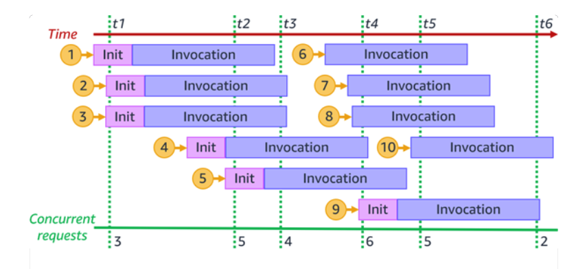

# AWS Performance DevOps

## DB Bottleneck

## Identify Routing over the Internet

JWKS Fetch from the Internet, solved by caching jwks.

## API Gateway + Kinesis + Lambda + Redshift

AWS Lambda provides a serverless compute service that can scale from a single request to hundreds of thousands per second.

The underlying reason for the limited concurrency is that, lambda has limited physical resources for execution envs.

      

 

For high-throughput scenarios, should consider using Kinesis acted as a Message Queue to cache coming data.

Lambda can read and parse protobuf-based packets to Redshift.