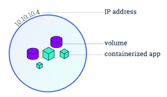

# Common K8S Components


## Similar Concept Discussions and Comparisons

### Deployment vs DaemonSet

||DaemonSet|Deployment|
|:---|:---|:---|
|Pod Placement|One pod per node (or a defined subset of nodes).|Pods are distributed across available nodes based on resource availability.|
|Scaling|Scales automatically with the number of nodes in the cluster.|Manually or automatically scaled by adjusting the desired replica count.|
|Primary Use Case|Node-level tasks like log collection, monitoring, and storage daemons.|Stateless applications such as web servers, APIs, and microservices.|
|Pod Redundancy|Ensures a pod is running on each node, not multiple replicas on one node.|Manages a desired number of identical pod replicas for high availability.|
|Node Addition|Automatically deploys a pod to a newly added node.|A new node might or might not receive a pod, depending on the replica count and scheduling.|
---

### Pod vs Deployment

A Pod is a Kubernetes representation of a functioning "logic host", included of one or many containers and shared resources.
Pods are the smallest deployable unit in Kubernetes.

Some shared resources for those containers. Those resources include:

1. Shared storage, as Volumes
2. Networking, as a unique cluster IP address
3. Information about how to run each container, such as the container image version or  specific ports to use

<div style="display: flex; justify-content: center;">
      
</div>
</br>

One pod can have multiple containers.

```yaml
apiVersion: v1
kind: Pod
metadata:
  name: test-pod
spec:
  containers:
  - name: test-container
    image: registry.k8s.io/busybox
    env:
    - name: DB_URL
      value: postgres://db_url:5432
  - name: proxy-container
    image: envoyproxy/envoy:v1.12.2
    ports:
      - containerPort: 80
```

where `busybox` coming in somewhere between 1 and 5 Mb in on-disk size (depending on the variant), it combines tiny versions of many common UNIX utilities into a single small executable as an compressed version of such tools.

#### `kind: Pod` vs `kind: Deployment`

||`kind: Pod`|`kind: Deployment`|
|:---|:---|:---|
|Definition|The **smallest** and most basic deployable unit in Kubernetes. It's an abstraction over one or more containers.|A higher-level controller that manages the **lifecycle of Pods** through a ReplicaSet. It provides declarative updates and scaling for Pods.|
|Lifecycle Management|None. If a node running a "bare" Pod fails, the Pod is lost and will not be rescheduled or replaced automatically. Pods are considered ephemeral.|**Automated**. A Deployment constantly monitors its Pods. If a Pod or its node fails, the Deployment's ReplicaSet will automatically create a new Pod to maintain the desired state.|
|Updates & Rollbacks|**Manual**. To update a bare Pod, must manually delete the old one and create a new one. There is no built-in rollback mechanism.|**Automated**. Deployments support strategies like rolling updates, allowing for zero-downtime application updates. You can also easily roll back to a previous version if something goes wrong.|
|Scaling|**Manual**. To scale, must manually create or delete individual Pods.|**Automated**. You simply change the replicas field in the Deployment manifest, and Kubernetes handles the creation or deletion of Pods to match the new count.|
|When to Use|- For quick testing, debugging, or experimentation no need of resiliency.|- The standard and recommended way to run stateless applications in production.|
---

#### `Job` vs `Deployment`

* `Job`: aim to only run once
* `Deployment`: provide lifecycle management of pods that are expected to be long-existed

#### Deployment Strategy

A K8S Deployment strategy encompasses the methods of creating, upgrading, or downgrading to a different version of a K8S application (typically a pod/container).

* Recreate

Demise old pods then launch new pods. There will be downtime during this strategy deployment

* RollingUpdate

When new launched pods are in service that available pods exceed the minimal, then start demising old pods. Recycling are through updating the pods according to the parameters: `maxSurge` and `maxUnavailable`.

`.spec.strategy.rollingUpdate.maxUnavailable` is an optional field that specifies the maximum number of Pods that can be unavailable during the update process.

`.spec.strategy.rollingUpdate.maxSurge` is an optional field that specifies the maximum number of Pods that can be created over the desired number of Pods.

For example, to recycle pod one by one, use the config below.

```yaml
strategy:
  type: RollingUpdate
  rollingUpdate:
     maxSurge: 1
     maxUnavailable: 0 
```

### Service vs Ingress

|Feature|Kubernetes Service|Kubernetes Ingress|
|:---|:---|:---|
|Purpose|Provides a stable **endpoint for accessing pods** within the cluster.|Manages **external access** to services in **the cluster**.|
|Traffic Type|Primarily handles Layer 4 (TCP/UDP) traffic.|Primarily handles Layer 7 (HTTP/HTTPS) traffic.|
|Routing|Distributes traffic to a set of pods based on a selector.|Routes traffic to different services based on rules like hostname or URL path.|

### StatefulSet vs Deployment

||Deployment (Managed by Deployment Controller)|StatefulSet (Managed by StatefulSet Controller)|
|:---|:---|:---|
|Identity|Ephemeral & Anonymous. Pods get a random hash (e.g., `web-app-5b8f...`).|Stable & Unique. Pods get a predictable, ordered name (e.g., `db-0`, `db-1`).|
|Storage|Stateless by default.|Stateful & Stable. Each pod gets its own unique PVC. The controller guarantees that `db-0` will always reconnect to the storage for `db-0`.|
|Access|Anonymous Pool. Pods are hidden behind a single Service which acts as a load balancer.|Directly Addressable. Uses a "Headless Service" to give each pod a unique, stable DNS entry (e.g., `db-0.svc.local`).|

### StatelessSet vs StatefulSet

A stateless application is one that does not care which network it is using, and it does not need permanent storage. Examples of stateless apps may include web servers (Apache, Nginx, or Tomcat).

On the other hand, a stateful applications have persistent/modifiable data, such as DBs.

## Services

Service is a method for exposing a network application that is running as one or more Pods in cluster.

### Service Port Type 

Reference: https://kubernetes.io/docs/concepts/services-networking/service/

The available type values and their behaviors are:

* ClusterIP

Exposes the Service on a cluster-internal IP. Choosing this value makes the Service only reachable from within the cluster. This is the default that is used if you don't explicitly specify a type for a Service. You can expose the Service to the public internet using an Ingress or a Gateway.

* NodePort

Exposes the Service on each Node's IP at a static port (the NodePort). To make the node port available, Kubernetes sets up a cluster IP address, the same as if you had requested a Service of type: ClusterIP.

* LoadBalancer

Exposes the Service externally using an external load balancer. Kubernetes does not directly offer a load balancing component; you must provide one, or you can integrate your Kubernetes cluster with a cloud provider.

* ExternalName

Maps the Service to the contents of the externalName field (for example, to the hostname api.foo.bar.example). The mapping configures your cluster's DNS server to return a CNAME record with that external hostname value. No proxying of any kind is set up.

To implement a Service of `type: LoadBalancer`, Kubernetes typically starts off by making the changes that are equivalent to you requesting a Service of type: `NodePort`. The cloud-controller-manager component then configures the external load balancer to forward traffic to that assigned node port.

`containerPort: 80`: Indicates that the container will listen on port 80.
For example, a mysql container has `containerPort: 3306`.

There can be multiple container port listening, such as

```yaml
ports: 
    - containerPort: 80
    - containerPort: 443
```

## Ingress

`Ingress` is an API object that manages external access to the services in a cluster, typically HTTP.

It provides functions such as firewall, load balancing, virtual DNS name hosting, etc.

<div style="display: flex; justify-content: center;">
      
</div>
</br>

### Ingress Controller and Ingress Class

In order for the Ingress resource to work, the cluster must have an *ingress controller* running.

Ingresses can be implemented by different controllers with different configs
An `IngressClass` is the controller implementation that contains additional configuration including the name of the controller.

Default `IngressClass` is used when setting `ingressclass.kubernetes.io/is-default-class: true` or `ingressClassName` is not set.

Below is an example that implements nginx as the controller.

```yaml
apiVersion: networking.k8s.io/v1
kind: IngressClass
metadata:
  labels:
    app.kubernetes.io/component: controller
  name: nginx-example
  annotations:
    ingressclass.kubernetes.io/is-default-class: "true"
spec:
  controller: k8s.io/ingress-nginx
```

### Specifications

* Access Rules

|Path Type `pathType`|Rule|Example Path|Match|
|-|-|-|-|
|Prefix|\ |(all paths) |Yes|
|Exact| \foo|\foo |Yes|
|Exact| \foo|\foo\ |No|
|Prefix| \foo|\foo |Yes|
|Prefix| \foo|\foo\ |Yes|
|Prefix| \foo|\foo\bar |Yes|

* Backend

`backend` describes what services are assigned to handles requests.

```yaml
...
- http:
      paths:
      - pathType: Prefix
        path: "/"
        backend:
          service:
            name: hello-world-service
            port:
              number: 80
```

* Hostname

Ingress can provide DNS name hosting.

```yaml
apiVersion: networking.k8s.io/v1
kind: Ingress
metadata:
  name: ingress-wildcard-host
spec:
  rules:
  - host: "foo.bar.com"
    http:
        ...
  - host: "*.foo.com"
    http:
        ...
```

To get k8s locally host an DNS name;
reference: https://minikube.sigs.k8s.io/docs/handbook/addons/ingress-dns/

## K8S FileSystem and Block Device

### Three Layers of a Pod's Filesystem

* The Foundation: The Read-Only Container Image

A container image (e.g., with a Dockerfile), immutable containing application code, system libraries, and dependencies.

* The Ephemeral Writable "Scratch" Space

Any changes made by the running container are stored, e.g., local log.

Its lifecycle is tied directly to the container. If the container crashes and restarts, or if the pod is deleted, this writable layer and all its data are permanently destroyed.

* Pluggable Volumes for Persistence and Sharing

A Volume is essentially a directory that is mounted into the container at a specific path.

The lifecycle of a Volume is independent of the container.
It ties to the cluster.

### Common Types of Volumes

|Volume Type|Purpose|Lifecycle|Use Case Example|
|:---|:---|:---|:---|
|emptyDir|Simple scratch space or sharing files between containers within the same pod.|Tied to the Pod. Data is deleted when the pod is deleted.|A web server container and a log-processing "sidecar" container need to access the same log file.|
|PersistentVolumeClaim (PVC)|Durable, persistent storage. The gold standard for stateful applications.|Independent of the Pod. Data survives pod restarts, crashes, and deletions.|Storing data for a PostgreSQL database or user-uploaded files for a web application.|
|ConfigMap / Secret|Injecting configuration files or credentials into the pod.|Tied to the Kubernetes resource.|Mounting a nginx.conf file or an API_KEY file into your application's configuration directory.|
|hostPath|Mounting a directory from the underlying host node's filesystem directly into the pod.|Tied to the node.|A monitoring agent that needs to read system logs directly from the node's /var/log directory. (Use with caution!)|

### CSI (Container Storage Interface)

It defines a standard set of API calls (like `CreateVolume`, `AttachVolume`, `MountVolume`) that Kubernetes will use.

It's up to the storage vendor (AWS, Google, NetApp, etc, through e.g., `ebs.csi.aws.com` for AWS, `pd.csi.storage.gke.io` for GCP) to write a CSI driver that implements this standard and translates these generic calls into their own specific API commands.

### Storage Class

A `StorageClass` enables dynamic provisioning.

#### For Cloud Storage Class

* A `StorageClass` named `fast-ssd` that uses the cloud provider's premium SSD storage.
* A `StorageClass` named `slow-hdd` that uses cheaper, standard hard disk drives.
* A `StorageClass` named `backup-storage` that uses network file storage (NFS).

The `StorageClass` definition points to a specific provisioner (e.g., `ebs.csi.aws.com` for AWS, `pd.csi.storage.gke.io` for GCP). This provisioner, a special controller running in cluster, wakes up.

The provisioner makes an API call to cloud provider, on this request e.g., AWS EBS volume or a GCP Persistent Disk is created in the cluster.

The provisioner then creates a PersistentVolume (PV) object inside Kubernetes.

#### For Host OS (Minikube) Storage Class

* A `StorageClass` named `standard` that uses a simple, built-in provisioner that creates storage using hostPath (provisioned by `k8s.io/minikube-hostpath`).

### Example Persistent Volume Creation

Given below PVC (Persistent Volume Claim)

```yaml
apiVersion: v1
kind: PersistentVolumeClaim
metadata:
  name: postgres-data-claim
spec:
  accessModes:
    - ReadWriteOnce
  storageClassName: fast-ssd  # Ordering from the "fast-ssd" section of the menu
  resources:
    requests:
      storage: 50Gi # 50 Gigabytes
```

1. Run `kubectl apply -f pvc.yaml`. The PVC is now in the cluster with a Pending status.
Soon the CSI Controller sees the new postgres-data-claim PVC.
2. Menu Consulted: CSI checks the `fast-ssd` storage class, which points to the correct provisioner (e.g., `ebs.csi.aws.com`).
3. The CSI Controller makes a series of API calls to the AWS control plane, that provisions a 50 GB EBS volume in user account with a returned unique Volume ID (e.g., `vol-012345abcdef`).
4. The CSI Controller now creates the Persistent Volume (PV) object inside Kubernetes. This PV acts as a "receipt" or "title deed" for the EBS volume, containing its unique ID.
5. Kubelet (the primary Kubernetes agent on every node) is Notified of the PV info, e.g., the volume id.
6. CSI Driver Attaches the Disk: The kubelet communicates with the CSI Node Plugin.
7. Host OS Sees a New Device: The CSI plugin makes another API call to the cloud provider, instructing it to attach the 50 GB volume to the virtual machine instance/node.
8. Formatting and Mounting the Device: The CSI plugin inspects the new device (/dev/sdc), and (equivalent) runs `mount /dev/sdc`.

### K8S Volume Extendability

In K8S, disk volume increase is to virtually "insert a new device block" then formatted.
The existing volume data will NOT lose.

The administrator who defines the StorageClass must explicitly permit volumes created from it to be resized. This is done with the `allowVolumeExpansion` flag.

```yaml
apiVersion: storage.k8s.io/v1
kind: StorageClass
metadata:
  name: resizable-ssd
provisioner: ebs.csi.aws.com # Example for AWS
allowVolumeExpansion: true   # <-- THIS IS THE CRITICAL LINE
reclaimPolicy: Delete
parameters:
  type: gp3
  fsType: ext4
```

On detecting from `kubectl apply` that volume size is diff, the `kubelet` triggers the CSI Node plugin. The Node plugin runs the appropriate OS command on the host (e.g., `resize2fs` for ext4, `xfs_growfs` for xfs) to expand the filesystem to fill the newly available space on the block device.

## Access Control in K8S: Account, Secret and Role

Typical use scenario: an application pod needs to connect to an external database.

1. Create a `Secret`: First create a Secret named `db-creds` that holds the database username and password. This keeps the sensitive data out of pod's definition and container image.
2. Create a `ServiceAccount`: create a specific `ServiceAccount` for application, for example, `my-app-sa`. This gives application a unique identity within the cluster.
3. Create a `Role`: define a Role that grants permission to get the `Secret` named `db-creds`. It doesn't grant access to any other secrets.
4. Create a `RoleBinding`: bind the Role to the `my-app-sa` ServiceAccount. This vital step connects the identity to the permission.
5. Assign the `ServiceAccount` to the Pod: In Pod's specification, you set `serviceAccountName: my-app-sa`.

### Secret

When running `kubectl apply -f db-credentials.yaml`,

1. API Server Validation: The YAML is sent to the Kubernetes API Server. 
2. Writing to `etcd`: The API Server then persists this Secret object as a key-value entry in `etcd`.
3. Encryption: By default, the data stored in `etcd` is only Base64 encoded, not encrypted. When enabled encryption, the API Server, before writing a Secret to `etcd`, will encrypt it with a provider (e.g., a local key, or a cloud KMS). The data in `etcd` is then a ciphertext blob, rendering it useless without the decryption key.

In the below example

1. Having seen `"myuser"` and `"SuperSecret123!"`, API Server encodes it to its Base64 equivalent: `bXl1c2Vy` and `U3VwZXJTZWNyZXQxMjMh`.
2. The API server then creates the Secret object and stores it in the etcd database. The `stringData` field is discarded, and only the data field with the encoded values is kept.

```yaml
apiVersion: v1
kind: Secret
metadata:
  name: db-credentials
  namespace: my-app-env
type: Opaque
stringData:
  DB_USER: "myuser"
  DB_PASS: "SuperSecret123!"
```

where `Opaque` means the Secret contains arbitrary key-value pairs that have no specific format requirements from Kubernetes's perspective.
`stringData` provides the secret data as plain, unencoded strings.

If to export the stored secret by `kubectl get secret db-credentials -n my-app-env -o yaml`, there is

```yaml
apiVersion: v1
kind: Secret
metadata:
  creationTimestamp: "2025-10-17T16:00:00Z"
  name: db-credentials
  namespace: my-app-env
  resourceVersion: "12345"
  uid: "a1b2c3d4-e5f6-7890-a1b2-c3d4e5f67890"
data:
  DB_PASS: U3VwZXJTZWNyZXQxMjMh
  DB_USER: bXl1c2Vy
type: Opaque
```

#### Consumption by a Pod

For example, assume there is a built user application `my-app` and two env vars `DATABASE_USERNAME` and `DATABASE_PASSWORD` are exported.

```yaml
apiVersion: v1
kind: Pod
metadata:
  name: my-backend-app
  namespace: my-app-env
spec:
  containers:
  - name: app-container
    image: my-app
    env:
    - name: DATABASE_USERNAME # The name of the env var in the container
      valueFrom:
        secretKeyRef:
          name: db-credentials # The name of the Secret
          key: DB_USER          # The key within the Secret to use
    - name: DATABASE_PASSWORD
      valueFrom:
        secretKeyRef:
          name: db-credentials
          key: DB_PASS
```

Below python code in the `my-app` container can retrieve the secret.

```py
import os
db_user = os.getenv("DATABASE_USERNAME") # Will be "myuser"
db_pass = os.getenv("DATABASE_PASSWORD") # Will be "SuperSecret123!"
```

### Accounts in K8S

In Kubernetes, there are two kinds of accounts: User/Admin Accounts for humans and Service Accounts

#### User/Admin Accounts

User Accounts are for humans—developers, cluster administrators, or anyone who interacts with the cluster from the outside, typically using `kubectl`.

In cloud, such accounts are managed via cloud provider.

For example, in Google,

1. Set up user `jane@my-company.com` in Google Cloud IAM (or Google Workspace).
2. Grant Jane the basic IAM permission to see the GKE cluster and get its details.

```sh
gcloud projects add-iam-policy-binding YOUR_PROJECT_ID \
    --member="user:jane@my-company.com" \
    --role="roles/container.clusterViewer"
```

To allow the user (assumed read-only) to check the k8s cluster, set up a `Role` with defined privileges `"get"` and `"list"` to `pods`.

```yaml
apiVersion: rbac.authorization.k8s.io/v1
kind: Role
metadata:
  namespace: my-app-env
  name: pod-viewer
rules:
- apiGroups: [""]
  resources: ["pods"]
  verbs: ["get", "list"]
```

Then, take permissions defined in the `Role` and grants them to a specific user.

```yaml
---
apiVersion: rbac.authorization.k8s.io/v1
kind: RoleBinding
metadata:
  namespace: my-app-env
  name: jane-can-view-pods
subjects:
- kind: User
  # The name MUST match the Google Cloud IAM user's email
  name: jane@my-company.com
  apiGroup: rbac.authorization.k8s.io
roleRef:
  kind: Role
  name: pod-viewer
  apiGroup: rbac.authorization.k8s.io
```

#### Service Accounts

Service account is used to manage pods/applications access to `Secret`.

First set up a `ServiceAccount` named `my-app-sa`.

```yaml
apiVersion: v1
kind: ServiceAccount
metadata:
  name: my-app-sa
  namespace: my-app-env
```

Assumed there is an existed DB credential.

```yaml
apiVersion: v1
kind: Secret
metadata:
  name: db-credentials
  namespace: my-app-env
type: Opaque
stringData:
  DB_USER: "myuser"
  DB_PASS: "SuperSecret123!"
```

Set up a `Role` named `secret-reader-role` with the privileges to read secrets from the above defined `db-credentials`.

Then assign the setup role to bind the service account `my-app-sa`.

```yaml
apiVersion: rbac.authorization.k8s.io/v1
kind: Role
metadata:
  name: secret-reader-role
  namespace: my-app-env
rules:
- apiGroups: [""] # Core API group for Secrets
  resources: ["secrets"]
  resourceNames: ["db-credentials"]
  verbs: ["get"]
---
apiVersion: rbac.authorization.k8s.io/v1
kind: RoleBinding
metadata:
  name: grant-app-secret-access
  namespace: my-app-env
subjects:
- kind: ServiceAccount
  name: my-app-sa
roleRef:
  kind: Role
  name: secret-reader-role
  apiGroup: rbac.authorization.k8s.io
```

### Role-Based Access Control (RBAC)

At its core, RBAC in Kubernetes is managed through four key API objects: *Roles*, *ClusterRoles*, *RoleBindings*, and *ClusterRoleBindings*.

#### Roles and ClusterRoles: Define A Set of Permissions

A `Role` is a namespaced resource; a `ClusterRole` is a non-namespaced resource.

* `apiGroups`: The API group of the resource (e.g., `""` for core API, apps for Deployments).
* `resources`: The type of resource you want to grant access to (e.g., `pods`, `deployments`, `services`).
* `verbs`: The actions that can be performed on those resources (e.g., `get`, `list`, `watch`, `create`, `update`, `patch`, `delete`).

Below is an example of a Role that grants a user to access db.

```yaml
apiVersion: v1
kind: ServiceAccount
metadata:
  name: my-app-sa
  namespace: my-app-env
---
apiVersion: rbac.authorization.k8s.io/v1
kind: Role
metadata:
  name: secret-reader-role
  namespace: my-app-env
rules:
- apiGroups: [""] # Core API group for Secrets
  resources: ["secrets"]
  resourceNames: ["db-credentials"]
  verbs: ["get"] # The pod only needs to "get" the secret, not list or watch all secrets.
```

where `verbs: ["get"]` permits retrieve a single pod by its name.

`resources` mapping rule can be found by `kubectl api-resources`.

```txt
$ kubectl api-resources
NAME                              SHORTNAMES   APIGROUP                       NAMESPACED   KIND
secrets                           sec                                         true         Secret
serviceaccounts                   sa                                          true         ServiceAccount
services                          svc                                         true         Service
configmaps                        cm                                          true         ConfigMap
pods                              po                                          true         Pod
deployments                       deploy       apps                           true         Deployment
replicasets                       rs           apps                           true         ReplicaSet
roles                                          rbac.authorization.k8s.io      true         Role
rolebindings                                   rbac.authorization.k8s.io      true         RoleBinding
clusterroles                                   rbac.authorization.k8s.io      false        ClusterRole
clusterrolebindings                            rbac.authorization.k8s.io      false        ClusterRoleBinding
```

#### RoleBindings and ClusterRoleBindings: Granting Permissions to Subjects

`RoleBindings` and `ClusterRoleBindings` are used to grant these permissions to specific entities, known as **subjects**. Subjects can be users, groups, or service accounts.

```yaml
apiVersion: rbac.authorization.k8s.io/v1
kind: RoleBinding
metadata:
  name: grant-app-secret-access
  namespace: my-app-env
subjects:
- kind: ServiceAccount
  name: my-app-sa
roleRef:
  kind: Role
  name: secret-reader-role
  apiGroup: rbac.authorization.k8s.io
```

where

* `subjects`: This section specifies who is receiving the permissions.
  * `kind: User`: The type of subject is a user.
  * `name: my-app-sa`: The service account.
* `roleRef`: This section specifies which permissions are being granted by referencing the Role created earlier.
  * `kind: Role`: The kind of permission set we are referencing is a `Role`.
  * `name: secret-reader-role`: The role name to bind
