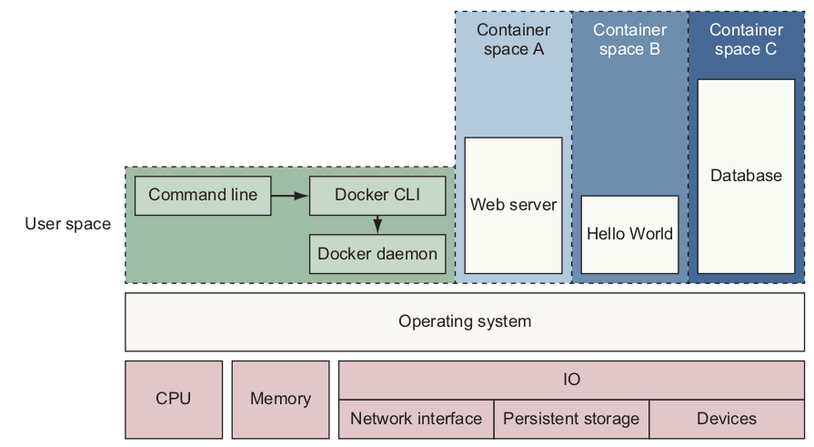

# Docker

Docker can package an application and its dependencies in a virtual container on OS using less resources than virtual machine.

<div style="display: flex; justify-content: center;">
      
</div>
</br>

Docker images are "compiled" from Dockerfile; depending on the levels of inclusion, an image can be with or without dependencies such as SDKs.

## Docker Image Lifecycle

* Created: create a container from an image `docker create --name <container name> <image name>`

* Started: start running a container `docker start <container name>`

* Run does the work of both `docker create` and `docker start` command.  `docker run -it --name <container name> <image name>`

* Pause vs Unpause: `docker pause <container name>` vs `docker unpause <container name>`

When suspending/pausing a process the `SIGSTOP` signal is used, which is observable by the process being suspended. 
Also, the memory portion would be there while the container is paused and again the memory is used when the container is resumed.

P.S. `SIGSTOP` is the pause signal. The only behaviour is to pause the process. 
The shell uses pausing (and its counterpart, resuming via `SIGCONT`) to implement job control.

* Stop: `docker stop <container name>` or `docker kill <container name>`

The main process inside the container receives `SIGTERM` signal, and after some time (in case of `SIGTERM` fails), runs `SIGKILL`. 
Also, it will release the memory used after the container is stopped.

P.S. The intention of `SIGTERM` is to kill the process, gracefully or not, but to first allow it a chance to clean up.
`SIGKILL` is the kill signal. The only behaviour is to kill the process, immediately.

* Delete: `docker rm <container name>` removes containers. Should first run `docker stop` then `docker rm`.

To remove all containers, use `sudo docker rm $sudo( docker ps -a -q)`

<div style="display: flex; justify-content: center;">
      
</div>
</br>

## Docker Sock

Docker.sock is a Unix socket that enables the Docker server-side daemon, dockerd, to communicate with its command-line interface via a REST API.

The socket appears as the /var/run/docker.sock file. Because it is a file, admins can share and run docker.

## Registry
A Docker registry is a repository for Docker images. Two main public registries are Docker Hub (the default registry where Docker looks for images) and Docker Cloud. 

## Docker Swarm

Docker swarm is a container orchestration tool, provides native clustering functionality for Docker containers,

### *Service* in Docker

*Service* is an abstraction of a network, over which processes, functionality, or data that must be discoverable and available.

Docker services run on swarm mode.

```bash
# enable services
docker swarm init
# launch service
docker service create \
--publish 8080:80 \
--name hello-world \
dockerinaction/ch11_service_hw:v1
```

Service can be used to monitor health of nodes and resume nodes' services once nodes shutdown. 

It helps scale a cluster.
```bash
docker service scale hello-world=3
```

## Docker-Compose

Docker-Compose is used for configuring multiple containers in the same host. It uses `docker-compose.yml` files to configure the application's services