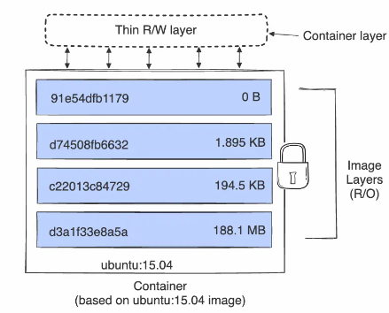
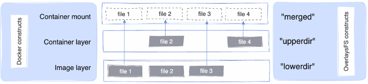
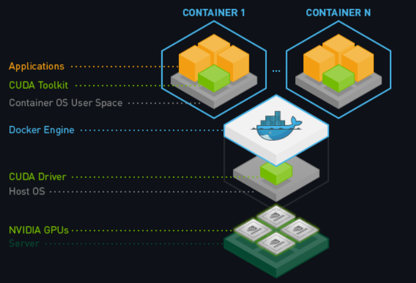

# Docker Engine and Advanced Knowledge

## `dockerd`

`dockerd` is the persistent process that manages containers.

To check its health, run below.

```bash
### Check if there is a pid running docker
sudo service docker status
```

The Docker daemon `dockerd` can listen for Docker Engine APIs (to configure docker engine components such as storage driver, networking).
By default, a unix domain socket (or IPC socket) is created at `/var/run/docker.sock` (needs `sudo` privilege).

For example, `sudo dockerd --storage-opt dm.basesize=50G` can specify the size to use when creating the base device, which limits the size of images and containers. The default value is 10G, and this config sets it to 50G.

`dockerd` is the runtime docker container manager process. If it is dead, other docker containers will be terminated.

For example, if `dockerd` is killed, all its managed docker containers are terminated (this can be a solution to kill all docker daemons at once).

```sh
yuqi@yuqipc:~$ ps -elf | grep docker
4 S root       27075       1  ... 00:04:04 /usr/bin/dockerd -H fd:// --containerd=/run/containerd/containerd.sock
4 S root       27295   27075  ... 00:00:00 /usr/bin/docker-proxy -proto tcp -host-ip 0.0.0.0 -host-port 8081 -container-ip 172.18.0.2 -container-port 8080
4 S root       27304   27075  ... 00:00:00 /usr/bin/docker-proxy -proto tcp -host-ip :: -host-port 8081 -container-ip 172.18.0.2 -container-port 8080
0 S yuqi      275588   12120  ... 00:00:01 docker run -ti --name=ContainerName -v DataVolume1:/datavolume1 ubuntu
0 S yuqi      345255  275938  ... 00:00:00 grep --color=auto docker
yuqi@yuqipc:~$ sudo kill -9 27075
yuqi@yuqipc:~$ ps -elf | grep docker
0 S yuqi      345255  275938  ... 00:00:00 grep --color=auto docker
```

## Dcoker Storage Driver/Overlay

### Storage drivers

Docker directories are called *layers* to store files that make up a docker image/container.
The highly frequently accessed files are put to higher level layers so that container can read such files fast.

Multiple containers may share some or all read-only image data/files.

Given a simple Dockerfile

* The `FROM` statement starts out by creating a layer from the `ubuntu:15.04` image
* The `COPY` command adds some files from your Docker client's current directory
* The first `RUN` command builds application using the make command, and writes the result to a new layer. 
* The second `RUN` command removes a cache directory, and writes the result to a new layer.
* The `CMD` instruction specifies what command to run within the container, only modifies the image's metadata, which does not produce an image layer.

```dockerfile
FROM ubuntu:15.04
COPY . /app
RUN make /app
RUN rm -r $HOME/.cache
CMD python /app/app.py
```

The layers are displayed such as below.

<div style="display: flex; justify-content: center;">
      
</div>
</br>

By `docker ps -s`, there are *size* and *virtual size*:

* size: the amount of data (on disk) that is used for the writable layer of each container.
* virtual size: the amount of data used for the read-only image data used by the container plus the container's writable layer size.

### OverlayFS

*OverlayFS* is the recommended storage driver of docker.

OverlayOS uses multiple-hierarchy directories and present them as one.
The directories are called layers, and the unified view is exposed through its own directory called `merged`.

The overlay2 driver natively supports up to 128 lower OverlayFS layers. 

Different small files make up the appeared unified final container. 
Small files are stored in multiple-hierarchy directories so that they can be reused. For example, system/low-level files are more likely being shared than app-specific files.

<div style="display: flex; justify-content: center;">
      
</div>
</br>

### How a container reads from overlay

A container first reads from `upperdir`, if not found required files, read to `lowerdir`.

OverlayFS can adjust the file directory layer.
For example, if a file is frequently accessed, OverlayFS can `copy_up` the file to a `upperdir`.

### Large `merged` File Issues

The overlay `merged` file can be very large.

```bash
yuqi@yuqipc:~$ sudo df -h
Filesystem      Size  Used Avail Use% Mounted on
/dev/nvme0n1p1  511M  6.1M  505M   2% /boot/efi
tmpfs           1.6G   44K  1.6G   1% /run/user/1000
overlay         468G  310G  135G  70% /var/lib/docker/overlay2/75397884ddffb040632b22b38baa9da0410c5e35b5fcc14245e8d944fbf8bb4a/merged
overlay         468G  310G  135G  70% /var/lib/docker/overlay2/b2706344751f839452ed8284c2c9f3fa821837804b35e212fb20afd9b0d971f4/merged
overlay         468G  310G  135G  70% /var/lib/docker/overlay2/e65b1c73617d26a2cb695208ed1dd901f84be0dd344fea2048c3f70f5b43b606/merged
shm              64M     0   64M   0% /var/lib/docker/containers/0071d00c56dbdc1750c64b9b6a6b8ae36225c22f3e4884414a55ef0242ecc0b2/mounts/shm
shm              64M     0   64M   0% /var/lib/docker/containers/2bd4d84835043bf76f60f0c27147e58e4cb1767f164683ab3a86873422d69da3/mounts/shm
shm              64M     0   64M   0% /var/lib/docker/containers/cfd0309535e593d745a665e260c0bc70b69ec127d7e1523bfe0836a4bb16a526/mounts/shm
overlay         468G  310G  135G  70% /var/lib/docker/overlay2/e009b9adb93a371537294737a39facf102056f5a73e24db540efe1f75354f1a3/merged
```

They can fill all disk that causes computer to freeze/unable to reboot for `no space left to disk` error.

Space can be release by deleting docker files such as by

* `docker container prune`
* `docker image prune`
* `docker system prune`

that deletes files of different scopes, in which `system` is the all scope file deletion.

## Docker Volume

By default all files created inside a container are stored on a writable container layer. This means that:

* Non-portable to other container
* Non-persistent, once container dies, data are lost

Volume is docker-managed persistent virtual disk.

To create a volume

```bash
docker volume create --name DataVolume1
```

Then inspect it

```bash
docker volume inspect DataVolume1
```

that gives

```txt
[
    {
        "CreatedAt": "2023-12-16T14:25:30+08:00",
        "Driver": "local",
        "Labels": null,
        "Mountpoint": "/var/lib/docker/volumes/DataVolume1/_data",
        "Name": "DataVolume1",
        "Options": null,
        "Scope": "local"
    }
]
```

To mount this volume simultaneously when a container is launched, use the that `-v <volumePhysicalDir>:<containerVirtualDir>` option indicates the mounting of the volume.
The `"Mountpoint": "/var/lib/docker/volumes/DataVolume1/_data"` is where data are physically stored.

The example below shows that

* `DataVolume1` is a name space pointing to a physical docker-managed directory on disk `"Mountpoint": "/var/lib/docker/volumes/DataVolume1/_data"`.
* `/datavolume1` and `/datavolume2` are two virtual directories on two containers but share the same underlying physical disk space (e.g., if a file `hello.txt` is modified in `UbuntuContainer1`, the another container `UbuntuContainer2` with the same volume namespace `DataVolume1` sees the same change as well. However, `UbuntuContainer2` cannot see the virtual directory `/datavolume1` which is visible from `UbuntuContainer1`).

```bash
# from terminal 1
docker run -ti --name=UbuntuContainer1 -v DataVolume1:/datavolume1 ubuntu
# inside UbuntuContainer1
root@fb8da41236bf:$ ls | grep data
datavolume1
root@fb8da41236bf:$ cd datavolume1 && echo hello > hello.txt

# from terminal 2
docker run -ti --name=UbuntuContainer2 -v DataVolume1:/datavolume2 ubuntu
# inside UbuntuContainer2
root@b4cba25e2375:$ ls | grep data
datavolume2
root@b4cba25e2375:$ cd datavolume2 && ls
hello.txt
```

Select a sharable directory as a volume that is accessible by multiple containers

```bash
docker run -v DataVolumePub:/usr/src/app/public --name=ContainerName ubuntu
```

Make a volume read-only

```bash
docker run -v DataVolumeReadOnly:/usr/src/app/:ro --name=ContainerName ubuntu
```

## Docker Networking

A container is enabled networking by default, and only sees a network interface with an IP address, a gateway, a routing table, DNS services, and other networking details.
However, container is not enabled by default exposing its port, need to start with `-p <host_ip:host_port:container_port>` to publish its communication channels.

|`-p <host_ip:host_port:container_port>`|Description|
|-|-|
|`-p 192.168.1.100:8080:80`|Map port `8080` on the Docker host IP `192.168.1.100` to TCP port `80` in the container.|
|`-p 8080:80/tcp -p 8080:80/udp`|Map TCP port `8080` on the Docker host to TCP port `80` in the container, and map UDP port `8080` on the Docker host to UDP port `80` in the container.|

The above mapping is called *bridge*. By default, docker uses bridge networking mode.
In terms of networking, a bridge network is a Link Layer device which forwards traffic between network segments.
A bridge can be a hardware device or a software device running within a host machine's kernel.

By default, the container gets an IP address for every Docker network it attaches to.

When a container starts, it can only attach to a single network.

A container's hostname defaults to be the container's ID in Docker (overridable by `--hostname`).

For example, below docker container is assigned an IP `172.17.0.1` (this is a private/internal IP addr).

```bash
yuqi@yuqipc:~$ docker ps
CONTAINER ID   IMAGE                       COMMAND                  CREATED         STATUS                          PORTS                                           NAMES
3c430f6619c1   huggingface_flask_chatbox   "/bin/sh -c 'python …"   5 seconds ago   Up 4 seconds                    0.0.0.0:4321->4321/tcp, :::4321->4321/tcp       angry_jang
...

yuqi@yuqipc:~$ docker inspect angry_jang
[
    {
        ...
        "NetworkSettings": {
            "Bridge": "",
            ...
            "Ports": {
                "4321/tcp": [
                    {
                        "HostIp": "0.0.0.0",
                        "HostPort": "4321"
                    },
                    {
                        "HostIp": "::",
                        "HostPort": "4321"
                    }
                ]
            },
            ...
            "Gateway": "172.17.0.1",
            "GlobalIPv6Address": "",
            "GlobalIPv6PrefixLen": 0,
            "IPAddress": "172.17.0.2",
            "IPPrefixLen": 16,
            "IPv6Gateway": "",
            "MacAddress": ...,
            "Networks": {
                "bridge": {
                    "IPAMConfig": null,
                    "Links": null,
                    "Aliases": null,
                    ...
                    "Gateway": "172.17.0.1",
                    "IPAddress": "172.17.0.2",
                    "IPPrefixLen": 16,
                    "IPv6Gateway": "",
                    "GlobalIPv6Address": "",
                    "GlobalIPv6PrefixLen": 0,
                    "MacAddress": ...,
                    "DriverOpts": null
                }
            }
        }
    }
]
```

### Domain Name Service (DNS)

Containers use the same DNS servers (by `/etc/resolv.conf`) as the host by default, but overridable this with `--dns <dns-server-ip>`.

Containers that attach to the default bridge network receive a copy of `/etc/resolv.conf`.

To specify multiple DNS servers, use multiple `--dns` flags.
If the container can't reach any of the IP addresses you specify, it uses Google's public DNS server at `8.8.8.8`.

## Docker Security

The privileged mode in Docker provides containers with root privileges for all devices on the host system. 

```bash
sudo docker inspect --format='{{.HostConfig.Privileged}}' [container-id]
```

If the output is `true`, the container runs in privileged mode. The `false` output indicates an unprivileged container.

## Docker With CUDA

Illustrated in the below figure, that a host machine MUST install CUDA driver.
Check the driver availability by `nvidia-smi`.

<div style="display: flex; justify-content: center;">
      
</div>
</br>

CUDA toolkit container https://github.com/NVIDIA/nvidia-container-toolkit is not a necessity to install in a docker to run CUDA.
However, advanced features such as `--gpus all` flag needs CUDA toolkit container.