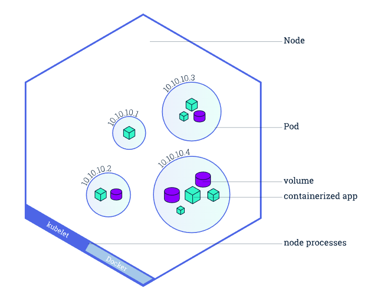

# Kubernetes

A Kubernetes cluster consists of two types of resources:

* The Control Plane coordinates the cluster

Tasks: scheduling applications, maintaining applications' desired state, scaling applications, and rolling out new updates.

* A Pod is a Kubernetes representation of a functioning "logic host", included of one or many containers and shared resources

Some shared resources for those containers. Those resources include:
1. Shared storage, as Volumes
2. Networking, as a unique cluster IP address
3. Information about how to run each container, such as the container image version or  specific ports to use

* Nodes are the workers that run applications

A node is a VM or a physical computer.

Pods run on nodes.

Each node has a Kubelet, which is an agent for managing the node and communicating with the Kubernetes control plane.

* Services help match traffic to designated pods and manage pod creations/terminations

Services match a set of Pods using labels and selectors,

When a worker node dies, the Pods running on the Node are also lost. A ReplicaSet might then dynamically drive the cluster back to desired state via creation of new Pods to keep your application running.

Services can be exposed in different ways by specifying a type in the ServiceSpec:

1. ClusterIP (default) - Exposes the Service on an internal IP in the cluster. This type makes the Service only reachable from within the cluster.
2. NodePort - Exposes the Service on the same port of each selected Node in the cluster using NAT. Makes a Service accessible from outside the cluster using `<NodeIP>:<NodePort>`. Superset of ClusterIP.
3. LoadBalancer - Creates an external load balancer in the current cloud (if supported) and assigns a fixed, external IP to the Service. Superset of NodePort.
4. ExternalName - Maps the Service to the contents of the externalName field (e.g. foo.bar.example.com), by returning a CNAME record with its value. No proxying of any kind is set up. This type requires v1.7 or higher of kube-dns, or CoreDNS version 0.0.8 or higher.

## Useful cmds

`kubectl get` - list resources
`kubectl describe` - show detailed information about a resource
`kubectl logs` - print the logs from a container in a pod
`kubectl exec` - execute a command on a container in a pod