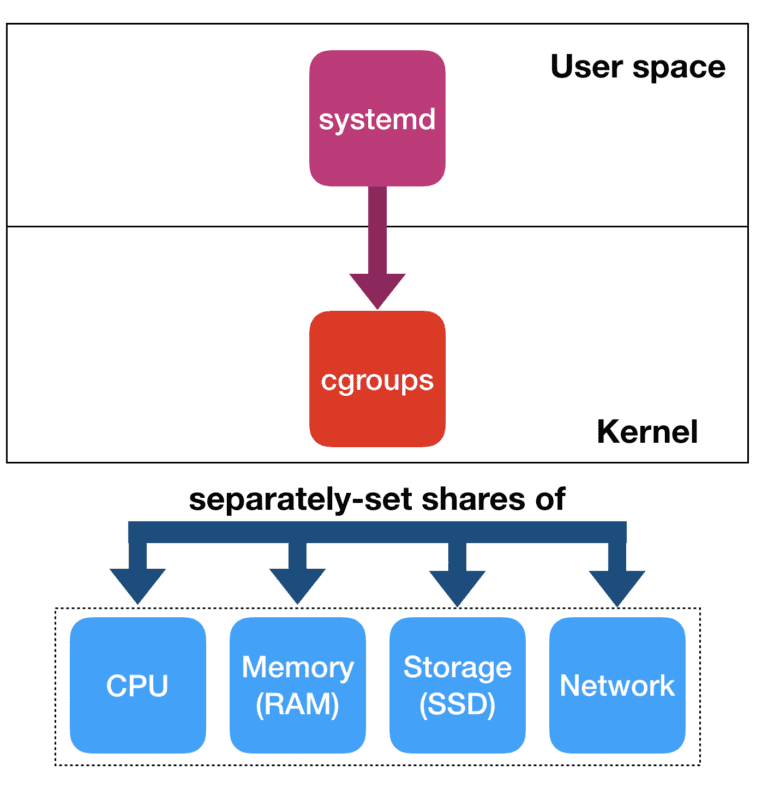
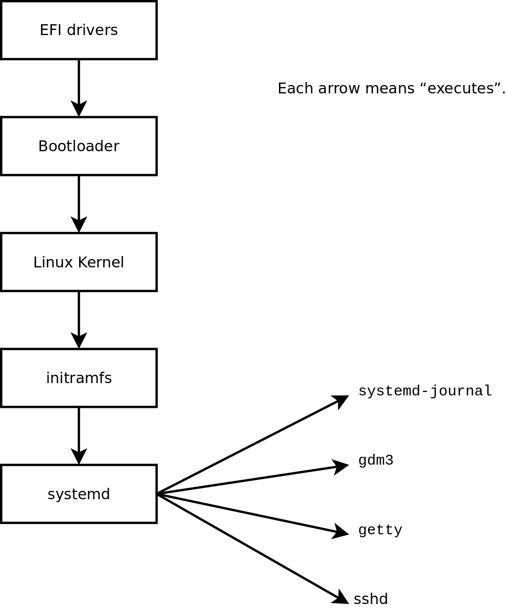

# Some Linux Knowledge and DevOps

## `systemd`

`systemd` is a software suite that provides an array of system components for Linux, offered reliable parallelism during boot as well as centralized management of processes, daemons, services and mount points.
It provides management to computer resource allocation as well.

<div style="display: flex; justify-content: center;">
      
</div>
</br>

where *cgroups* (abbreviated from control groups) is a Linux kernel feature that limits, accounts for, and isolates the resource usage (CPU, memory, disk I/O, etc.) of a collection of processes.

Below shows how `systemd` is started, and how `systemd` is a daemon that manages other daemons.

Given a typical Linux boot process:

1. system startup: BIOS firmware, searching for the bootable device (CD-ROM, USB flash drive, a partition on a hard disk)
2. bootloader stage: load the Linux kernel image into memory
3. kernel stage: sets up interrupt handling (IRQs), mounts root filesystem, and `initramfs` (a.k.a. early user space) to detect device drivers
4. init process: `/sbin/init` (one popular implementation is `systemd`) runs as the first (user space) process such that PID = 1, and will be the last process to terminate; `systemd` prepares the user space

where in the final step during `/sbin/init`, the Linux kernel loads `systemd` and passes control over to it and the startup process begins.

<div style="display: flex; justify-content: center;">
      
</div>
</br>

P.S. typical PIDs are

* PID = 0: CMD: `kernel_task`, responsible for paging, and this process is always referred to as the swapper or sched process, or just cpu idle
* PID = 1: CMD: `/sbin/init`
* PID = 2: CMD: `kthreadd`

Do NOT get confused that

||`systemd`|`systemctl`|`sysctl`|
|-|-|-|-|
|**Description**|A comprehensive system and service manager for Linux|A utility to interact with `systemd`, allowing users to manage services and check their statuses.|A utility to query and modify kernel parameters at runtime|
|**Examples**||`systemctl start <service>`: Starts a service.|`sysctl -a`: Lists all available kernel parameters.|

### Service Type (Process Management)

`systemd` manages services by `systemctl start <service>` starting the service's process, and `systemctl stop <service>` killing the process.

There are different service types that cater for different purposes, e.g., restart on different booting/failure conditions and forked child process management.

Reference: 

https://www.freedesktop.org/software/systemd/man/latest/systemd.service.html

https://wiki.archlinux.org/title/systemd

* simple

If service type is not manually set, `simple` is used.

In the default `simple` service type, only ONE process can be managed.
If multiple processed start under this service type, such as

```sh
for i in {1..5}; do
  ./start_a_process.sh &
done
```

only the 5th process survives and the previous four processes are dead.

* forking

Only the parent process exits and the forked child processes survive.

Should specify `PIDFile` as well so systemd can keep track of the main process.
For example, for nginx service runs with a master and multiple worker nodes, use `PIDFile=/var/run/nginx.pid` to monitor relevant PIDs.

```ini
[Service]
Type=forking
PIDFile=/var/run/nginx.pid
```

* oneshot

Parent process starts sub-processes then exit; should set `RemainAfterExit=yes` as well to prevent parent process terminating all sub-processes.
often used after OS booting for one time setup tasks.

### Resource Allocation and `cgroups`


### Register A `systemctl` Service

Reference: https://unix.stackexchange.com/questions/236084/how-do-i-create-a-service-for-a-shell-script-so-i-can-start-and-stop-it-like-a-d

1. Prepare a script/executable `/usr/bin/myscript` and make it `chmod +x`.

2. Write down below cfg to `/etc/systemd/system/my-svc.service`.

```txt
[Unit]
Description=My Script

[Service]
Type=simple
ExecStart=/usr/bin/myscript

[Install]
WantedBy=multi-user.target
```

3. Reload all systemd service files: `systemctl daemon-reload`

4. Check that it is working by starting the service with `systemctl start my-svc`.

5. To auto-start, use enable  `systemctl enable my-svc`.

#### `service` vs `systemctl`

Both are used to manage Linux processes for initialization.
`systemctl` aims to replace `service` as the modern unified process initialization management solution under `systemd`.

|`service`|`systemctl`|
|-|-|
|operates on `/etc/init.d`|operates on `/lib/systemd`|
|belongs to *SysVinit* (System V Init), aka the classic Linux initialization process|belongs to `systemd`, the successor of SysVinit and the modern initialization process|

#### Example: One Service Managing Multiple Processes

Split processes into such that

```conf
[Unit]
Description=Simple Service Managing Multiple Processes

[Service]
Type=simple
ExecStartPre=/path/to/pre_process_1
ExecStartPre=/path/to/pre_process_2
ExecStart=/path/to/main_process
ExecStartPost=/path/to/post_process_1
ExecStartPost=/path/to/post_process_2

[Install]
WantedBy=multi-user.target
```

An alternative would be using `Type=forking` or `Type=oneshot` such that starting processes by such below `start-multi-processes.sh`

```sh
#!/bin/bash

/path/to/pre_process_1.sh &
/path/to/pre_process_2.sh &
/path/to/main_process.sh &
/path/to/post_process_1.sh &
/path/to/post_process_2.sh &

# Wait for all background processes to finish
wait
```

Then in `service` define (use `oneshot` as an example)

```conf
[Unit]
Description=Multi-process Background Service (oneshot)
After=network.target

[Service]
Type=oneshot
ExecStart=/usr/local/bin/start-multi-processes.sh
RemainAfterExit=yes

# Resource Control
CPUQuota=50%                # Limit the CPU usage to 50%
MemoryLimit=500M            # Limit the memory usage to 500MB

[Install]
WantedBy=multi-user.target
```

Make sure the script is executable by `sudo chmod +x /usr/local/bin/start-multi-processes.sh`.

Reload by `sudo systemctl daemon-reload`.

Start service `sudo systemctl start multi-process.service`.

Check status by `systemctl status multi-process.service`.

```bash
● multi-process.service - Multi-process Background Service (oneshot)
   Loaded: loaded (/etc/systemd/system/multi-process.service; enabled; vendor preset: enabled)
   Active: active (exited) since Wed 2024-07-03 12:34:56 UTC; 5min ago
  Process: 12345 ExecStart=/usr/local/bin/start-multi-processes.sh (code=exited, status=0/SUCCESS)
 Main PID: 12345 (code=exited, status=0/SUCCESS)
    Tasks: 0 (limit: 4915)
   CGroup: /system.slice/multi-process.service
           ├─12346 /path/to/pre_process_1.sh
           ├─12347 /path/to/pre_process_2.sh
           ├─12348 /path/to/main_process.sh
           ├─12349 /path/to/post_process_1.sh
           └─12350 /path/to/post_process_2.sh

Jul 03 12:34:56 hostname systemd[1]: Starting Multi-process Background Service (oneshot)...
Jul 03 12:34:56 hostname systemd[1]: Started Multi-process Background Service (oneshot).
```

where the main `start-multi-processes.sh` finishes execution but the sub-processes are alive under `CGroup: /system.slice/multi-process.service`.

#### Debug

The registered `systemd` log can be found by `journalctl`.

## Linux Process Management

### Foreground vs Background Processes

* A foreground process is one that runs directly under the control of the user's shell and takes over the terminal input and output.

* A background process runs independently of the terminal,  processes are detached from the terminal's direct input and output.

A background process is marked by `&`.
For example, `sleep 100 &`.

### `nohup` and the `SIGHUP` signal

The `SIGHUP` signal to notify processes that the terminal or controlling process has been closed.
As a result, the sub-processes should exit as well.

For example, when a shell terminal is closed, the shell running processes are shutdown.

`nohup` is used to mark a process

### Start From Local Shell vs By Service

When started a process from a local shell, the shell becomes the parent of that process.

If the shell exits, the parent of the process is typically reassigned to the init process (PID 1).

## Common DevOps

* CRLF vs LF for new line

-> LF (Line Feed):

ASCII Code: 10 (or `0x0A` in hexadecimal)
Character: `\n`
Commonly used in Unix-like operating systems (Linux, macOS, etc.)

-> CRLF (Carriage Return + Line Feed):

ASCII Code: CR is 13 (`0x0D`), LF is 10 (`0x0A`).
Characters: `\r\n`
Commonly used in Windows-based systems

* `|` vs `xargs` for data forwarding

The left side of `|` is standard output (stdout), and right side is standard input (stdin), e.g., `ls | grep ".txt"`.
Used when the second command can handle input via stdin, which is how many commands (like `grep`, `awk`, `sed`, etc.)

`xargs` is used to take the output of one command and build arguments for another command, e.g., `find . -name "*.txt" | xargs rm`.
Many commands like `rm`, `cp`, or `mv` don't read from stdin but rather expect filenames or paths as arguments.

* Port Listening

```bash
sudo lsof -i -P -n | grep LISTEN
```

* Find the largest files

By directory (One common crash is caused by too many logs generated in a directory)

```bash
sudo du -a / 2>/dev/null | sort -n -r | head -n 20
```

By file

```bash
sudo find / -type f -printf "%s\t%p\n" 2>/dev/null | sort -n | tail -10
```

* Check disk usage

```bash
df
```

and accordingly the largest files

```bash
du ./ / 2>/dev/null | sort -n -r | head -n 20
```

Tips: on Linux after `rm`, the disk space is not immediately released, likely there are still processes own the file descriptor.
The `rm` simply removes the link between the filename and the mapped `inode`, and only when `inode` linker counter is zero, Linux will release the disk space.

One can use `lsof | grep 'deleted'` to list open files and locate what processes own the file.

* Check I/O to/from devices

```bash
iostat
```

* Failed `apt install` for connection error

There are different apt mirrors with different levels of legal constraints: *main*, *restricted*, *universe*, *multiverse*

Change apt-get mirror on `/etc/apt/sources.list` and add more mirrors to this list (below `focal` is used for ubuntu 20.04)

```bash
deb http://archive.ubuntu.com/ubuntu/ focal main universe multiverse restricted
deb http://us.archive.ubuntu.com/ubuntu/ focal main universe multiverse restricted
deb http://cn.aarchive.ubuntu.com/ubuntu focal main universe multiverse restricted
```

We can download manually from browser and instally locally:

```bash
sudo apt install ./path/to/deb
```

* Create a bootable usb

```bash
sudo umount /dev/sda1
sudo dd if=/path/to/ubuntu.iso of=/dev/sda1 bs=1M
```

* Route

`/etc/hostname` contains name of the machine, as known to applications that run locally.

`/etc/hosts` contains the mapping of some hostnames to IP addresses before DNS can be referenced. 

```txt
IPAddress     Hostname    		 Alias
127.0.0.1			localhost	 	 deep.openna.com
208.164.186.1		deep.openna.com		 deep
208.164.186.2		mail.openna.com		 mail
208.164.186.3		web.openna.com		 web
```

`/etc/gateways` file identifies gateways for a routed daemon.

`/etc/resolv.conf` file is used for domain name resolver

In Linux there is a *resolver* performing domain name translation.
Specifically, it translates domain names to IP addresses by querying the Domain Name Server (DNS). 
The `/etc/resolv.conf` file is the file that configures the domain name resolver.

For example, `8.8.4.4` is the Google DNS server.

```bash
nameserver 8.8.4.4
```

* `/etc` vs `/var`

`/etc` (etcetera) is used to store config, while `/var` (variable) stores frequently changed data such as logs.

* `modprobe`

The Linux kernel has a modular design.
A kernel module, or often referred to as a driver, is a piece of code that extends the kernel's functionality.

Modules can be manually loaded by `modprobe`, or automatically at boot time using /etc/modules or /etc/modules-load.d/*.conf files.

To load a module
`modprobe <module_name>`

To check a module
`lsmod | grep <module_name>`

To remove a module
`modprobe -r <module_name>`
