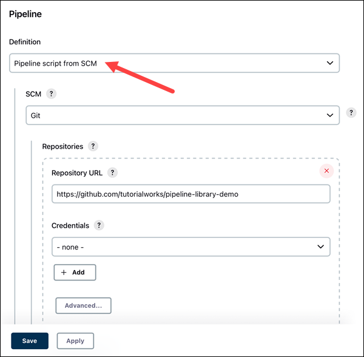

# Jenkins

## Build Pipeline

Write `buildpipeline.groovy` to define the build pipeline.

```groovy
def mvnCommand(String args) {
    sh "mvn ${args}"
}

node('any') {
    checkout scm
    timestamps {
        stage('Build') {
            echo '🔨 Building the application...'
            mvnCommand('clean compile package')
        }
        stage('Test') {
            echo '🧪 Running tests...'
            mvnCommand('test')
        }
        stage('Archive') {
            echo '📦 Archiving artifacts...'
            archiveArtifacts artifacts: 'target/*.jar', fingerprint: true
        }
    }
}
```

where

* The `checkout scm` command is a shorthand in Jenkins pipelines to check out the source code from the version control system (e.g., Git, SVN) configured in the Jenkins job.

On Jenkins server, the `scm` is configured as follows that takes the repository URL and the branch to checkout.

<div style="display: flex; justify-content: center;">
      
</div>
</br>

* `node('any')` specifies the node on which the pipeline will run.

The `any` label allows the pipeline to run on any available node.
Another example is `node('linux-jenkins-agent-icp-123456789')`, where `'linux-jenkins-agent-icp-123456789'` is the (canonical) IP of a specific server.

## Jenkinsfile

A `Jenkinsfile` is a script that defines the pipeline for a Jenkins job.

Jenkins scans the `Jenkinsfile` in (by default, the root directory of) repository and uses it to create a new job.

```groovy
// Load the build pipeline script
def pipeline = load 'buildpipeline.groovy'

// Define configuration arguments
def config = [
    buildProfile: 'production',
    testEnvironment: 'staging',
    artifactVersion: '1.0.0'
]

// Execute the pipeline with the configuration
pipeline.executePipeline(config)
```