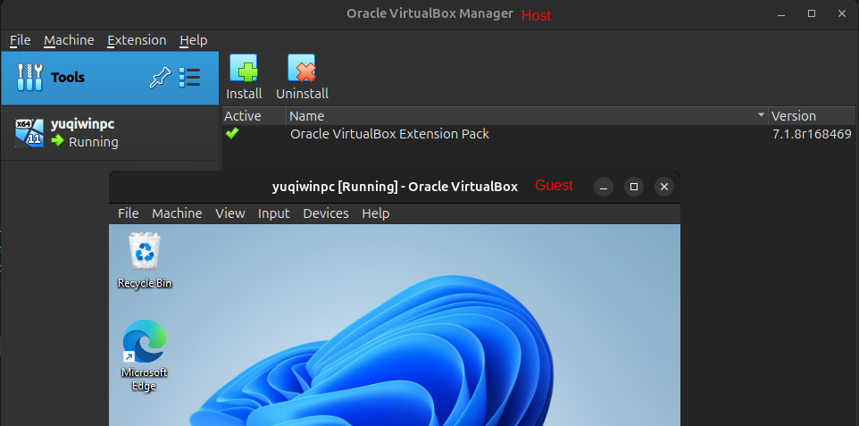
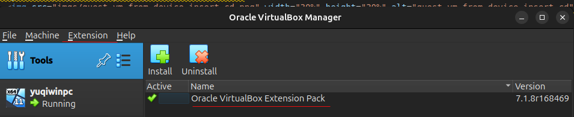
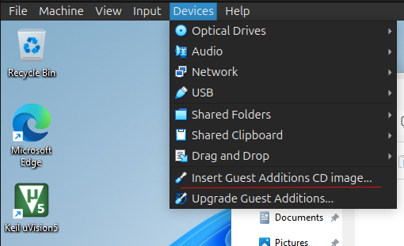
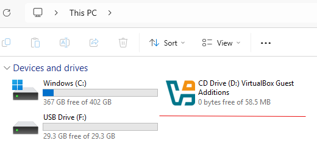
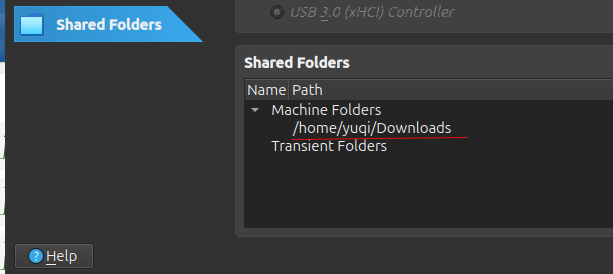
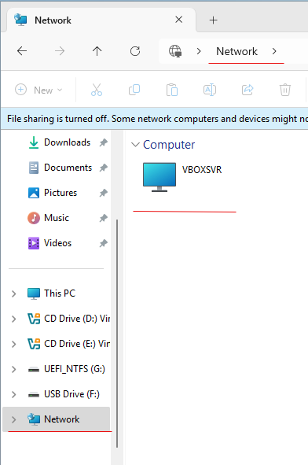
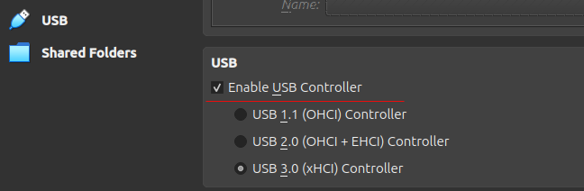
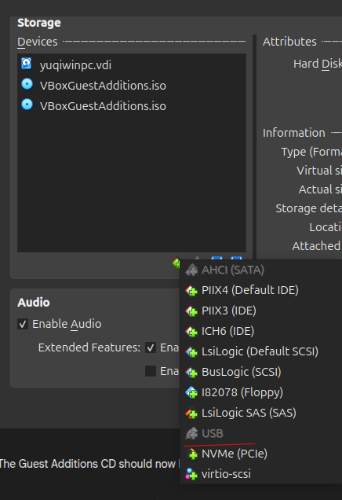

# VirtualBox

Some start guide:

There are two virtualbox windows: host and guest that have diff setting options.

      

 

To use advanced features such as interactions between host vs guest,
need to install addons both to host and guest.

* To install in host (the extension can be downloaded from Oracle Virtualbox website)

      

 

* To install in guest, from "Device" load a CD then double clicked to launch the guest addon CD installation

      

 

      

 

## Some Useful Feature Setup

### Host-Guest Shared Folder Setup

On host config the shared folder:

      

 

On guest open the shared folder on "Network"

      

 

### Add USB be Detectable (Also work for adding virtual device)

On host enable USB

      

 

On host add USB

      

 