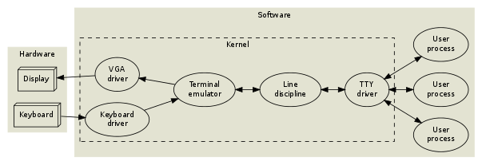

# Linux file and IO

## File descriptor

Given an open file cmd:
```cpp
int fd;
fd = open(pathname, O_RDWR);
```
The returned `fd` is a file descriptor (an  int greater than zero). Linux OS create a process mapping `fd` onto a table (`files_struct` inside *linux/fdtable.h*) describing this opened file, such as
```cpp
struct file_struct {
    atomic_t count;
    bool resize_in_progress;
    // ... many other attrinutes
}
```

There are three defined file descriptor integers: 
* stdin: 0 (standard input)
* stdout: 1 (standard output)
* stderr: 2 (standard error output)

Typical they refer to keyboard input and monitor/shell output.

## Terminal

### TTY

**tty** (TeleTYpewriter) is a native terminal device; the backend is either hardware or kernel emulated.

* Historically speaking, user interacts with a terminal and communicate with computer through UART (Universal Asynchronous Receiver and Transmitter) which directs bytes to various processes.


* Given fruther integrations, modern console does not have UART, emulated with software.



Use `alt + crtl + F1~F7` to switch between virtual terminals from `tty1` to `tty6`. `tty0` is root virtual terminal.

### pty

**pty** (pseudo-tty), a pair of slave (pts) and master (ptmx) provides  an  interface that behaves exactly like a classical terminal (tty).

## IO

### Shell Redirection

Shell redirection is not even *C* nor *Linux* standard, but rather for *bash* of the given syntax for input
```bash
[fd]<string_stream
```
and for output
```bash
[fd]>string_stream
```
where by defult `fd=0` when no `fd` is present, such as
```bash
>new_file.txt # create a new file
echo "hello world" > new_file.txt # input "hello world" into a new file 
```
