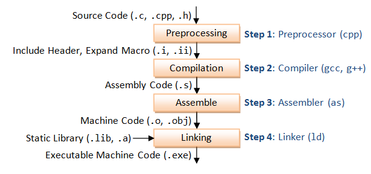

# Hello world example



* Example hello world source cpp code

```cpp
// helloworld.cpp
#include <iostream>

int main() {
    std::string H("H");
    std::cout << H + "ello World!";    
    return 0;
}
```

## Preprocessing

Process macros typically with a prefix `#`. Often expand/load code from `#`. 

```bash
cpp helloworld.cpp -o helloworld.i
```

The example hello world source code expands to more than 28k lines of code (most are loading from `#include <iostream>`), the user helloworld cpp code is placed in the end of the preprocessed code.
```cpp
// ...... (there are more than 28k lines of code) 
namespace std __attribute__ ((__visibility__ ("default")))
{
# 60 "/usr/include/c++/9/iostream" 3
  extern istream cin;
  extern ostream cout;
  extern ostream cerr;
}

# 3 "helloworld.cpp"
int main() {
    std::string H("H");
    std::cout << H + "ello World!";
    return 0;
}
```

## Compilation

There are about 100 lines of assembly code generated (by `g++` of `g++ (Ubuntu 10.3.0-1ubuntu1~20.04) 10.3.0`).

```bash
g++ -S helloworld.i -o helloworld.s
```

Explanation and result is shown as below.

A zero-terminated string is included in the section ".rodata" ("ro" means "read-only": the application will be able to read the data, but any attempt at writing into it will trigger an exception).

`.text` section, is where code goes.
```x86asm
	.file	"helloworld.cpp" ; filename
	.text ; code section
	.section	.rodata ; read-only data
	.type	_ZStL19piecewise_construct, @object
	.size	_ZStL19piecewise_construct, 1
_ZStL19piecewise_construct:
	.zero	1
	.local	_ZStL8__ioinit
	.comm	_ZStL8__ioinit,1,1
```

* `.LC0` local constant, e.g string literal.
* `.LFB0` local function beginning,
* `.LFE0` local function ending,
```x86asm
.LC0:
	.string	"H"
.LC1:
	.string	"ello World!"
	.text
	.globl	main
	.type	main, @function
```

We define a function called `main` and globally visible (other object files will be able to invoke it).
```x86asm
main:
.LFB1522:
	.cfi_startproc
	endbr64
	pushq	%rbp ; stack push
	.cfi_def_cfa_offset 16
	.cfi_offset 6, -16
	movq	%rsp, %rbp
	.cfi_def_cfa_register 6
	leaq	.LC0(%rip), %rsi ; load the address for our string from the label .LC0 using a load effect address (lea) instruction
	leaq	_ZSt4cout(%rip), %rdi ; load the address of std::cout 
	call	_ZStlsISt11char_traitsIcEERSt13basic_ostreamIcT_ES5_PKc@PLT ; call a long mangled name that includes basic_ostream inside it
	movl	$0, %eax
	popq	%rbp ; stack pop
	.cfi_def_cfa 7, 8
	ret ; return 0; statement. It does this by setting the %eax register to 0 using movl, then return using ret
	.cfi_endproc
```

## Assembly

Translate the assembly code into machine code by an assembler.

The result is typically referred to object code or object files (with the `.o` extension).

```bash
g++ -c helloworld.s -o helloworld.o
```

`objdump` can disassemble the object file with `-d`.

```bash
objdump -d helloworld.o > helloworld.o.disasm
```

Below are some excerpt of `helloworld.o.disasm`.

In the `<main>` below, `Hello, world!\n` string and `std::cout` have been replaced by placeholders, to be filled with symbols from a symbol table.

```x86asm
helloworld.o:     file format elf64-x86-64

Disassembly of section .text:

0000000000000000 <main>:
   0:	f3 0f 1e fa          	endbr64 
   4:	55                   	push   %rbp
   5:	48 89 e5             	mov    %rsp,%rbp
   8:	48 8d 35 00 00 00 00 	lea    0x0(%rip),%rsi        # f <main+0xf>
   f:	48 8d 3d 00 00 00 00 	lea    0x0(%rip),%rdi        # 16 <main+0x16>
  16:	e8 00 00 00 00       	callq  1b <main+0x1b>
  1b:	b8 00 00 00 00       	mov    $0x0,%eax
  20:	5d                   	pop    %rbp
  21:	c3                   	retq   
  ; There are many to come ...
```

The symbol table is a map between names (like `std::cout`) and information related to those names that is used by the linker.

Symbol table for an object file can be generated by `nm`.
```bash
nm -C helloworld.o > helloworld.o.symbols
```
For each symbol, we get an address, and the symbol type. 
* `U`: undefined, need linker to locate definition
* `T`/`t`: exists in the code/text section of this object file
* `r`: read-only data section
* `b`: BSS data section  (zero/uninitialized data)
```x86asm
                 U __cxa_atexit
                 U __dso_handle
0000000000000000 V DW.ref.__gxx_personality_v0
                 U _GLOBAL_OFFSET_TABLE_
0000000000000151 t _GLOBAL__sub_I_main
                 U __gxx_personality_v0
0000000000000000 T main
                 U __stack_chk_fail
                 U _Unwind_Resume
0000000000000104 t __static_initialization_and_destruction_0(int, int)
                 U std::allocator<char>::allocator()
                 U std::allocator<char>::~allocator()
                 U std::__cxx11::basic_string<char, std::char_traits<char>, std::allocator<char> >::append(char const*)
                 U 
                ; There many std::string members ...... 
```

## Linker

Object file placeholder addresses get replaced with their final values by linker locating their definitions by searching in other shared libraries. The linker for GCC is `ld`. 

The below instruction builds an executable. This helloworld example links `libstdc++.so`.
```bash
g++ helloworld.o -o helloworld
```

`nm` shows the linked symbols for previously empty placeholders.
```bash
nm -C helloworld > helloworld.symbols
``` 

`objdump` shows the final version object file with all symbols linked. The
```bash
objdump -d helloworld > helloworld.disasm
```