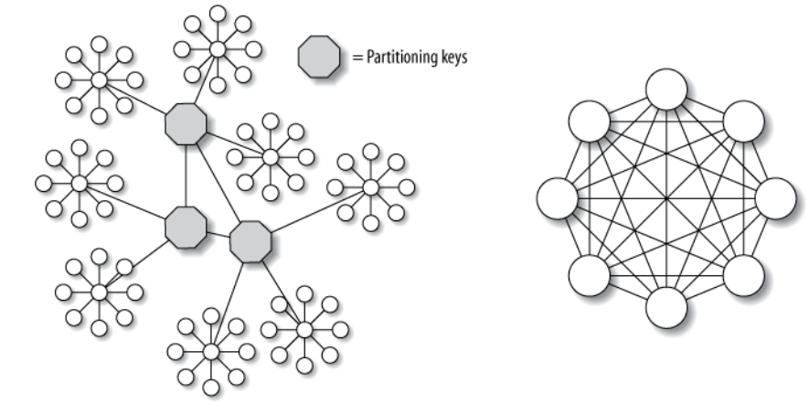

# Common DB knowledge

## Database storage structures

DB Storage with indexing:
ordered/unordered flat files, ISAM, heap files, hash buckets, or B+ trees

**Unordered** storage offers good insertion efficiency ( $O(1)$ ), but inefficient retrieval times ( $O(n)$ ). Most often, by using indexes on primary keys, retrieval times of $O(log n)$ or $O(1)$ for keys are the same as the database row offsets within the storage system.

**Ordered** storage typically stores the records in order. It has lower insertion efficiency, while providing more efficient retrieval of $O(log n)$

### Structured files

* Heap files

Heap files are lists of unordered records of variable size. New records are added at the end of the file, providing chronological order.

* Hash buckets

Hash functions calculate the address of the page in which the record is to be stored based on one or more fields in the record. So that given fields of a record (served as indexing), hash function can point to the memory address with $O(1)$.

* B+ trees

A B+ tree is an m-ary tree with a variable but often large number of children per node. B+ trees have very high fanout (number of pointers to child nodes in a node, typically on the order of 100 or more).

It searches with multiple branches, thus efficient
```py
def search(k):
    return tree_search(k, root)

def tree_search(k, node):
    if node is a_leaf:
        return node
    switch (k):
        case k ≤ k_0
            return tree_search(k, p_0)
        case k_i < k ≤ k_{i+1}
            return tree_search(k, p_{i+1})
        case k_d < k
            return tree_search(k, p_{d})
```

### Data Orientation

* "row-oriented" storage: 

each record/entry as a unit

* "column-oriented" storage: 

feature based storage

easy for data warehouse-style queries


## High Availability

Best way to optimize MySQL is to provide high performance hardware (still single instance, a.k.a. scaling up) and correct SQL query/schema for Mysql, after which, scaling out (provide more Mysql running machines) is required.

* Scaling Up: prefer multi-core CPU and multi-IO peripherals.

### Scaling Out:

* Replication: simply replicating instances from master db instance.

Might have limitations when high concurrency writes for data syncs.

* Functional partitioning, or division of duties: dedicate different nodes to different tasks.

This is about business level of providing db instances for targeted usage, such as one db for user login (db stores token, user profile, etc.) and another for user business services (db stores subscribed news, purchased products, etc.).

* #### Data sharding: shard the data by splitting it into smaller pieces, or
shards, and storing them on different instances/nodes.

Shard is a horizontal partition of data in a database.

Horizontal partitioning is a database design principle whereby rows of a database table are held separately (vertical partitioning is for column held data).

Each partition forms part of a shard, which may in turn be located on a separate database server or physical location. 

The most important challenge with sharding is finding and retrieving data (choose a right partition key).

One typical partition key is date-based timestamp (Unix date count starting from 1970.01.01), that data entries generated from the same date are grouped into a shard (contiguous disk addresses).



## Key Explained

* `PRIMARY KEY (a)`: The partition key is a.
* `PRIMARY KEY (a, b)`: The partition key is a, the clustering key is b.
* `PRIMARY KEY (a, b, c)`: The partition key is a, the composite clustering key is (b, c).
* `PRIMARY KEY ((a, b), c)`: The composite partition key is (a, b), the clustering key is c.

## Terminologies

* Procedure

A SQL procedure is a  group of SQL statements and logic, compiled and stored together to perform a specific task.

```sql
Create  PROCEDURE GetStudentName 
(
    --Input parameter, employeID of the employee
    @employeeID INT,
    --Output parameter, employeeName of employee
    @employeName VARCHAR(50) OUT

    AS
    BEGIN
        SELECT @employeName = 
        Firstname + ' ' + Lastname 
        FROM Employee_Table 
            WHERE EmployeId=@employeID
    END
```

* View

A *view* is a virtual table that doesn’t store any data itself, but maps query results to underlying physical table data, so that when next time a user runs the same query, the result is delivered fast.

```sql
CREATE VIEW Oceania AS
    SELECT * FROM Country WHERE Continent = 'Oceania'
```