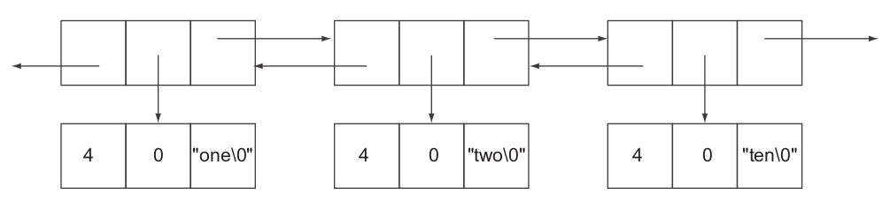

# Redis Performance Discussions

## Short Structures

### `ziplist`
A `ziplist` is an unstructured representation of one of `LIST`s, `HASH`es, and `ZSET`s.

`LIST` in redis is a doubly linked list, containing three pointers in each node: one points to previous node, one points to data block (including data itself and metadata such as string length) and another one points to next node.



For example, to store three byte string item "one", it needs 21 bytes of overhead (pointer and metadata). By `ZIPLIST`, list nodes are stored continuously thus no need of pointer address overhead. Each node/entry only has content itself, and previous and following node's content length. 

Below are `ziplist` config for reference:
```bash
# max number of entries allowed in a list
list-max-ziplist-entries 512
# max length of a node
list-max-ziplist-value 64
```

Same rules apply to `HASH` and `SET` as well:
```bash
hash-max-ziplist-entries 512
hash-max-ziplist-value 64

zset-max-ziplist-entries 128
zset-max-ziplist-value 64
```

### `intset`

Usually redis stores set data as char arrays. However, if data can be interpreted as int (`setint`), it can save much space. 

## Sharding

Basically, sharding takes data, partitions it into smaller pieces based on some simple rules, and then sends the data to different locations depending on which partition the data had been assigned to.

Sharding in redis is managed by user, that user when dealing with large volume of data, user set additional shard keys for partition.
```bash
HSET shardKey itemKey item
```

## Aggregates

