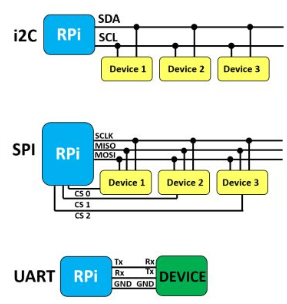
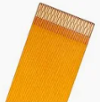
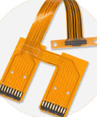
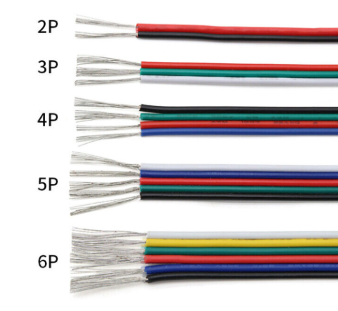
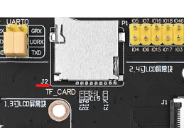
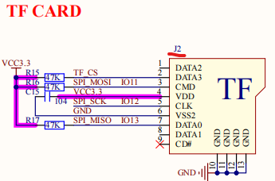
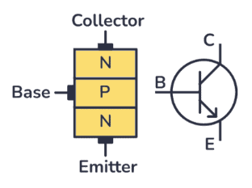
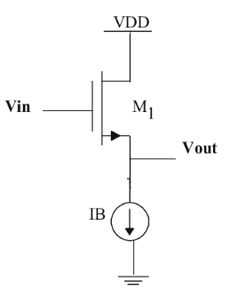

# Embedded System Basics

## Basic Arch

### Processor (Microcontroller or Microprocessor)

Microcontrollers (MCUs) vs Microprocessors (MPUs)

* Microprocessors (MPUs): These are essentially the CPU itself, requiring external memory and peripherals to form a complete system.
* Microcontrollers (MCUs): These are self-contained systems-on-a-chip (SoCs) that integrate a CPU, memory (RAM and ROM), and various input/output (I/O) peripherals onto a single chip.

### Memory

#### ROM (Read-Only Memory)

Modern descendents are Flash/EEPROM (Electrically Erasable Programmable Read-Only Memory).

* Non-Volatile: Retains data without power.
* Stores the essential, unchanging firmware (bootloader, operating system kernel, core application code) that the embedded system needs to start up and function.

#### RAM (Random Access Memory)

* Volatile: Lose data without power.
* Used for temporary data storage during program execution

##### SRAM (Static Random Access Memory)

* Uses latches (flip-flops) to store each bit (hence very fast).
* Used for temporary variables, intermediate calculation results, function call stacks, and buffer data.

##### DRAM (Dynamic Random Access Memory)

* Stores each bit in a tiny capacitor.
* Refresh Cycles: Requires periodic "refresh" cycles to prevent the capacitors from discharging and losing data.
* Slower than SRAM
* The most common type of main memory in larger embedded systems (and general-purpose computers) where large amounts of RAM are needed (e.g., DDR, LPDDR for systems running embedded Linux, graphics applications).

##### PSRAM (Pseudo-Static RAM)

PSRAM's "Pseudo-Static" Nature: By integrating the refresh circuitry directly onto the DRAM chip, PSRAM appears to the external system (like a microcontroller) as if it were a static RAM. The microcontroller doesn't need to worry about managing refresh cycles; the PSRAM chip handles it internally and transparently.

### Input/Output (I/O) Interfaces

* Digital I/O (GPIO - General Purpose Input/Output): Basic pins that can be configured as either inputs (reading high/low states from switches, sensors) or outputs (controlling LEDs, relays).
* Analog-to-Digital Converters (ADCs): Convert continuous analog signals (e.g., from temperature sensors, microphones) into digital values that the processor can understand.
* Digital-to-Analog Converters (DACs): Convert digital values from the processor into analog signals (e.g., for controlling motors, generating audio).

#### Communication Interfaces

##### Serial Communication

* UART (Universal Asynchronous Receiver/Transmitter)
* SPI (Serial Peripheral Interface)
* I2C (Inter-Integrated Circuit)

##### Network Interfaces

* Ethernet: For wired network connectivity
* Wi-Fi, Bluetooth, Zigbee: For wireless communication
* CAN (Controller Area Network): A robust serial bus primarily used in automotive and industrial applications for communication between various electronic control units.

##### USB (Universal Serial Bus)

* USB: For connecting to host computers or other USB devices

### Power Supply

Most MCUs operate at 3.3V or 5V.
Sensors and peripherals might also use these, or sometimes 1.8V, 12V, etc.

#### Power and Ground Pins

* VCC/VDD: These typically refer to the positive power supply voltage.
* GND: This is the common ground reference for the circuit, typically 0V.
* VIN: Input for an unregulated voltage, often used when an on-board voltage regulator converts it to the required operating voltage (VCC/VDD).

#### Power for High Voltage Machines

An embedded system board CANNOT drive a high-power motor.
The motor could sink high current flow and burns out the board.

Instead, an intermediary dedicated motor driver circuit needs to build up.

* Voltage Level Shifting: signals from the MCU to control motor voltage
* Current Amplification
* Back-EMF Protection: Motors are inductive. Drivers often include flyback diodes (or other mechanisms) to dissipate "inductive spikes"
* Over-current/Thermal Protection: Many dedicated driver ICs have built-in protection.

### Software

#### Firmware

The low-level software that is permanently stored in the non-volatile memory (ROM) and controls the basic operations of the hardware.

#### Operating System (OS) and Application Code

* For simpler embedded systems, the application code might run directly on the hardware (bare-metal programming)
* Real-Time Operating System (RTOS): RTOSes are designed for applications where timing and responsiveness are critical.

## Pins and Explanation

## Main Controller

|Feature/Aspect|8051 Microcontroller (e.g., Atmel AT89C51)|STM32 (STMicroelectronics)|ESP32 (Espressif Systems)|
|-|-|-|-|
|Primary Focus|Basic control, legacy systems, education|General-purpose embedded control, industrial, high-performance|IoT, wireless connectivity (Wi-Fi, Bluetooth)|
|Processor Core|8-bit CISC (e.g., MCS-51, many variations)|32-bit RISC ARM Cortex-M (M0, M0+, M3, M4, M7)|32-bit RISC Xtensa LX6 (dual/single), newer RISC-V variants|
|Bit Width|8-bit|32-bit|32-bit|
|Wireless Connectivity|None (requires external, often complex, additions)|No built-in Wi-Fi/Bluetooth (requires external modules)|Built-in Wi-Fi and Bluetooth (Classic & BLE)|
|Clock Speed|Typically up to 33 MHz (original often 12 MHz)|Tens to hundreds of MHz (e.g., 24 MHz to 480 MHz)|Up to 240 MHz (Xtensa), higher for RISC-V variants|
|On-chip Memory (Typical)|Very limited (e.g., 4KB Flash, 128-256 bytes RAM)|Large (tens of KB to MBs of Flash, tens to hundreds of KB of RAM)|Decent (e.g., 4MB Flash, 520KB SRAM)|
|Peripherals|Very basic (GPIO, simple timers, 1x UART, external interrupts)|Extremely rich and diverse (numerous GPIOs, advanced timers, multiple ADCs/DACs, CAN, Ethernet, USB Host/OTG, I2S, etc.)|Good (GPIOs, ADCs, DACs, SPI, I2C, UART, I2S, touch sensors, Hall sensor, CAN on some models)|
|Analog Performance|None built-in, or very basic in non-standard derivatives|Generally superior ADC/DAC accuracy and more channels|Adequate for most IoT applications, ADCs can be sensitive to noise|
|Power Management|Basic sleep modes, but not as sophisticated as modern MCUs|Excellent and highly configurable low-power modes (nanoamp range in deep sleep)|Good for IoT, Deep Sleep mode available (often loses RAM)|
|Development Tools|Assembly, C (Keil uVision, SDCC), often command-line based|STM32CubeIDE, STM32CubeMX, professional C/C++ toolchains (Keil, IAR)|ESP-IDF, Arduino IDE, MicroPython, PlatformIO|
|Development Community|Primarily historical/educational, limited for new industrial designs|Large professional community, good documentation|Huge, very active open-source and hobbyist community|
|Cost (Chip)|Extremely low|Varies widely, from very affordable to high-end|Generally lower, especially considering integrated wireless|
|Reliability|Proven, but modern MCUs offer more robust features (e.g., watchdog timers, ECC)|Highly regarded for industrial-grade reliability|Very good for consumer/IoT, but sometimes seen as less "industrial" than STM32|

## Common Data Communication Protocols in Embedded Systems

|Feature|UART|I2C|SPI|I2S|CAN|USB|HDMI|Parallel RGB|MIPI (CSI/DSI)|
|-|-|-|-|-|-|-|-|-|-|
|**Full Name**|Universal Asynchronous Receiver/Transmitter|Inter-Integrated Circuit|Serial Peripheral Interface|Inter-IC Sound|Controller Area Network|Universal Serial Bus|High-Definition Multimedia Interface|Parallel Red, Green, Blue|MIPI Alliance (Camera/Display Serial Interface)|
|**Type**|Asynchronous Serial|Synchronous Serial, Multi-master, Half-duplex|Synchronous Serial, Master-Slave, Full-duplex|Synchronous Serial, Master-Slave, Full-duplex (audio)|Asynchronous Serial, Multi-master, Broadcast|Asynchronous Serial, Master-Slave, Full-duplex|Synchronous Serial, Uncompressed Video/Audio|Synchronous Parallel, Unidirectional|High-speed Differential Serial for Video/Imaging|
|**Wires**|2 (TX, RX)|2 (SDA, SCL)|4 (MOSI, MISO, SCLK, SS) + 1 SS per slave|3 (SCK, WS, SD) + optional MCLK|2 (CAN_H, CAN_L)|4 (D+, D-, VBUS, GND) and more|19 (Type A) with multiple TMDS pairs|Many (e.g., 16-24 for data + 3-4 for control)|Variable (e.g., 4-10+), 1 clock pair + 1-4+ data pairs|
|**Speed**|Low to Moderate (9600 bps - 1 Mbps)|Moderate (100 kbps - 5 Mbps)|High (1 - 50+ Mbps)|High (1.4 - 10+ Mbps)|High (up to 5 Mbps)|Very High (1.5 Mbps - 40+ Gbps)|Extremely High (5 Gbps to 48 Gbps)|High (tied to pixel clock, e.g., 20-70+ MHz)|Extremely High (e.g., 2.5 Gbps per lane, scalable)|
|**Number of Devices**|Point-to-point (2)|Up to 127|Limited by SS lines|Point-to-point (2)|Up to 64 nodes|Up to 127 per host|Point-to-point (1 source, 1 sink)|Point-to-point (1 controller, 1 display)|Point-to-point (1 peripheral to 1 host)|
|**Topology**|Point-to-point|Bus|Master-slave (star)|Point-to-point|Bus|Star|Point-to-point|Point-to-point|Point-to-point|
|**Clock**|No shared clock|Shared clock (SCL)|Shared clock (SCLK)|Shared clocks (SCK, WS)|No shared clock|Dedicated clock/data|Shared clock (TMDS clock lane)|Shared clock (PCLK) + Sync Signals (HSYNC, VSYNC)|Shared differential clock pair|
|**Complexity**|Simple|Moderate|Simple to Moderate|Simple|Moderate to High|High|Very High (EDID, HDCP)|Low (protocol) but High (pin count & timing)|High (Low-power states, specific PHY required)|
|**Distance**|Long (with transceivers)|Short (< 1m)|Short (< 1m)|Very Short (< 30cm)|Moderate (up to 40m)|Short (up to 5m)|Medium (up to 15m)|Extremely Short (on-board only, < 30cm)|Extremely Short (on-board only, < 30cm)|
|**Power Consumption**|Low|Low|Moderate|Low to Moderate|Moderate|Can supply power|High|High (many pins switching at high speed)|Very Low (optimized for mobile)|
|**Typical Use Cases**|Debugging, GPS, Bluetooth|Sensors, EEPROMs|Flash memory, SD cards, ADCs|Digital audio (MCU to Codec)|Automotive, industrial|PC peripherals, charging|Connecting TVs, Monitors, Consoles|Directly driving raw LCD/TFT panels in embedded systems|Internal Camera & Display connections in Phones, Tablets|
---

### I2C vs SPI vs UART

<div style="display: flex; justify-content: center;">
      
</div>

where

* UART is a simply TX/RX one-to-one connection.
* SPI: Dedicated Chip Select (CS) or Slave Select (SS) pin for each device.
    * Master pulls the CS pin of the desired slave device LOW. That slave is now active; all others are ignored.
    * Simpler protocol, hence higher speed
* I2C: Master sends a START, then the slave's 7-bit address. Only the matching slave responds with an ACK.
    * Protocol overhead (addressing, ACKs) slows it down.

### Common Cables/Wires

#### FFC (Flexible Flat Cable)

<div style="display: flex; justify-content: center;">
      
</div>

#### FPC (Flexible Printed Circuit)

<div style="display: flex; justify-content: center;">
      
</div>
 
#### Ribbon Cable (杜邦线)

<div style="display: flex; justify-content: center;">
      
</div>

## Development Practice

### JTAG (Joint Test Action Group)

JTAG (Joint Test Action Group) in embedded systems is a standardized interface (IEEE 1149.1) primarily used for testing, programming, and debugging hardware.

#### Key Components

* Host Interface (USB/Ethernet):

Manages communication with the host PC (e.g., via USB bulk transfers).

Example ICs: FTDI FT2232H (dual high-speed USB-UART/JTAG), Cypress FX2LP.

* JTAG Engine:

Generates precise TCK/TMS/TDI signals and samples TDO based on host commands.

Implements the JTAG state machine (TAP controller) in hardware/firmware.

> TDI (Test Data In): Serial data input.
>
> TDO (Test Data Out): Serial data output.
>
> TCK (Test Clock): Synchronizes data.
>
> TMS (Test Mode Select): Controls the state machine.
>
> (Optional) TRST (Test Reset): Resets the JTAG controller.

* Voltage Level Shifting:

Adapts logic levels (e.g., 3.3V host <-> 1.8V target) using voltage translators like TXS0108E.

* Buffer Memory:

Caches JTAG data to handle speed mismatches (e.g., USB 2.0 vs. 10 MHz TCK).

* Firmware/Microcontroller:

Runs protocol translators (e.g., USB <-> JTAG commands).

Example: Segger J-Link uses an ARM Cortex-M core with proprietary firmware.

### OpenOCD

OpenOCD (Open On-Chip Debugger) is open-source software that controls JTAG probes for debugging/programming.

### Some Terminologies

#### General Purpose Input/Output (GPIO) Pins

* Reading Switches/Buttons: As inputs, GPIO pins can detect when a button is pressed or a switch is toggled.
* Controlling LEDs: As outputs, they can turn LEDs on or off.
* Controlling Relays/Motors: They can activate relays or control the on/off state of motors (often requiring additional driver circuits).

#### HAL (Hardware Abstraction Layer)

The Hardware Abstraction Layer is a software layer that provides a standard interface between the hardware and the software.

In STM32 microcontrollers (from STMicroelectronics), the STM32Cube HAL provides high-level functions like:

```c
HAL_GPIO_WritePin(GPIOA, GPIO_PIN_5, GPIO_PIN_SET);
```

rather than

```c
GPIOA->ODR |= (1 << 5);
```

#### lwIP (lightweight IP)

lwIP is a lightweight TCP/IP protocol designed dedicated to embedded system, required only 10-20 KB RAM and dozens of ROM.

* TCP/IP Stack: It implements the core protocols of the Internet Protocol Suite, including:
    * IP (Internet Protocol): For addressing and routing packets.
    * ICMP (Internet Control Message Protocol): For error messages and diagnostics (e.g., ping).
    * UDP (User Datagram Protocol): A connectionless, unreliable transport protocol often used for speed (e.g., DNS, DHCP, streaming).
    * TCP (Transmission Control Protocol): A connection-oriented, reliable transport protocol (e.g., HTTP, MQTT, FTP).
* Network Services: LwIP often includes or facilitates common network services:
    * DHCP (Dynamic Host Configuration Protocol): Client (to get an IP address) and sometimes server (to assign IP addresses).
    * DNS (Domain Name System): Client (to resolve hostnames to IP addresses).
    * HTTP (Hypertext Transfer Protocol): Server or client (for web communication).
    * MQTT (Message Queuing Telemetry Transport): Client (popular for IoT).

Two modes in lwIP:

* STA (Station Mode): a Wi-Fi client
* AP (Access Point Mode): creates its own Wi-Fi network that other Wi-Fi enabled devices (Stations, like phones or laptops) can connect to, e.g., personal hotspot

STA mode example scan results:

```txt
I (4116) scan: SSID             CU_bqPT
I (4116) scan: RSSI             -97
I (4116) scan: Authmode         WIFI_AUTH_WPA2_WPA3_PSK
I (4118) scan: Pairwise Cipher  WIFI_CIPHER_TYPE_CCMP
I (4123) scan: Group Cipher     WIFI_CIPHER_TYPE_CCMP
I (4127) scan: Channel          6
```

* SSID: Stands for "Service Set Identifier." This is the human-readable name of the Wi-Fi network.
* RSSI: Stands for "Received Signal Strength Indicator." It's a measure of how strong the Wi-Fi signal from this Access Point is. $-97$ is measured in dBm (decibels relative to a milliwatt), and is very weak.
* Authmode: Refers to the "Authentication Mode." `WIFI_AUTH_WPA2_WPA3_PSK` supports WPA2-PSK (Wi-Fi Protected Access 2 - Pre-Shared Key) and WPA3-PSK (Wi-Fi Protected Access 3 - Pre-Shared Key)
* Pairwise Cipher: This specifies the encryption algorithm
* Channel: Wi-Fi operates on specific radio frequency channels. In the 2.4 GHz Wi-Fi band, channels typically range from 1 to 11 (in North America) or 1 to 13/14 (in other regions).

#### Flash

Flash is a block of non-volatile storage/a filesystem for embedded system.

##### Flash Partition

A flash partition is a way to logically divide this single physical block of flash memory into several distinct sections.

Typically, there are

* `app` partitions: Store executable application code (raw binary).
* `nvs`: Stores key-value data (NVS format).
* `spiffs`/`littlefs`/`fat`: Can host a filesystem for storing larger files.
* `phy_init`: Stores PHY (physical layer for Wi-Fi/Bluetooth) calibration data.
* `ota_data`: Stores information about which app partition to boot.

##### NVS (Non-Volatile Storage)

NVS is a software library/API designed specifically for storing small pieces of data (key-value pairs) in flash memory on embedded devices.

NVS is not a general-purpose filesystem like SPIFFS or FAT, but used ot store configuration settings, calibration data, counters, Wi-Fi credentials, etc.

NVS persists when

* Device reboot
* Application code flash, e.g., by `idf.py flash` for ESP32

NVS will be overwritten when

* Full chip erase, e.g., `idf.py erase_flash` for ESP32
* Flash partition changes
* Explicit write in application code, e.g., `nvs_set_str(...)`

##### NAND Flash

NAND Flash is type of Raw flash that requires a Flash Translation Layer (FTL) to manage wear-leveling, bad blocks, and present a block device interface.

SPIFFS: Filesystems designed for raw flash, but typically for smaller files due to performance limitations. Less common for large video files unless the "disk" is raw SPI flash.

#### Circuit Component Acronyms

| Designator | Component Type                 | Description                                    |
| :--------- | :----------------------------- | :--------------------------------------------- |
| **U**      | **Integrated Circuit (IC)**    | The "chips" on the board, like the MCU, RAM, etc. |
| **J**      | **Jack / Jumper / Connector**  | Connectors for power, data (USB), or debugging (JTAG). |
| **P**      | **Plug / Pin Header**          | Connectors, often male pin headers for cables/jumpers. |
| **R**      | **Resistor**                   | Used to limit current or create voltage dividers.   |
| **C**      | **Capacitor**                  | Used for filtering power or storing energy.    |
| **L**      | **Inductor**                   | A coil, used in power supplies and filters.    |
| **Q**      | **Transistor**                 | A semiconductor switch (e.g., BJT, MOSFET).   |
| **D**      | **Diode**                      | Allows current to flow in only one direction.  |
| **LED**    | **Light Emitting Diode**       | A diode that lights up. Often a D, but LED is clearer. |
| **X / Y**  | **Crystal / Oscillator**       | Generates a precise clock signal for the MCU.  |
| **SW**     | **Switch**                     | A user-pressable button or a configuration switch. |
| **F**      | **Fuse**                       | A protection device that breaks a circuit if current is too high. |
| **TP**     | **Test Point**                 | A small metal pad on the board for probing with a multimeter. |
| **FB**     | **Ferrite Bead**               | Used to suppress high-frequency noise on power lines. |

Example: Jack2 (Acronym "J2") in this board is a TF card.

<div style="display: flex; justify-content: center;">
      
</div>

from schematics is referred as

<div style="display: flex; justify-content: center;">
      
</div>

where data read and write are carried on SPI.

* `SPI_MOSI` is connected to the MCU's GPIO Pin 11.
* `SPI_SCK` is connected to the MCU's GPIO Pin 12.
* `SPI_MISO` is connected to the MCU's GPIO Pin 13.

#### VCC vs VDD

##### VCC - Voltage at the Common Collector

* Transistor Type: Bipolar Junction Transistor (BJT)
* Terminals: A BJT has three terminals: Collector, Base, and Emitter.
* Origin: In early digital logic families like TTL (Transistor-Transistor Logic), the positive voltage rail was connected to the Collector terminals of the internal NPN transistors. Hence, it was the "Voltage at the Common Collector" or VCC.
* Typical Voltage: For decades, the standard for TTL logic was +5V. This is why you often see VCC associated with 5V supplies.

<div style="display: flex; justify-content: center;">
      
</div>


##### VDD - Voltage at the Common Drain

* Transistor Type: Field-Effect Transistor (FET), specifically a MOSFET.
* Terminals: A MOSFET has three terminals: Drain, Gate, and Source.
* Origin: In logic families using FETs, such as NMOS, PMOS, and especially CMOS, the positive voltage rail is connected to the Drain terminals of the internal P-channel MOSFETs. Hence, it was the "Voltage at the Common Drain" or VDD.
* Typical Voltage: CMOS technology is much more flexible and power-efficient. VDD can be a wide range of voltages, such as +5V, +3.3V, +1.8V, or even lower for modern CPUs.

<div style="display: flex; justify-content: center;">
      
</div>
