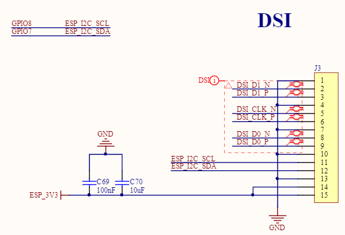

# Multi-Media

## Audio

### Codec

Codec stands for Coder-Decoder. These ICs typically handle both:

* Encoding: Converting analog audio (from a microphone or line-in) into digital audio data (ADC - Analog-to-Digital Converter).
* Decoding: Converting digital audio data (from a microcontroller/processor) back into analog audio (to drive headphones or speakers) (DAC - Digital-to-Analog Converter).

Everest Semiconductor (顺芯) is an audio semiconductor manufacturer.

Reference: http://www.everest-semi.com/en_products.php

Some popular types are

* ES7201: 2-channel (stereo) audio input ADC
* ES8311: 1-channel (mono) audio input and output with ADC and DAC
* ES8388: 2-channel (stereo) audio input and output with ADC and DAC

### Typical Audio Input/Output Process

First, register audio to I2C.
I2C is for CONTROL and CONFIGURATION. It's a slower, message-based bus used to send commands to the audio codec chip.

```cpp
i2c_master_bus_handle_t i2c_bus_;

void InitializeCodecI2c() {
    // Initialize I2C peripheral
    i2c_master_bus_config_t i2c_bus_cfg = {
        .i2c_port = I2C_NUM_1,
        .sda_io_num = AUDIO_CODEC_I2C_SDA_PIN,
        .scl_io_num = AUDIO_CODEC_I2C_SCL_PIN,
        .clk_source = I2C_CLK_SRC_DEFAULT,
        .glitch_ignore_cnt = 7,
        .intr_priority = 0,
        .trans_queue_depth = 0,
        .flags = {
            .enable_internal_pullup = 1,
        },
    };
    ESP_ERROR_CHECK(i2c_new_master_bus(&i2c_bus_cfg, &i2c_bus_));
}
```

Then, I2S is for the AUDIO DATA.
It's a high-speed, real-time, continuous stream of the actual sound samples (the 1s and 0s that represent the audio waveform).

Below code init audio driver with `ES7201` for audio input/mic and `ES8311` for audio output/speaker.

Finally, `input_dev_` and `output_dev_` are set up.

```cpp
AudioCodec* GetAudioCodec() override {
    static BoxAudioCodec audio_codec(
        i2c_bus_, 
        AUDIO_INPUT_SAMPLE_RATE, 
        AUDIO_OUTPUT_SAMPLE_RATE,
        AUDIO_I2S_GPIO_MCLK, // Pin number for the Master Clock.
        AUDIO_I2S_GPIO_BCLK, // Pin number for the Bit Clock.
        AUDIO_I2S_GPIO_WS,   // Pin number for the Word Select.
        AUDIO_I2S_GPIO_DOUT, // Pin number for Data Out (to speaker codec).
        AUDIO_I2S_GPIO_DIN,  // Pin number for Data In (from microphone codec).
        AUDIO_CODEC_PA_PIN,  // Pin number to enable the Power Amplifier.
        AUDIO_CODEC_ES8311_ADDR, 
        AUDIO_CODEC_ES7210_ADDR, 
        AUDIO_INPUT_REFERENCE);
    return &audio_codec;
}

BoxAudioCodec::BoxAudioCodec(void* i2c_master_handle, int input_sample_rate, int output_sample_rate,
    gpio_num_t mclk, gpio_num_t bclk, gpio_num_t ws, gpio_num_t dout, gpio_num_t din,
    gpio_num_t pa_pin, uint8_t es8311_addr, uint8_t es7210_addr, bool input_reference) {
    duplex_ = true;
    input_reference_ = input_reference;
    input_channels_ = input_reference_ ? 2 : 1;
    input_sample_rate_ = input_sample_rate;
    output_sample_rate_ = output_sample_rate;

    // Communication is two-way and simultaneous.
    // Setup standard I2S (Inter-IC Sound) hardware peripheral in TDM (Time-Division Multiplexing) mode
    CreateDuplexChannels(mclk, bclk, ws, dout, din);

    // Do initialize of related interface: data_if, ctrl_if and gpio_if
    audio_codec_i2s_cfg_t i2s_cfg = {
        .port = I2S_NUM_0,
        .rx_handle = rx_handle_,
        .tx_handle = tx_handle_,
    };
    data_if_ = audio_codec_new_i2s_data(&i2s_cfg);
    assert(data_if_ != NULL);

    // Output
    audio_codec_i2c_cfg_t i2c_cfg = {
        .port = (i2c_port_t)1,
        .addr = es8311_addr,
        .bus_handle = i2c_master_handle,
    };
    out_ctrl_if_ = audio_codec_new_i2c_ctrl(&i2c_cfg);
    assert(out_ctrl_if_ != NULL);

    gpio_if_ = audio_codec_new_gpio();
    assert(gpio_if_ != NULL);

    es8311_codec_cfg_t es8311_cfg = {};
    es8311_cfg.ctrl_if = out_ctrl_if_;
    es8311_cfg.gpio_if = gpio_if_;
    es8311_cfg.codec_mode = ESP_CODEC_DEV_WORK_MODE_DAC; // Set the chip to DAC mode (Digital to Analog Converter for playback)
    es8311_cfg.pa_pin = pa_pin;
    es8311_cfg.use_mclk = true;
    es8311_cfg.hw_gain.pa_voltage = 5.0;
    es8311_cfg.hw_gain.codec_dac_voltage = 3.3;
    out_codec_if_ = es8311_codec_new(&es8311_cfg);
    assert(out_codec_if_ != NULL);

    esp_codec_dev_cfg_t dev_cfg = {
        .dev_type = ESP_CODEC_DEV_TYPE_OUT,
        .codec_if = out_codec_if_,
        .data_if = data_if_,
    };
    output_dev_ = esp_codec_dev_new(&dev_cfg);
    assert(output_dev_ != NULL);

    // Input
    i2c_cfg.addr = es7210_addr;
    in_ctrl_if_ = audio_codec_new_i2c_ctrl(&i2c_cfg);
    assert(in_ctrl_if_ != NULL);

    es7210_codec_cfg_t es7210_cfg = {};
    es7210_cfg.ctrl_if = in_ctrl_if_;
    es7210_cfg.mic_selected = ES7120_SEL_MIC1 | ES7120_SEL_MIC2 | ES7120_SEL_MIC3 | ES7120_SEL_MIC4;
    in_codec_if_ = es7210_codec_new(&es7210_cfg);
    assert(in_codec_if_ != NULL);

    dev_cfg.dev_type = ESP_CODEC_DEV_TYPE_IN;
    dev_cfg.codec_if = in_codec_if_;
    input_dev_ = esp_codec_dev_new(&dev_cfg);
    assert(input_dev_ != NULL);
}
```

Having enabled the `input_dev_` and `output_dev_`, the audio input and output devices can be read or written.

```cpp
int BoxAudioCodec::Read(int16_t* dest, int samples) {
    if (input_enabled_) {
        ESP_ERROR_CHECK_WITHOUT_ABORT(esp_codec_dev_read(input_dev_, (void*)dest, samples * sizeof(int16_t)));
    }
    return samples;
}

int BoxAudioCodec::Write(const int16_t* data, int samples) {
    if (output_enabled_) {
        ESP_ERROR_CHECK_WITHOUT_ABORT(esp_codec_dev_write(output_dev_, (void*)data, samples * sizeof(int16_t)));
    }
    return samples;
}
```

## Display

Example by Video Processing

1. Storage (Long-term): The video file lives on Flash (e.g., SD card or internal flash).
2. DMA (Direct Memory Access): Allows data to be transferred from the storage interface (e.g., SDIO controller) directly to RAM/PSRAM without CPU intervention, freeing up the CPU for decoding.
3. Staging Area (Short-term, Active): Chunks of that video file are read from Flash and loaded into PSRAM (or internal SRAM if sufficient) to create an input buffer.
4. Codec (Coder-Decoder): The algorithm used to compress/decompress/decode the video (e.g., H.264, H.265/HEVC, MJPEG, VP9). If hardware is present, e.g., ST7703, decoding takes place in the dedicated hardware, otherwise, CPU comes in help.
5. DMA (Direct Memory Access): Come in help again transfer video data from RAM to display. If there is no DMA, CPU will help transfer the data.
6. Display Interface: Show pixel on display (e.g., SPI, Parallel RGB, MIPI DSI), no decoding.

### Display Interface Comparison

| Interface | Category | Signal Type | Key Characteristics | Common Connector / Form |
| :--- | :--- | :--- | :--- | :--- |
| **Parallel RGB** | **Internal** (Chip-to-Screen) | Digital | Simple logic but requires many wires; for small, low-cost displays. | Wide ribbon cables |
| **LVDS** | **Internal** (Chip-to-Screen) | Digital | Excellent noise immunity with fewer wires; former laptop screen standard. | Small connector with twisted-pair wires |
| **MIPI DSI** | **Internal** (Chip-to-Screen) | Digital | Very high speed & extremely low power; modern mobile standard. | Small flex cables (smartphones, R-Pi) |
| **VGA** | **External** (Device-to-Device) | Analog | Legacy standard; video only; quality degrades with resolution/distance. | 15-pin D-sub (often blue) |
| **HDMI** | **External** (Device-to-Device) | Digital | Universal consumer standard for video, audio, and control. | HDMI (Type-A, Mini, Micro) |
| **DisplayPort (DP)** | **External** (Device-to-Device) | Digital | High bandwidth for PCs; supports daisy-chaining multiple monitors. | DisplayPort, Mini DisplayPort |
| **USB Type-C** | **External** (Device-to-Device) | Digital (via Alt Mode) | Universal connector carrying video (usually DP), power, and data. | USB-C |

### Display by SPI + Parallel RGB

Directly letting MCU take control over RGB display is expensive for it requires a powerful MCU with a dedicated hardware peripheral called a "TFT Controller" or "LCD-TFT Display Controller (LTDC)" and enough RAM to hold at least one full frame buffer.
It needs enormous pin count, complex timing requirements for the MCU, high power consumption.

One can add an SPI - Parallel RGB driver boaad, so that MCU only needs a standard SPI peripheral and a small amount of RAM for a buffer. Almost any MCU can do this.

1. Send commands to the controller over SPI (e.g., "Set draw window to X,Y coordinates").
2. Send the raw pixel data over SPI.
3. The display's internal controller receives this data and writes it into its own RAM (frame buffer).
4. hat controller then independently handles the demanding task of driving the physical RGB panel using its internal frame buffer.

#### Typical 4-pin SPI for Touchable Display

Typically need four signals to control a touchable display:

* Data sent from MCU to display
* Touch action from display to MCU
* Clock to sync data transmission
* Special commands, e.g., usually MCU data to display is pixel, but occasionally would send special instructions such as "invert color"

```cpp
// --- Standard SPI Pins ---
#define DISPLAY_SPI_MODE        0
#define DISPLAY_MOSI_PIN        GPIO_NUM_1
#define DISPLAY_MISO_PIN        GPIO_NUM_2
#define DISPLAY_CLK_PIN         GPIO_NUM_5

// --- Display-Specific Control Pins ---
#define DISPLAY_DC_PIN          GPIO_NUM_3
#define DISPLAY_RST_PIN         GPIO_NUM_NC
#define DISPLAY_CS_PIN          GPIO_NUM_NC
```

where

* `#define DISPLAY_SPI_MODE        0`: Mode 0 means the clock is idle when LOW (CPOL=0) and data is sampled on the first (rising) clock edge (CPHA=0).
* `#define DISPLAY_MOSI_PIN        GPIO_NUM_1`: Assigns the MOSI (Master Out, Slave In) signal to GPIO pin 1
* `#define DISPLAY_MISO_PIN        GPIO_NUM_2`: Assigns the MISO (Master In, Slave Out) signal to GPIO pin 2.
* `#define DISPLAY_CLK_PIN         GPIO_NUM_5`: Assigns the SCLK (Serial Clock) signal to GPIO pin 5.
* `#define DISPLAY_DC_PIN          GPIO_NUM_3`: Assigns the D/C (Data/Command) signal to GPIO pin 3.
    * D/C Pin LOW: The data on MOSI is a command (e.g., "set contrast," "invert colors").
    * D/C Pin HIGH: The data on MOSI is display data (e.g., the color of a pixel).
* `#define DISPLAY_RST_PIN` and `#define DISPLAY_CS_PIN`: Assigns the RST (Reset) and CS (Chip Select) pins to `GPIO_NUM_NC`, which means Not Connected.
    * CS set to NC means the chip is hard wire on the circuit board, meaning it's always selected.

To use SPI for touch vs display, there are two bus cfgs that define pin input/outputs

* `spi_bus_config_t buscfg`
* `esp_lcd_panel_io_spi_config_t io_config`

Followed by LCD driver `ST7796`.

```cpp
LcdDisplay* display_;

void InitializeSpi() {
    ESP_LOGI(TAG, "Initialize QSPI bus");
    spi_bus_config_t buscfg = {};
    buscfg.mosi_io_num = DISPLAY_MOSI_PIN;
    buscfg.miso_io_num = DISPLAY_MISO_PIN;
    buscfg.sclk_io_num = DISPLAY_CLK_PIN;
    buscfg.quadwp_io_num = GPIO_NUM_NC;
    buscfg.quadhd_io_num = GPIO_NUM_NC;
    buscfg.max_transfer_sz = DISPLAY_WIDTH * DISPLAY_HEIGHT * sizeof(uint16_t);
    ESP_ERROR_CHECK(spi_bus_initialize(SPI3_HOST, &buscfg, SPI_DMA_CH_AUTO));
}

void InitializeLcdDisplay() {
    esp_lcd_panel_io_handle_t panel_io = nullptr;
    esp_lcd_panel_handle_t panel = nullptr;
    ESP_LOGI(TAG, "Install panel IO");

    esp_lcd_panel_io_spi_config_t io_config = {};
    io_config.cs_gpio_num = DISPLAY_CS_PIN;
    io_config.dc_gpio_num = DISPLAY_DC_PIN;
    io_config.spi_mode = DISPLAY_SPI_MODE;
    io_config.pclk_hz = 40 * 1000 * 1000;
    io_config.trans_queue_depth = 10;
    io_config.lcd_cmd_bits = 8;
    io_config.lcd_param_bits = 8;
    ESP_ERROR_CHECK(esp_lcd_new_panel_io_spi(SPI3_HOST, &io_config, &panel_io));

    st7796_vendor_config_t st7796_vendor_config = {
        .init_cmds = st7796_lcd_init_cmds,
        .init_cmds_size = sizeof(st7796_lcd_init_cmds) / sizeof(st7796_lcd_init_cmd_t),
    };      

    ESP_LOGI(TAG, "Install LCD driver");
    esp_lcd_panel_dev_config_t panel_config = {};
    panel_config.reset_gpio_num = DISPLAY_RST_PIN;
    panel_config.rgb_ele_order = DISPLAY_RGB_ORDER;
    panel_config.bits_per_pixel = 16;
    panel_config.vendor_config = &st7796_vendor_config;

    ESP_ERROR_CHECK(esp_lcd_new_panel_st7789(panel_io, &panel_config, &panel));
        
    esp_lcd_panel_reset(panel);
    esp_lcd_panel_init(panel);
    esp_lcd_panel_invert_color(panel, DISPLAY_INVERT_COLOR);
    esp_lcd_panel_swap_xy(panel, DISPLAY_SWAP_XY);
    esp_lcd_panel_mirror(panel, DISPLAY_MIRROR_X, DISPLAY_MIRROR_Y);

    display_ = new SpiLcdDisplay(panel_io, panel,
                                DISPLAY_WIDTH, DISPLAY_HEIGHT, DISPLAY_OFFSET_X, DISPLAY_OFFSET_Y, DISPLAY_MIRROR_X, DISPLAY_MIRROR_Y, DISPLAY_SWAP_XY,
                                {
                                    .text_font = &font_puhui_16_4,
                                    .icon_font = &font_awesome_16_4,
                                    .emoji_font = font_emoji_32_init(),
                                });
}

InitializeSpi();
InitializeLcdDisplay();
```

`ST7796` states these instructions.

```cpp 
typedef struct {
    int cmd;                /*<! The specific LCD command */
    const void *data;       /*<! Buffer that holds the command specific data */
    size_t data_bytes;      /*<! Size of `data` in memory, in bytes */
    unsigned int delay_ms;  /*<! Delay in milliseconds after this command */
} st7796_lcd_init_cmd_t;

typedef struct {
    const st7796_lcd_init_cmd_t *init_cmds;     /*!< Pointer to initialization commands array. Set to NULL if using default commands.
                                                 *   The array should be declared as `static const` and positioned outside the function.
                                                 *   Please refer to `vendor_specific_init_default` in source file.
                                                 */
    uint16_t init_cmds_size;                    /*<! Number of commands in above array */
} st7796_vendor_config_t;


st7796_lcd_init_cmd_t st7796_lcd_init_cmds[] = {

    // Command: 0x11 (Sleep Out)
    // Data: None (data_bytes=0)
    // Delay: 120ms
    // Purpose: Wakes the driver from sleep mode. The long delay is required for the
    //          internal oscillator and power circuits to stabilize. This is almost always
    //          the first command sent after a reset.
    {0x11, (uint8_t []){ 0x00 }, 0, 120},

    // Command: 0x3A (Pixel Format Set - COLMOD)
    // Data: 0x05
    // Purpose: Sets the color depth. 0x05 typically means 16 bits-per-pixel (BPP),
    //          in the RGB565 format (5 bits for Red, 6 for Green, 5 for Blue).
    {0x3A, (uint8_t []){ 0x05 }, 1, 0},
    {0xF0, (uint8_t []){ 0xC3 }, 1, 0},
    {0xF0, (uint8_t []){ 0x96 }, 1, 0},
    {0xB4, (uint8_t []){ 0x01 }, 1, 0},
    {0xB7, (uint8_t []){ 0xC6 }, 1, 0},
    {0xC0, (uint8_t []){ 0x80, 0x45 }, 2, 0},
    {0xC1, (uint8_t []){ 0x13 }, 1, 0},
    {0xC2, (uint8_t []){ 0xA7 }, 1, 0},
    {0xC5, (uint8_t []){ 0x0A }, 1, 0},
    {0xE8, (uint8_t []){ 0x40, 0x8A, 0x00, 0x00, 0x29, 0x19, 0xA5, 0x33}, 8, 0},

    // Commands: 0xE0, 0xE1 (Gamma Correction)
    // Purpose: This is crucial for accurate color representation. The display's
    //          brightness response is not linear. These 14-byte tables define a
    //          correction curve (gamma curve) so that shades of gray and color
    //          gradients look smooth and natural to the human eye. These are also
    //          highly panel-specific values.
    {0xE0, (uint8_t []){ 0xD0, 0x08, 0x0F, 0x06, 0x06, 0x33, 0x30, 0x33, 0x47, 0x17, 0x13, 0x13, 0x2B, 0x31}, 14, 0}, // Positive Gamma
    {0xE1, (uint8_t []){ 0xD0, 0x0A, 0x11, 0x0B, 0x09, 0x07, 0x2F, 0x33, 0x47, 0x38, 0x15, 0x16, 0x2C, 0x32},14, 0},  // Negative Gamma
    {0xF0, (uint8_t []){ 0x3C }, 1, 0},
    {0xF0, (uint8_t []){ 0x69 }, 1, 120},
    {0x21, (uint8_t []){ 0x00 }, 0, 0},
    {0x29, (uint8_t []){ 0x00 }, 0, 0},
};
```

### Image Input from Camera (MIPI CSI)

### Display by MIPI DSI

MIPI DSI (Display Serial Interface) is the standard, high-performance connection used to send image data from a processor to a display screen.

```txt
+---------------------+        +---------------------------+        +----------------------+
| Host Processor(SoC) |        | Interconnect (e.g., FPC)  |        |    Display Module    |
|                     |        |                           |        |                      |
|  +---------------+  |        |       +-----------+       |        |  +-----------------+ |
|  |   DSI Host    |---------->|-------|  D-PHY    |------>|------->|  |   DSI Device    | |
|  |  Controller   |  |        |       +-----------+       |        |  |  (on panel)     | |
|  +---------------+  |        |         Clock Lane        |        |  +-------+---------+ |
|        ^          | |        |        Data Lane(s)       |        |          |           |
|        |          | |        +---------------------------+        |          v           |
| +-----------------+ |                                             |   +----------------+ |
| | Application/OS  | |                                             |   |  Frame Buffer  | |
| +-----------------+ |                                             |   +----------------+ |
|                     |                                             |          |           |
|                     |                                             |          v           |
+---------------------+                                             |   +----------------+ |
                                                                    |   | Display Panel  | |
                                                                    |   +----------------+ |
                                                                    +----------------------+
```

MIPI DSI 

|Feature|High-Speed (HS) Mode|Low-Power (LP) Mode|
|-|-|-|
|Used For|Video data bursts (pixels)|Control commands, idle states|
|Signaling|Differential (2 wires)|Single-Ended (1 wire)|

#### The D-PHY

D-PHY is the physical layer.

1. D-PHY (Host Side):
    * The D-PHY transmitter first enters LP mode to send a "start of transmission" command.
    * It then instantly switches all lanes to HS mode to blast the entire frame of pixel data across the data lanes, with the clock lane providing the timing reference.
    * Once the frame is sent, it switches back to the ultra-efficient LP mode, waiting for the next frame or command.
2. Interconnect (FPC): The HS and LP electrical signals travel across the physical wires to the display.
3. D-PHY (Device Side):
    * It detects whether the incoming signal is LP or HS, converts the electrical voltages back into digital ones and zeros, and passes them to DSI device that writes the pixel data into the Frame Buffer.
    * Display panel driver reads from frame buffer and lights up screen

#### MIPI DSI Schematic Example

Below is an example of two-lane MIPI DSI interface:

Each lane is a differential pair `P`/`N` for positive/negative, and there are two pairs:

* `DSI_D0_P`
* `DSI_D0_N`
* `DSI_D1_P`
* `DSI_D1_N`

There is one lane for clock

* `DSI_CLK_P`
* `DSI_CLK_N`

There is another I2C signal for control (I2C uses a diff clock signal hence required an additional `ESP_I2C_SCL`), e.g., wake up DSI from sleep mode.

* `ESP_I2C_SCL`
* `ESP_I2C_SDA`

<div style="display: flex; justify-content: center;">
      
</div>

#### Typical MIPI DSI Display Process
 