# EPS32

Compared to other microcontrollers, e.g., STM32, EPS32 (developed by Espressif Systems) is characterized by capabilities in Internet of Things (IoT), e.g., built-in bluetooth and wifi, and AI, e.g., SIMD (Single Instruction, Multiple Data) and optimization for matrix multiplcation.

## Env Setup and Start (for Windows)

Download ESP-IDF from Espressif Systems website.

During installation, tick ESP Power-Shell, and launch the ESP Power-Shell.
Run ESP PowerShell **from project dir**, or build a new one.

<div style="display: flex; justify-content: center;">
      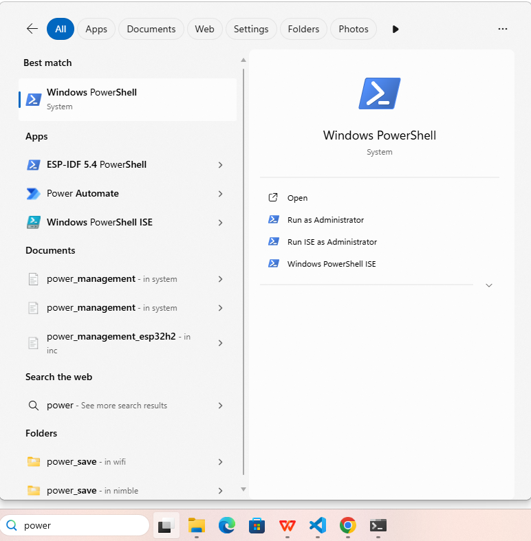
</div>

Project set up and build by

```sh
idf.py create-project --path <project name>
# e.g.,  idf.py create-project --path C:\Users\yuqi\Documents\esp32-proj\led-test led
idf.py create-component <component name>
# e.g.,  idf.py create-component components
idf.py --list-targets
idf.py set-target esp32s3
idf.py build
```

Additionally, monitor by

```sh
idf.py monitor
```

Finally having done building the project, load the code to board by (need to find user's board port, e.g., UART)

```sh
idf.py -p COM3 flash
```

### VS Code Setup

1. Install from VS Code extension

<div style="display: flex; justify-content: center;">
      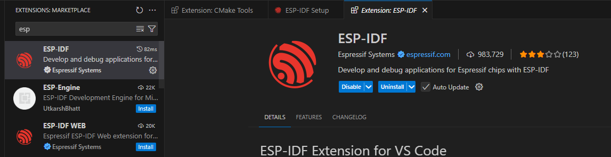
</div>

2. Config ESP-IDF

<div style="display: flex; justify-content: center;">
      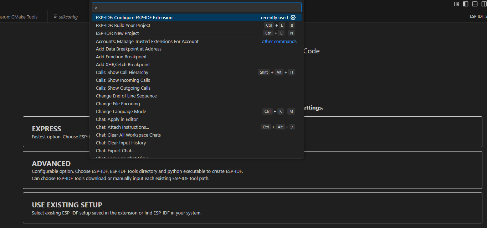
</div>

3. User can start a new project and perform detailed config

<div style="display: flex; justify-content: center;">
      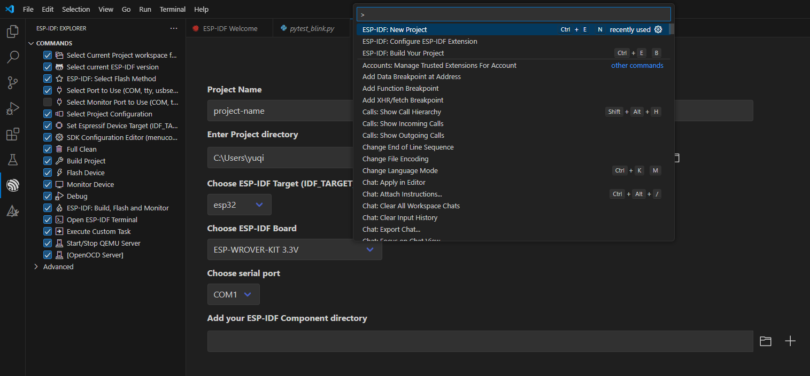
</div>

## Two Popular ESP32 Chips For AI (by 2025)

ESP32S3 and ESP32P4 are two popular ESP32 chips for AI.

ESP32S3 arch supports most basic functions (240 MHz).

<div style="display: flex; justify-content: center;">
      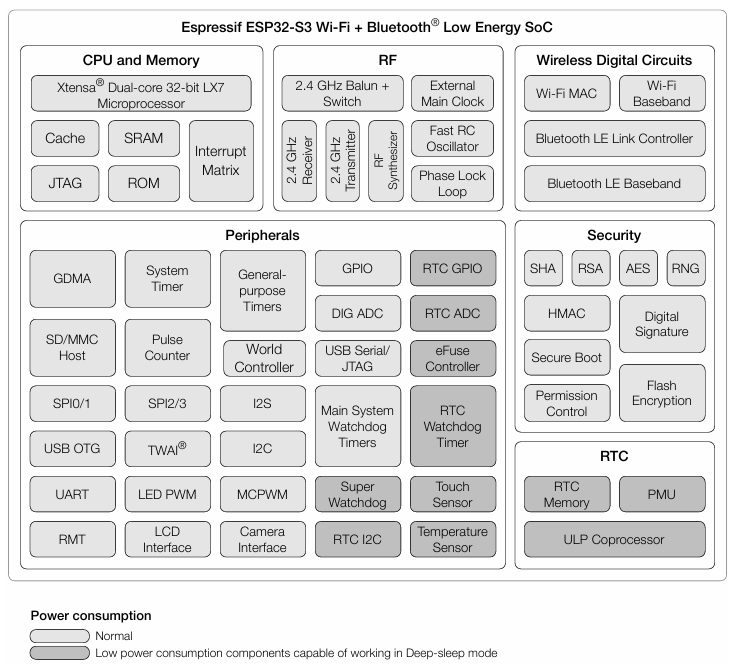
</div>

ESP32P4 arch is a high performance MCU (400 MHz).

<div style="display: flex; justify-content: center;">
      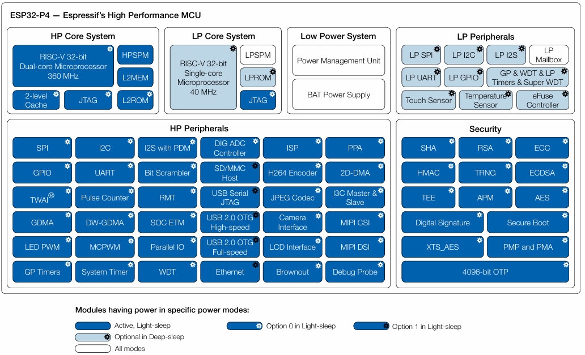
</div>

## LED Blink Start Guide

Check the circuit design, that IO1 is used for LED red.
The LED blue is uncontrollable only used as power supply indicator.

<div style="display: flex; justify-content: center;">
      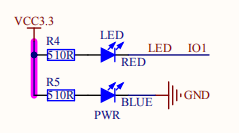
</div>

Check board GPIO map, and update from `idf.py meneconfig`.

<div style="display: flex; justify-content: center;">
      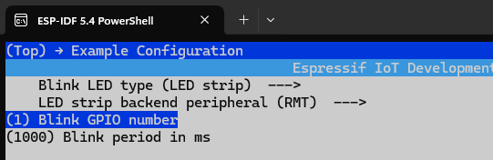
</div>

Behind the scene is the config updated to code (hence `idf.py meneconfig` needs to run on the project dir).

<div style="display: flex; justify-content: center;">
      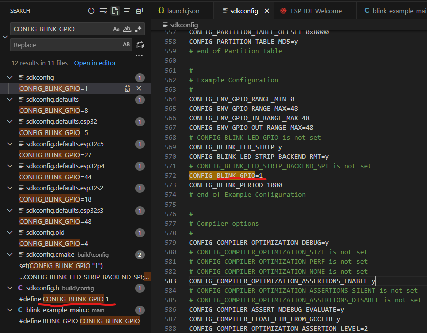
</div>

### C++ Enable Guide

`esp-idf-cxx` component provides higher-level C++ APIs for some of the ESP-IDF features.

Go to project directory, use `idf.py add-dependency espressif/esp-idf-cxx^1.0.0-beta`  (should only be done once).

### Code Example

In `components\BSP\LED\led.h`, define led blink wrapped in `extern "C"`

```h
#define __LED_H

#include "driver/gpio.h"

#define LED0_GPIO_PIN GPIO_NUM_1 

#define LED0(x)                                                              \
  do                                                                         \
  {                                                                          \
    x ? gpio_set_level(LED0_GPIO_PIN, 1) : gpio_set_level(LED0_GPIO_PIN, 0); \
  } while (0)

#ifdef __cplusplus
extern "C"
{
#endif

#define LED0_TOGGLE()                                              \
  do                                                               \
  {                                                                \
    gpio_set_level(LED0_GPIO_PIN, !gpio_get_level(LED0_GPIO_PIN)); \
  } while (0)
  void led_init(void);

#ifdef __cplusplus
}

#endif
```

In `components\BSP\LED\led.c`, define hardware operations, the GPIO on/off.

```c
#include "led.h"

void led_init(void) {
    gpio_config_t gpio_init_struct = {0};

    gpio_init_struct.intr_type = GPIO_INTR_DISABLE;
    gpio_init_struct.mode = GPIO_MODE_INPUT_OUTPUT;
    gpio_init_struct.pull_up_en = GPIO_PULLUP_DISABLE;
    gpio_init_struct.pull_down_en = GPIO_PULLDOWN_DISABLE;
    gpio_init_struct.pin_bit_mask = 1ull << LED0_GPIO_PIN;
    ESP_ERROR_CHECK(gpio_config(&gpio_init_struct));

    LED0(1);
}
```

In `main\main.cc`, start the `app_main(void)` which in ESP32 will be registered as a process/task in RTOS.

```cpp
#include "freertos/FreeRTOS.h"
#include "freertos/task.h"
#include "nvs_flash.h"
#include <stdio.h>
#include "led.h"
#include <iostream>

extern "C" void app_main(void) {
    std::cout << "Hello from std::cout in app_main!" << std::endl;

    esp_err_t ret;
    
    ret = nvs_flash_init();
    if (ret == ESP_ERR_NVS_NO_FREE_PAGES || ret == ESP_ERR_NVS_NEW_VERSION_FOUND)
    {
        ESP_ERROR_CHECK(nvs_flash_erase());
        ESP_ERROR_CHECK(nvs_flash_init());
    }

    led_init();

    while(1)
    {
        LED0_TOGGLE();
        vTaskDelay(pdMS_TO_TICKS(500));
    }
}
```

### JTAG Debug Guide

JTAG runs on USB, so make sure it is USB connected not UART or other serial ports.

Due to limited hardware memory and computation capability, only a small number of break points are allowed.

<div style="display: flex; justify-content: center;">
      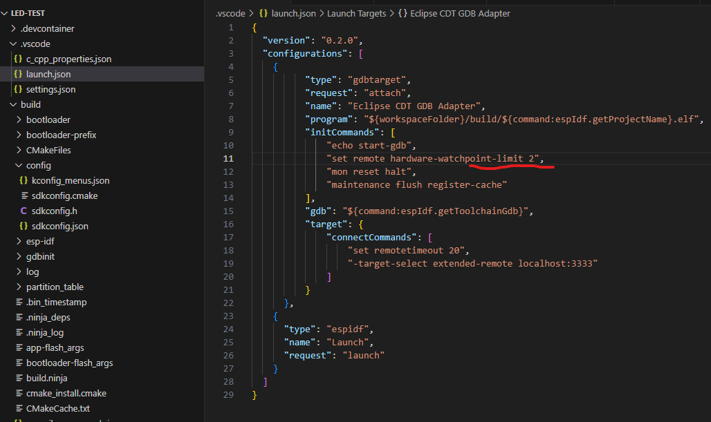
</div>

EPS32 works with GDB with OpenOCD to control JTAG to interact with boards.

<div style="display: flex; justify-content: center;">
      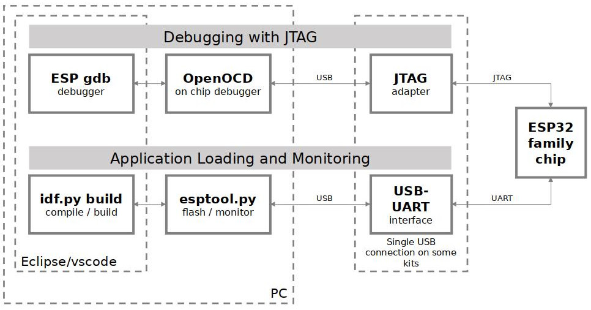
</div>

### Monitor

Monitor in embedded system is to check log from code such as `printf(...)`.

In ESP32, having done config, run `idf.py monitor`.

## XiaoZhi AI Compact Board

Source Code Reference:

https://github.com/78/xiaozhi-esp32

<div style="display: flex; justify-content: center;">
      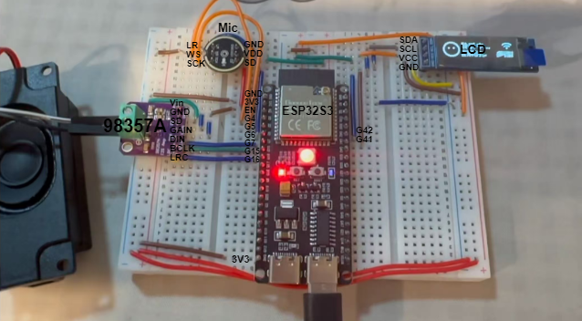
</div>

### 98357A (Audio Amplifier)

```cpp
#define AUDIO_I2S_SPK_GPIO_DOUT GPIO_NUM_7
#define AUDIO_I2S_SPK_GPIO_BCLK GPIO_NUM_15
#define AUDIO_I2S_SPK_GPIO_LRCK GPIO_NUM_16
```

* LRC (or LRCLK) - `GPIO_NUM_16`: Left-Right Clock, also called Frame Select (FS) or Word Select (WS).

This is the channel selector. It's a clock signal that tells the amplifier whether the data currently being sent on the DIN pin is for the Left channel or the Right channel.

* BCLK (or BCK) - `GPIO_NUM_15`: Bit Clock

For every single tick of this clock, one bit of audio data is sent on the DIN pin.

* DIN - `GPIO_NUM_7`: Data In

This is the actual audio data.

* GAIN - `Vcc`: Amplification Gain

It selects from a few fixed gain presets (e.g., +3dB, +6dB, +9dB, +12dB, +15dB).

For example, to set a low speaker volume, e.g., +3dB, depending on speaker driver board setup, one might simple connect a $100 \text{k}\Omega$ resistor to VIN.

In this bread board, it is simply set to `1` same as `Vcc`.

* SD - `GNG`: Shutdown

This is a power-saving pin. It allows you to turn the amplifier completely off without cutting power to the VIN pin.

In this bread board, it is simply set to `0`/`GND` (never shutdown).

* Vin (Voltage In) and GND (Ground)

### Mic (Audio Input)

For mic, there are below pin definitions.

```cpp
#define AUDIO_INPUT_SAMPLE_RATE  16000
#define AUDIO_OUTPUT_SAMPLE_RATE 24000

#define AUDIO_I2S_MIC_GPIO_WS   GPIO_NUM_4
#define AUDIO_I2S_MIC_GPIO_SCK  GPIO_NUM_5
#define AUDIO_I2S_MIC_GPIO_DIN  GPIO_NUM_6
```

The configs are added by below setup.

```cpp
NoAudioCodecSimplex audio_codec(AUDIO_INPUT_SAMPLE_RATE, AUDIO_OUTPUT_SAMPLE_RATE,
            AUDIO_I2S_SPK_GPIO_BCLK, AUDIO_I2S_SPK_GPIO_LRCK, AUDIO_I2S_SPK_GPIO_DOUT,
            AUDIO_I2S_MIC_GPIO_SCK, AUDIO_I2S_MIC_GPIO_WS, AUDIO_I2S_MIC_GPIO_DIN);
```

```cpp
NoAudioCodecSimplex::NoAudioCodecSimplex(int input_sample_rate, int output_sample_rate, 
            gpio_num_t spk_bclk, gpio_num_t spk_ws, gpio_num_t spk_dout,
            gpio_num_t mic_s ck, gpio_num_t mic_ws, gpio_num_t mic_din) {
    duplex_ = false;
    input_sample_rate_ = input_sample_rate;
    output_sample_rate_ = output_sample_rate;

    // Create a new channel for speaker
    i2s_chan_config_t chan_cfg = {
        .id = (i2s_port_t)0,
        .role = I2S_ROLE_MASTER,
        .dma_desc_num = AUDIO_CODEC_DMA_DESC_NUM,
        .dma_frame_num = AUDIO_CODEC_DMA_FRAME_NUM,
        .auto_clear_after_cb = true,
        .auto_clear_before_cb = false,
        .intr_priority = 0,
    };
    ESP_ERROR_CHECK(i2s_new_channel(&chan_cfg, &tx_handle_, nullptr));

    i2s_std_config_t std_cfg = {
        .clk_cfg = {
            .sample_rate_hz = (uint32_t)output_sample_rate_,
            .clk_src = I2S_CLK_SRC_DEFAULT,
            .mclk_multiple = I2S_MCLK_MULTIPLE_256,
			#ifdef   I2S_HW_VERSION_2
				.ext_clk_freq_hz = 0,
			#endif

        },
        .slot_cfg = {
            .data_bit_width = I2S_DATA_BIT_WIDTH_32BIT,
            .slot_bit_width = I2S_SLOT_BIT_WIDTH_AUTO,
            .slot_mode = I2S_SLOT_MODE_MONO,
            .slot_mask = I2S_STD_SLOT_LEFT,
            .ws_width = I2S_DATA_BIT_WIDTH_32BIT,
            .ws_pol = false,
            .bit_shift = true,
            #ifdef   I2S_HW_VERSION_2
                .left_align = true,
                .big_endian = false,
                .bit_order_lsb = false
            #endif

        },
        .gpio_cfg = {
            .mclk = I2S_GPIO_UNUSED,
            .bclk = spk_bclk,
            .ws = spk_ws,
            .dout = spk_dout,
            .din = I2S_GPIO_UNUSED,
            .invert_flags = {
                .mclk_inv = false,
                .bclk_inv = false,
                .ws_inv = false
            }
        }
    };
    ESP_ERROR_CHECK(i2s_channel_init_std_mode(tx_handle_, &std_cfg));

    // Create a new channel for MIC
    chan_cfg.id = (i2s_port_t)1;
    ESP_ERROR_CHECK(i2s_new_channel(&chan_cfg, nullptr, &rx_handle_));
    std_cfg.clk_cfg.sample_rate_hz = (uint32_t)input_sample_rate_;
    std_cfg.gpio_cfg.bclk = mic_sck;
    std_cfg.gpio_cfg.ws = mic_ws;
    std_cfg.gpio_cfg.dout = I2S_GPIO_UNUSED;
    std_cfg.gpio_cfg.din = mic_din;
    ESP_ERROR_CHECK(i2s_channel_init_std_mode(rx_handle_, &std_cfg));
    ESP_LOGI(TAG, "Simplex channels created");
}
```

### LCD Display

The bread uses I2C for image display.

I2C is designed for low-speed communication between chips on the same board, hence the LCD is of a small size.

```cpp
#define DISPLAY_SDA_PIN GPIO_NUM_41
#define DISPLAY_SCL_PIN GPIO_NUM_42

void InitializeDisplayI2c() {
      i2c_master_bus_config_t bus_config = {
      .i2c_port = (i2c_port_t)0,
      .sda_io_num = DISPLAY_SDA_PIN,
      .scl_io_num = DISPLAY_SCL_PIN,
      .clk_source = I2C_CLK_SRC_DEFAULT,
      .glitch_ignore_cnt = 7,
      .intr_priority = 0,
      .trans_queue_depth = 0,
      .flags = {
            .enable_internal_pullup = 1,
      },
      };
      ESP_ERROR_CHECK(i2c_new_master_bus(&bus_config, &display_i2c_bus_));
}
```