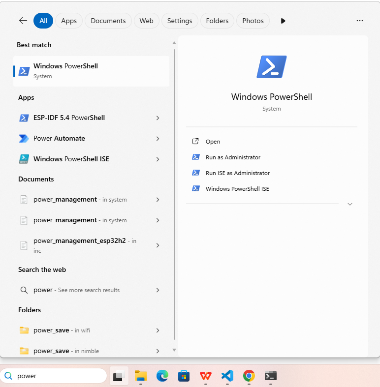
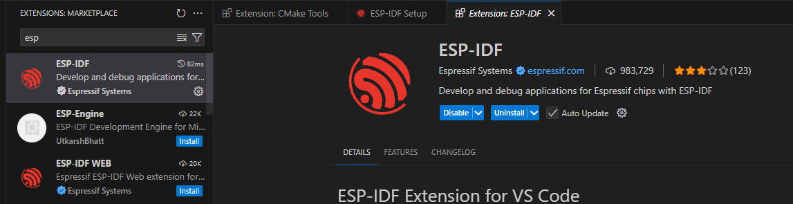
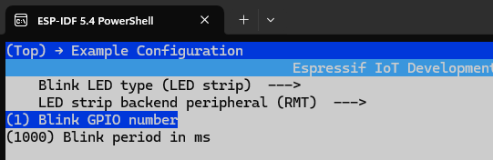
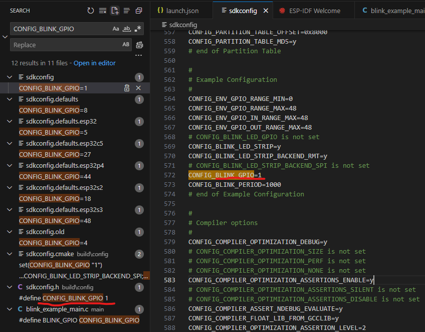
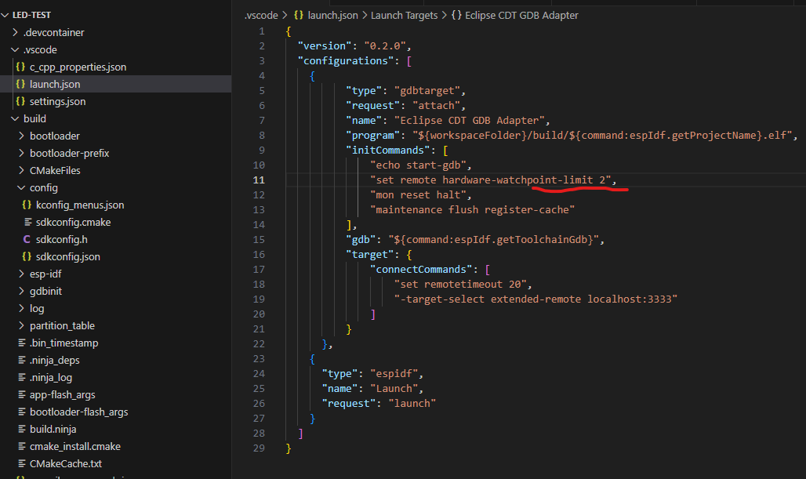

# EPS32

Compared to other microcontrollers, e.g., STM32, EPS32 (developed by Espressif Systems) is characterized by capabilities in Internet of Things (IoT), e.g., built-in bluetooth and wifi, and AI, e.g., SIMD (Single Instruction, Multiple Data) and optimization for matrix multiplcation.

## Env Setup and Start (for Windows)

Download ESP-IDF from Espressif Systems website.

During installation, tick ESP Power-Shell, and launch the ESP Power-Shell.
Run ESP PowerShell **from project dir**, or build a new one.

<div style="display: flex; justify-content: center;">
      
</div>

Project set up and build by

```sh
idf.py create-project --path <project name>
# e.g.,  idf.py create-project --path C:\Users\yuqi\Documents\esp32-proj\led-test led
idf.py create-component <component name>
# e.g.,  idf.py create-component components
idf.py --list-targets
idf.py set-target esp32s3
idf.py build
```

Additionally, monitor by

```sh
idf.py monitor
```

Finally having done building the project, load the code to board by (need to find user's board port, e.g., UART)

```sh
idf.py -p COM3 flash
```

### VS Code Setup

1. Install from VS Code extension

<div style="display: flex; justify-content: center;">
      
</div>

2. Config ESP-IDF

<div style="display: flex; justify-content: center;">
      
</div>

3. User can start a new project and perform detailed config

<div style="display: flex; justify-content: center;">
      
</div>

## Flash Partition Table

The partition table is a small, fixed-size data structure stored at a specific offset in the flash memory (by default, 0x8000). This table acts like an index or a map, defining how the rest of the flash memory is divided into logical sections called partitions.

This partition table is designed for an ESP32-S3 with 16MB of flash memory.

|Name|Type|SubType|Offset|Size|Flags|
|-|-|-|-|-|-|
|nvs|data|nvs|0x9000|0x6000||
|phy_init|data|phy|0xF000|0x1000||
|factory|app|factory|0x10000|0x1F0000||
|vfs|data|fat|0x200000|0xA00000||
|storage|data|spiffs|0xC00000|0x400000||

where

* `nvs` (Non-Volatile Storage): This partition is used by the NVS library to store key-value pairs persistently, such as Wi-Fi credentials, application settings, boot counters, etc.
* `phy` (PHYsical layer initialization data): Stores calibration data for the Wi-Fi and Bluetooth radio hardware (PHY). This data is loaded at boot to ensure optimal radio performance.
* `app` (meaning it contains executable application code) and `factory` (The main, default application firmware): main application binary
* `vfs` (Virtual File System) and `fat` (FAT filesystem): It's suitable for storing larger files
* `storage` and `spiffs` (SPI Flash File System): SPIFFS is a lightweight filesystem optimized for NOR flash, providing wear leveling. It's commonly used for storing web server assets (HTML, CSS, JS), configuration files, or smaller data logs.

For large embedded chip, there are multiple OTA (Over-The-Air) spaces that allow remote firmware update.

## LED Blink Start Guide

Check board GPIO map, and update from `idf.py meneconfig`.

<div style="display: flex; justify-content: center;">
      
</div>

Behind the scene is the config updated to code (hence `idf.py meneconfig` needs to run on the project dir).

<div style="display: flex; justify-content: center;">
      
</div>

### C++ Enable Guide

`esp-idf-cxx` component provides higher-level C++ APIs for some of the ESP-IDF features.

Go to project directory, use `idf.py add-dependency espressif/esp-idf-cxx^1.0.0-beta`  (should only be done once).

### Code Example

In `components\BSP\LED\led.h`, define led blink wrapped in `extern "C"`

```h
#define __LED_H

#include "driver/gpio.h"

#define LED0_GPIO_PIN GPIO_NUM_1 

#define LED0(x)                                                              \
  do                                                                         \
  {                                                                          \
    x ? gpio_set_level(LED0_GPIO_PIN, 1) : gpio_set_level(LED0_GPIO_PIN, 0); \
  } while (0)

#ifdef __cplusplus
extern "C"
{
#endif

#define LED0_TOGGLE()                                              \
  do                                                               \
  {                                                                \
    gpio_set_level(LED0_GPIO_PIN, !gpio_get_level(LED0_GPIO_PIN)); \
  } while (0)
  void led_init(void);

#ifdef __cplusplus
}

#endif
```

In `components\BSP\LED\led.c`, define hardware operations, the GPIO on/off.

```c
#include "led.h"

void led_init(void) {
    gpio_config_t gpio_init_struct = {0};

    gpio_init_struct.intr_type = GPIO_INTR_DISABLE;
    gpio_init_struct.mode = GPIO_MODE_INPUT_OUTPUT;
    gpio_init_struct.pull_up_en = GPIO_PULLUP_DISABLE;
    gpio_init_struct.pull_down_en = GPIO_PULLDOWN_DISABLE;
    gpio_init_struct.pin_bit_mask = 1ull << LED0_GPIO_PIN;
    ESP_ERROR_CHECK(gpio_config(&gpio_init_struct));

    LED0(1);
}
```

In `main\main.cc`, start the `app_main(void)` which in ESP32 will be registered as a process/task in RTOS.

```cpp
#include "freertos/FreeRTOS.h"
#include "freertos/task.h"
#include "nvs_flash.h"
#include <stdio.h>
#include "led.h"
#include <iostream>

extern "C" void app_main(void) {
    std::cout << "Hello from std::cout in app_main!" << std::endl;

    esp_err_t ret;
    
    ret = nvs_flash_init();
    if (ret == ESP_ERR_NVS_NO_FREE_PAGES || ret == ESP_ERR_NVS_NEW_VERSION_FOUND)
    {
        ESP_ERROR_CHECK(nvs_flash_erase());
        ESP_ERROR_CHECK(nvs_flash_init());
    }

    led_init();

    while(1)
    {
        LED0_TOGGLE();
        vTaskDelay(pdMS_TO_TICKS(500));
    }
}
```

### JTAG Debug Guide

JTAG runs on USB, so make sure it is USB connected not UART or other serial ports.

Due to limited hardware memory and computation capability, only a small number of break points are allowed.

<div style="display: flex; justify-content: center;">
      
</div>

EPS32 works with GDB with OpenOCD to control JTAG to interact with boards.

<div style="display: flex; justify-content: center;">
      
</div>

### Monitor

Monitor in embedded system is to check log from code such as `printf(...)`.

In ESP32, having done config, run `idf.py monitor`.

## WIFI + Image Process Example Guide
