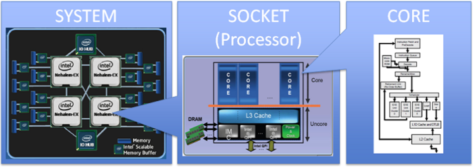

# CPU

## CPU Pipeline for Assembly

## Processor vs Core

* CPU chip: contained multiple processors; modern CPU has integrated GPU and in-chip memory as well

* Processor: contained multiple cores

* Core: One block of a CPU, executing one instruction at a time. 

      

 

## Processor Microarchitecture

## Intel VTune Profiler

Intel® VTune™ Profiler can help identify and analyze performance bottlenecks in your serial or parallel application by performing a series of steps in a workflow. 