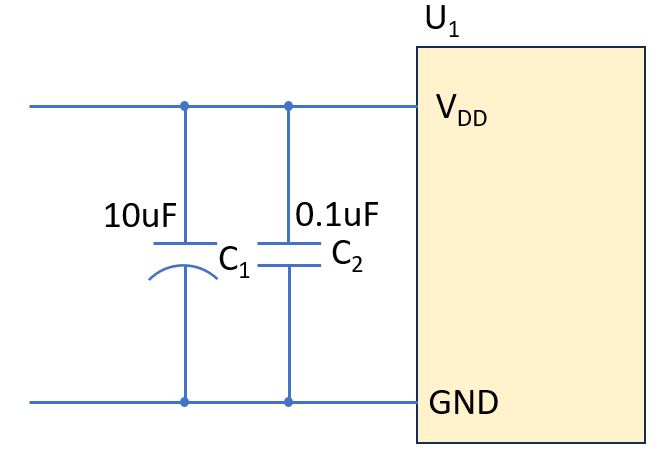
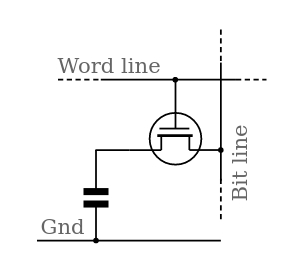

# Circuit Basics

## Decoupling capacitors in circuit

Power supply fluctuations (high/low frequency noises) are often observed in circuit, hence required adding *decoupling capacitors* such as $C1$ and $C2$ between $V_{DD}$ and $\text{GND}$.

Generally speaking, a 0.1uF capacitor will cover a broad range of frequencies supporting from ~15 kHz to >1 GHz.

      

 

## Latching (Flip-flop)

Flip-flop or latch is a circuit that has two stable states and can be used to store state information - a bistable multivibrator. 
The circuit can be made to change state by signals applied to one or more control inputs and will have one or two outputs. 

A flip-flop is a device serving as a basic storage unit holding one bit value. A single SRAM or DRAM cell is a flip-flop.

## Chip Naming and Explains

* ROM

Read Only Memory: store persistent data even when power is cut off.

* RAM

Random Access Memory: store the programs and data being used by the CPU in real-time.

* DRAM

Dynamic RAM: inside a DRAM chip, each memory cell holds one of information and is made up of two parts: a transistor and a capacitor.

      

 

* SRAM

Static random-access memory: made up of flip-flop memory cells that take four or six transistors along with some wiring, but never has to be refreshed.

Example 6-transistor SRAM cell

      

 

$\space \space$ Notes:

$BL$: Bit Line, input/output;

$WL$: Word Line, addr select;

### $\space \space$ Operation flow:

$\space \space$ 1. Standby (idle):

$WL$ is disconnected, $M_5$ and $M_6$ receive no signal (no elec current to transistors' bases), $M_1$ - $M_4$ combined preserve $0$/$1$ states.

For example, this SRAM cell stores one bit $1$. $V_{DD}$ continues supplying 0.7+ volt, from which current goes through $M_4$'s collector to emitter to $Q$, then to $M_1$'s base to emitter, and finally ground. The negated $M_4$'s base is off.

$\space \space$ 2. Reading:

Reading starts when $WL$ is truned on, both $M_5$ and $M_6$'s bases receive elec current. Given the elec flow when this SRAM cell is idle, $Q$ immediately turns on $BL$, hence outputing bit $1$.

$\space \space$ 3. Writing:

When $WL$ is truned on, and input truns on $\overline{BL}$. $\overline{Q}$ has elec current flow which turns off $M_4$ and switches on $M_3$'s base. $M_3$'s collector and emitter then have elec current flow through. This behavior changes the bit info $1$ to bit $0$.

* EEPROM

Electrically Erasable Programmable ROM: non-volatile memory chip can be electrically erased using field electron emission.