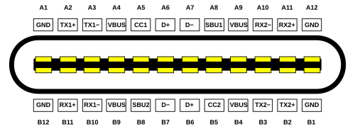
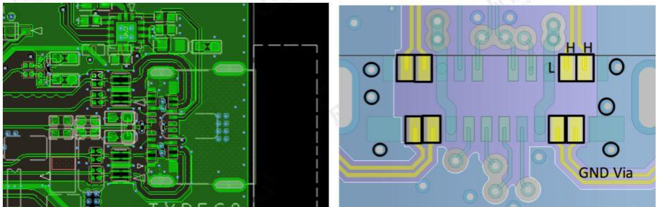

# Printed Circuit Board

## Example PCB: Type-C USB

Reference: https://www.usb.org/document-library/usb-type-cr-cable-and-connector-specification-release-24

The 24 pins are named "full-pin" or "full-featured" cables and ports.

      

 

The pin arrangements are shown as below.

Some pins are arranged diagonal symmetric so that up/down orientation does not matter when typc-c usb is attached to receptable.

      

 

The definitions are

|Pin|Name|Description|
|-|-|-|
|A1|GND|Ground return|
|A2|SSTXp1 ("TX1+")|SuperSpeed differential pair #1, transmit, positive|
|A3|SSTXn1 ("TX1−")|SuperSpeed differential pair #1, transmit, negative|
|A4|VBUS|Bus power|
|A5|CC1|Configuration channel|
|A6|D+|USB 2.0 differential pair, position 1, positive|
|A7|D−|USB 2.0 differential pair, position 1, negative|
|A8|SBU1|Sideband use (SBU)|
|A9|VBUS|Bus power|
|A10|SSRXn2 ("RX2−")|SuperSpeed differential pair #4, receive, negative|
|A11|SSRXp2 ("RX2+")|SuperSpeed differential pair #4, receive, positive|
|A12|GND|Ground return|

|Pin|Name|Description|
|-|-|-|
|B12|GND|Ground return|
|B11|SSRXp1 ("RX1+")|SuperSpeed differential pair #2, receive, positive|
|B10|SSRXn1 ("RX1−")|SuperSpeed differential pair #2, receive, negative|
|B9|VBUS|Bus power|
|B8|SBU2|Sideband use (SBU)|
|B7|D−|USB 2.0 differential pair, position 2, negative[a]|
|B6|D+|USB 2.0 differential pair, position 2, positive[a]|
|B5|CC2|Configuration channel|
|B4|VBUS|Bus power|
|B3|SSTXn2 ("TX2−")|SuperSpeed differential pair #3, transmit, negative|
|B2|SSTXp2 ("TX2+")|SuperSpeed differential pair #3, transmit, positive|
|B1|GND|Ground return|

where

* Power and Ground (VBUS, GND): Power supply
* USB 2.0 Data (D+, D-): These pins are essential for backward compatibility with older USB 2.0 devices and peripherals, supporting data transfer rates of up to 480 Mbps.
* SuperSpeed Data (SSTX, SSRX): High Speed data transfer
* Configuration Channel (CC): Responsible for detecting when a USB port has been attached or detached, determining the cable's orientation, and identifying the roles of the connected devices (e.g., Host/Downstream Facing Port (DFP), Device/Upstream Facing Port (UFP), or Dual-Role Port (DRP)), and power delivery.
* Sideband Use (SBU): To carry non-USB signals when the connector is operating in an Alternate Mode, such as transmitting video and audio signals for DisplayPort or HDMI.
* VCONN (for active cables): Signal amplificationf for long cable, signal retiming

      

 