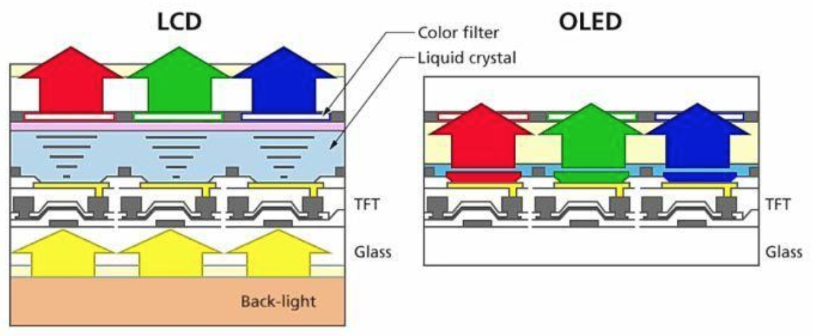

# Display

## Monitor Display Materials

By Jan 2025, such materials are popular and available to consumers.

||OLED (Organic LED)|miniLED|QLED (Quantum LED)|VA (Vertical Alignment )|IPS (In-Plane Switching)|
|-|-|-|-|-|-|
|Material|Organic compounds|LCD (Liquid crystals)|LCD (Liquid crystals)|LCD (Liquid crystals)|LCD (Liquid crystals)|
|Contrast|Infinite (perfect blacks)|High (limited by dimming zones)|High (improved by quantum dots)|High (improved by deep blacks)|Moderate (lower than VA/OLED)|
|Brightness|Moderate (~800-1000 nits)|Very High (up to 2000+ nits)|Very High (up to 1500-2000 nits)|High (800-1,500 nits)|Moderate (~300-600 nits)|
|Response Time (GTG)|Near-instant (0.1ms)|1-5ms|1-5ms|1-5ms|1-5ms|
|Burn-in Risk|Yes|No|No|No|No|
|Price|Expensive|Mid-to-High|Mid-to-High|Budget-to-Mid|Budget-to-Mid|
|Light Modulation (usually)|PWM|DC|DC|DC|DC|
|Lifespan|Shorter (organic decay)|Long (inorganic LEDs)|Long|Long|Long|
|Thickness|Thin|Thick|Thick|Thick|Thick|

where

* LED: Light-Emitting Diode
* LCD: Liquid Crystal Display
* GTG: the time it takes for a pixel to change from one shade of gray to another
* QD: Quantum Dots
* PWM: Pulse Width Modulation
* DC: Direct Current Dimming

### LCD vs OLED

      

 

### Terminology Explains

* Why OLED can achieve perfect blacks

Each pixel in an OLED display is a self-emissive light source that can be totally turned off, while LCD needs to maintain minimum electric current (back light).

* What is trailing/ghosting

It refers to a trailing or ghosting effect on a display. This is when fast-moving objects leave behind a visible "trail" or afterimage as they move across the screen.

* What is image retention/burn-in and on what conditions it is likely to happen

It refers to residual images that remain on the screen even after the original content has changed. This can manifest as a ghost image or a "burn-in" effect, where parts of a static image seem to linger.

When a material area is constantly emitting light, it is likely eventually burned, and this material area is "ghosted".

Static images (like logos, news tickers, or UI elements) can cause certain pixels to degrade faster than others, creating persistent ghost images.

* Why Burn-in risk is much higher in OLED

Since LCDs don't use self-emissive pixels, there's no degradation of individual pixels from static content.

For typical viewing conditions (moderate brightness, varied content), an OLED display can last anywhere from 30,000 to 50,000 hours. If you watch 5 hours a day, that translates to around 16 to 27 years before the display's brightness may degrade significantly.

* Why OLED has a faster response time than LCD

OLED organic materials can switch on and off very quickly.

The color switching of an LCD screen is accomplished through the deflection of the liquid crystal molecules.
Therefore, the deflection speed of the liquid crystal layer directly determines the LCD screen's response time.
The deflection speed of the liquid crystal molecules is significantly affected by temperature: the lower the temperature, the slower the deflection.

* What are Quantum Dots (QDs)

When these tiny particles are illuminated with light, they emit light at specific wavelengths (colors) based on their size.

Size-Dependent Emission: The size of a quantum dot determines the wavelength of light it emits. Smaller quantum dots emit bluer light, while larger ones emit redder light.

Excitation by Light: Quantum dots are usually excited by blue light (from an LED or another light source). After excitation, the quantum dots emit pure, highly saturated colors.

* Explain and compare PWM vs DC

PWM (Pulse Width Modulation): brightness is controlled by rapidly turning the LED backlight on and off at a frequency that is usually high enough to be imperceptible to most people.

DC Dimming (Direct Current): DC dimming reduces the current supplied to the LEDs, thereby dimming the light without rapidly cycling it on and off.

* Flicker issues

Both LCD and OLED displays that use PWM for brightness control can cause flickering, especially at lower brightness levels.

This flicker may be imperceptible to many but can contribute to eye fatigue or headaches for sensitive individuals.

* Blue light issues

Blue light has a short wavelength, which means each photon carries more energy than those with longer wavelengths (like red or yellow).
Due to its higher energy per photon, blue light has a greater potential to cause cellular damage when it penetrates deep into the eye.

OLEDs can be designed to emit a relatively narrow band of blue light, which results in vivid colors.

Quantum Dots (QDs) can have better control over light areas, hence being better to modulate blue light.

### Markets and Manufacturer

## DCI Resolution

Cinema resolution standards set by Digital Cinema Initiatives (DCI).

* DCI = 1K 1024(horizontal) x 540(vertical) = 552,960 pixels.
* DCI 2K = 2048 x 1080 = 2,211,840
* DCI 4K = 4096 x 2160 = 8,847,360
* DCI 8K = 8192 x 4320 = 35,389,440

## Colar Spaces

Color Gamut: The range of colors a display can reproduce:

* DCI-P3 > Adobe RGB > sRGB

|Standard|Use Case|Coverage|
|-|-|-|
|sRGB|Web content, apps, most consumer uses|~35% of visible spectrum|
|Adobe RGB|Professional photo editing, print|~50% (broader greens/reds than sRGB)|
|DCI-P3|Cinema, HDR content, premium displays|~45% (richer reds/greens vs. sRGB)|
|Rec.2020|Future-proof ultra-HDR (8K/12-bit)|~75% (mostly theoretical for current tech)|

### CIELAB

CIELAB color space is a color space defined by the International Commission on Illumination (abbreviated CIE) in 1976.

L* for perceptual lightness and a* and b* for the four unique colors of human vision: red, green, blue and yellow.

#### CIEXYZ

The CIE 1931 color spaces (CIEXYZ) are the first defined quantitative links between distributions of wavelengths in the electromagnetic visible spectrum, and physiologically perceived colors in human color vision.

In CIEXYZ, Y is the luminance, Z is quasi-equal to blue (of CIE RGB), and X is a mix of the three CIE RGB curves chosen to be nonnegative.

#### CIERGB

CIERGB is standardized for defined red at wavelength $700$ nm, green at $546.1$ nm and blue at $435.8$ nm.

#### CIE and Gamut

*Color gamut* is a certain complete subset of a color space such as CIEXYZ or CIELAB.

For example, wide-gamut (WCG) RGB tech represents 77.6% of CIELAB, while sRGB tech covers only 35.9%.

### sRGB

sRGB is a standard RGB (red, green, blue) color space that HP and Microsoft created cooperatively in 1996.

### DCI-P3

DCI-P3 is an RGB color space first defined in 2005 as part of the Digital Cinema Initiative (DCI).
It is popular for video gaming and cinematic display.

DCI-P3 covers around 45% of the visible colours of the CIELAB colour space.
DCI-P3 is 26% larger than sRGB gamut.

## HDR

The High-Performance Monitor and Display Compliance Test Specification (DisplayHDR, or High Dynamic Range) from the Video Electronics Standards Association (VESA) defines the display industry's first fully open standard specifying HDR quality, including luminance, color gamut, bit depth, and rise time/latency to adjust color display.

HDR is a communications protocol.

Higher the HDR, more advanced display technology.

Brightness/Luminance is measured in cd/m2 (nit).

||Minimum Peak Luminance|Maximum Black Level Luminance|Gamut|
|-|-|-|-|
|DisplayHDR 400|400|0.4|sRGB|
|DisplayHDR 600|600|0.1|Wide Color Gamut (WCG)|
|DisplayHDR 1000|1000|0.05|Wide Color Gamut (WCG)|

### Dolby Vision

Dolby Vision is a high-end HDR-compatible display standard with enhancements, that allows for a maximum resolution of 8K, up to 12-bit color depth, maximum peak brightness of 10,000 nits, and requires minimum DisplayHDR 1000 hardware.
