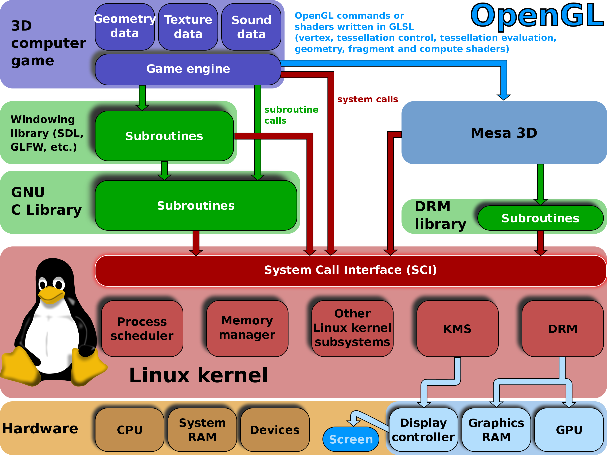

# GPU

## Intro

## How to Use

### Quick PyTorch Install

Goto `https://developer.nvidia.com/cuda-downloads?target_os=Linux&target_arch=x86_64&Distribution=Ubuntu&target_version=20.04&target_type=deb_local` to install driver.

Download and install Anaconda (in China, goto `https://mirrors.tuna.tsinghua.edu.cn/help/anaconda/`).

Goto `https://pytorch.org/get-started/locally/` to install pytorch `pip3 install torch torchvision torchaudio --index-url https://download.pytorch.org/whl/cu118` (Sometimes `--upgrade --force-reinstall` is required if in python `torch.cuda.is_available()` says no after repeated reinstalls).

## CUDA cores vs Tensor Cores

* CUDA cores focus on more traditional computational tasks across various industries like gaming, scientific research, and video editing
* Tensor cores cater specifically to AI-related workloads such as image recognition, and natural language processing

## Nvidia GPU and Ubuntu Monitor Display (HDMI Signal)

Incompatible Nvidia GPU driver versions can cause Ubuntu failed to detect HDMI signal (Monitor Display).
This happens happens when just having installed/updated Anaconda, CUDA, PyTorch, or other GPU related software.

Run below bash to re-install Nvidia driver. 

```bash
sudo ubuntu-drivers autoinstall

## Optional fix
sudo apt --fix-broken install
```

## OpenGL

OpenGL (Open Graphics Library) is a popular APIs for rendering 2D and 3D vector graphics,
managed by Khronos Group (The Khronos Group, Inc. is an open, non-profit, member-driven consortium of 170 organizations developing, publishing and maintaining royalty-free interoperability standards for 3D graphics, virtual reality, augmented reality, parallel computation, vision acceleration and machine learning).

<div style="display: flex; justify-content: center;">
      
</div>
</br>

OpenGL is the often the default acceleration program for Linux-like systems, such as gaming platform steam, browsers, and video players.

### OpenGL vs DirectX

Both openGL vs DirectX serve the same use scenarios of accelerating computing graphic tasks,
but DirectX is proprietary + non-open source owned by Microsoft.
Generally speaking, DirectX outperforms OpenGL in most graphic tasks.

|OpenGL|DirectX|
|-|-|
|Open source, cross-platform (Linux, Mac OS, and Windows)|Non-open source, only on Windows (and Microsoft platforms such as Xbox)|
|Generally worse in performance, such as no support for ray tracing computation facilitation (popular in gaming)|Generally Better in performance|