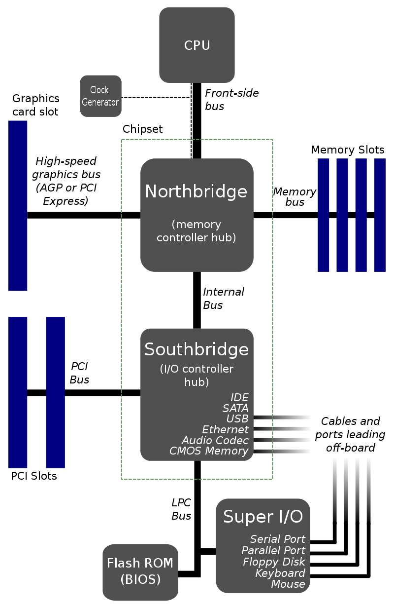

# Motherboard

Northbridge is for high-speed clock component communication, e.g., memory.
Southbridge is for low-speed clock component communication, e.g., peripherals.

      

 

      

 

### Latency

      

 

## DDR SDRAM

Double Data Rate Synchronous Dynamic Random-Access Memory (DDR SDRAM) is a double data rate (DDR) synchronous dynamic random-access memory (SDRAM) 
