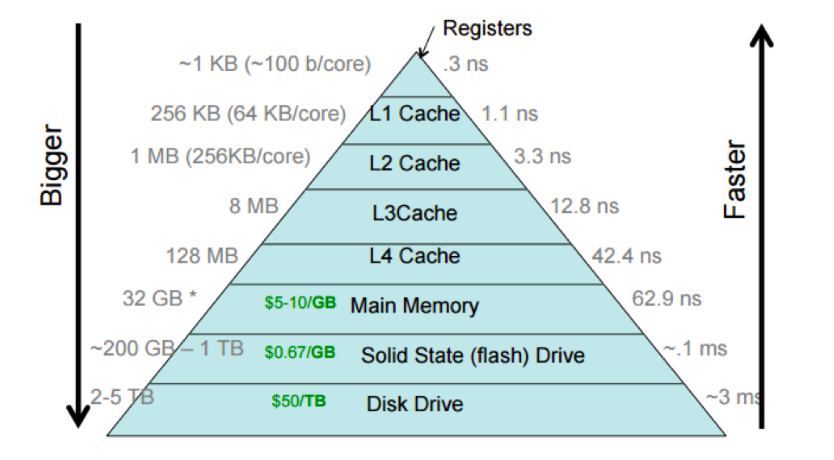

# Motherboard

Northbridge is for high-speed clock component communication, e.g., memory.
Southbridge is for low-speed clock component communication, e.g., peripherals.

      

 

      

 

### Latency

      

 

## PCIE

## Resizable BAR / Smart Access Memory

* The Old Way (before ReBAR): The CPU could only "see" and map a tiny 256MB window of the GPU's VRAM at any given time. If a game needed to transfer a 1GB asset, it had to be broken up into four separate 256MB transfers. The CPU had to be involved four times to set up each chunk, adding overhead.
* The New Way (with ReBAR/SAM): This technology allows the CPU to see and map the GPU's entire VRAM (all 32GB of your hypothetical 5090) as one single, continuous block.

## Case Study: A Typical Data Traffic Flow - Video Rendering by GPU

Hardware provisioned:

* ASUS Z890
* DDR5-8400 Memory
* Motherboard with PCIE 5.0
* GPU 5090 (32 GB VRAM, 1536 GB/s)
* NVMe SSD on PCIE 5.0

A general process:

1. Launch Video Streaming: User initiated action to open a video file
2. SSD to System RAM: The CPU instructs the DMA controller to load the video file, level map, and initial assets from NVMe SSD directly into DDR5-8400 System RAM.
3. CPU Instructs GPU: The CPU starts running the video loading logic (AI, physics, player input). It determines what needs to be drawn on the screen and sends a series of instructions, called "draw calls," to the GPU via the PCIe 5.0 bus.
4. System RAM to VRAM: The specific assets needed for the current scene are copied from the System RAM into the GPU's own 32GB of VRAM. This transfer also uses the high-speed PCIe 5.0 bus.
5. GPU Takes Over: The GPU is now in its element. GPU runs the CPU's instructions in parallel, e.g., thousands of CUDA cores, to render graphics/frames.
6. Output to Monitor: The finished frame is sent directly from the GPU to user monitor.

where data transfer from System RAM to GPU VRAM is done by DMA where a dedicated data transfer CPU component named *CPU's PCIe Root Complex* is engaged to enable fast data transfer.

ASUS Z890 is an advanced motherboard edition (by 2025) that enables ReBAR in data transfer.
