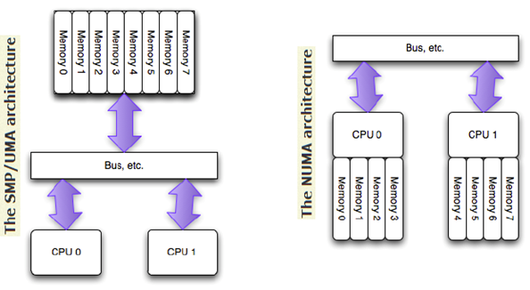

# Non-Uniform Memory Access (NUMA)

Multi-processor architecture faces a problem of having multiple processors accessing the main memory that could be slow in data retrieval.
Non-uniform memory access (NUMA) systems come with more than one system bus that helps alleviate data traffic jam.

Illustrated as below, Uniform memory access (UMA) has everything controlled by one bus, so that access consistency can be guaranteed (one variable should have one and only one memory location, and CPUs can only access this variable sequentially).

In NUMA architecture, each CPU has its own assigned memory (different from cache, they are part of main RAM memory).
If one variable is not found in one CPU assigned memory, it queries other CPUs' assigned RAM memory.

<div style="display: flex; justify-content: center;">
      
</div>
</br>

## Practices

Run `numactl --hardware` to check numa nodes.
Typically on a consumer-level computer, there would be only one numa node.
```
available: 1 nodes (0)
node 0 cpus: 0 1 2 3 4 5 6 7 8 9 10 11
node 0 size: 15789 MB
node 0 free: 916 MB
node distances:
node   0 
  0:  10 
```