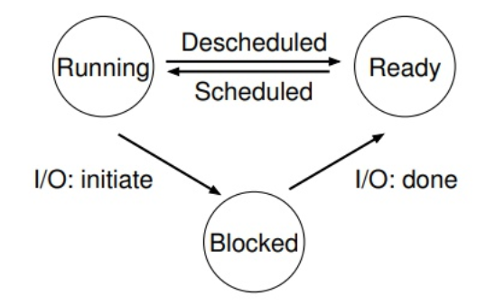
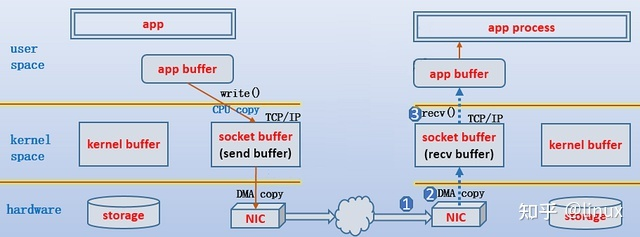
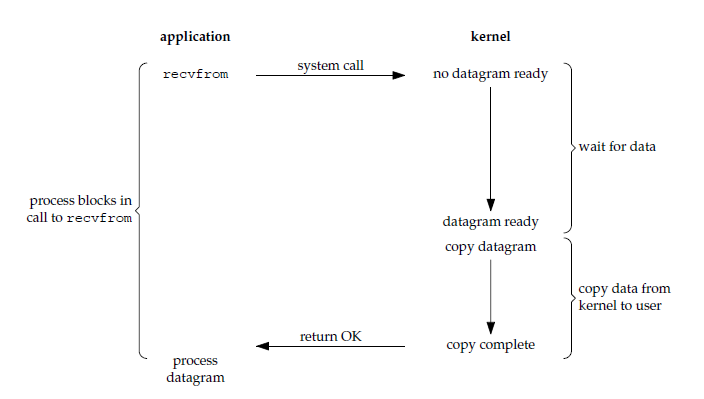
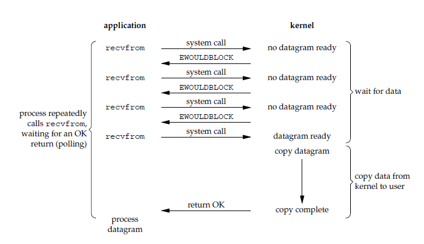
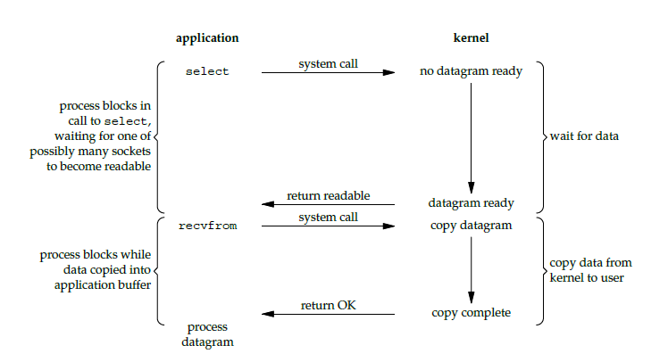
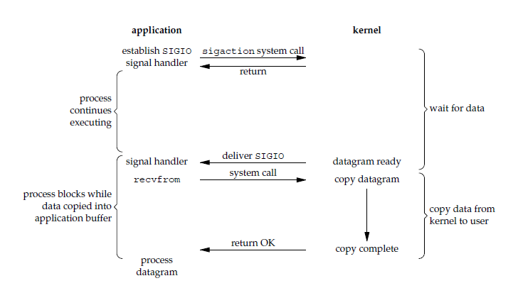
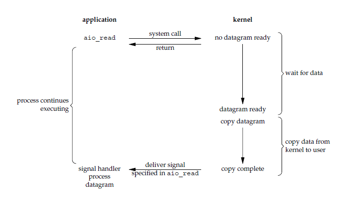

# Linux I/O

## Blocking I/O

An OS process should have three states: *Running*, *Ready* and *Blocked*.

* Running: the process is getting executed on a CPU
* Ready: the process is ready to be executed, but for some reason, OS chooses not to run it now, might run it later
* Blocked: the process is waiting for a reply so that it can proceed execution.
For example, a process sends an I/O request to OS, it will be blocked at a `read()` instruction, until OS responds with some data.

<div style="display: flex; justify-content: center;">
      
</div>
</br>

During I/O blocking, the current process does not occupy CPU resource, simply waiting for I/O response.

In detail, in Linux, a typical I/O process is
1. I/O request raised in user space
2. OS generates a system interrupt, user space process is blocked, execution is transferred to kernel space
3. kernel reads file for data and goes back with data
4. user process is waken up and sets the process state to ready.

## Five I/O Modes

Below is example of Linux I/O arch for TCP/IP communication.

<div style="display: flex; justify-content: center;">
      
</div>
</br>

reference: https://programmerall.com/article/37681060266/

### Synchronous blocking I/O

1) During `recv()`/`recvfrom()` system call, kernel waits until at least one complete data packet arrives (such as one UDP/TCP packet). User process is blocked during the wait. 

2) Once arrived, kernel copies data from kernel memory to user process memory. 




### Synchronous non-blocking I/O

1) While kernel waits for at least one complete data packet arrives, user process is not blocked by `recv()`/`recvfrom()`, but continues running next line of code. However, `recv()`/`recvfrom()` receives `err_no` from system call indicating the data is not yet ready.

2) `recv()`/`recvfrom()` returns positive result when data is ready, and it is up to user process when to call `recv()`/`recvfrom()` again.



### I/O multiplexing

I/O multiplexing is what we call `select`, `poll`, `epoll`, and some places also call this I/O method as event driven I/O. 

Kernel checks data by polling, same as sync blocking and non-blocking I/O modes, but multiplexing use one process to check many sockets in charge, thus cost-efficient.

This behavior is same as sync blocking I/O's, with addition of being cost-efficient for multiple socket communication. If socket number is small, sync blocking I/O is even better.

1) when a user process calls `select`, user process is blocked, and kernel monitors all sockets registered under the `select`.

2) Kernel returns ready to notify the user process to invoke `read` to retrieve data.




### Signal-driven I/O (signal-driven I/O)

1) A user process calls a `read` then continues running next line of code. Kernel notifies the user process by system signal `SIGIO` to the process. 

2) The user process invokes a `recvfrom` function on receiving `SIGIO`.

CPU utilization rate is higher than polling for signal-driven mode.




### Asynchronous non-blocking I/O (asynchronous I/O)

A user process inits/invokes `aio_read` which immediately returns. When data is ready, kernel signals the user process to invoke a callback function.




## File descriptor

Given an open file cmd:
```cpp
int fd;
fd = open(pathname, O_RDWR);
```
The returned `fd` is a file descriptor (an  int greater than zero). Linux OS create a process mapping `fd` onto a table (`files_struct` inside *linux/fdtable.h*) describing this opened file, such as
```cpp
struct file_struct {
    atomic_t count;
    bool resize_in_progress;
    // ... many other attrinutes
}
```

There are three defined file descriptor integers: 
* stdin: 0 (standard input)
* stdout: 1 (standard output)
* stderr: 2 (standard error output)

Typical they refer to keyboard input and monitor/shell output.

## Shell Redirection

Shell redirection is not even *C* nor *Linux* standard, but rather for *bash* of the given syntax for input
```bash
[fd]<string_stream
```
and for output
```bash
[fd]>string_stream
```
where by defult `fd=0` when no `fd` is present, such as
```bash
>new_file.txt # create a new file
echo "hello world" > new_file.txt # input "hello world" into a new file 
```
