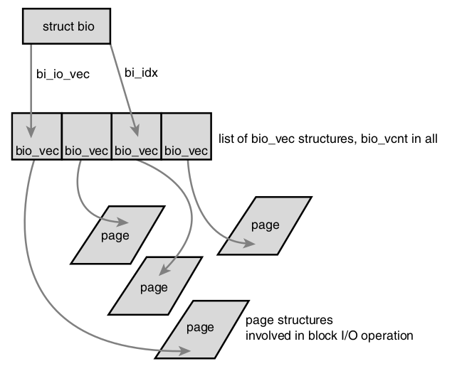

# Block IO/Peripheral/Devices Layer

## Block Devices vs Char Devices

### Block Device

*Block devices* are hardware devices distinguished by the random (that is, not necessarily sequential) access of fixed-size chunks of data. The fixed-size chunks of data are called *blocks*. 

The smallest addressable unit on a block device is a *sector*. Sectors come in various powers of two, but 512 bytes is the most common size. The device cannot address or operate on a unit smaller than the sector. Block size is greater than a sector but smaller than a page. 

For example, many CD-ROM discs have 2-kilobyte sectors.

### Char Device

The other basic type of device is a *character device*. Character devices, or char devices, are accessed as a stream of sequential data, one byte after another. Example character devices are serial ports and keyboards. If the hardware device is accessed as a stream of data, it is
implemented as a character device.

The difference comes down to whether the device accesses data in random or in order. If data such as keyboard inputs comes as a stream one char after another in sequence, it is a char device, whereas a block device sees its data in the form of *block* scattered in different places.

### Buffer

When a block is stored in memory — say, after a read or pending a write—it is stored in a *buffer*. 
Each buffer is associated with exactly one block. The buffer serves as the object that represents a disk block in memory.

Each buffer has an associated *descriptor* named *buffer head*.
```cpp
struct buffer_head {
    unsigned long b_state;              /* buffer state flags */
    struct buffer_head *b_this_page;    /* list of page’s buffers */
    struct page *b_page;                /* associated page */
    sector_t b_blocknr;                 /* starting block number */
    size_t b_size;                      /* size of mapping */
    char *b_data;                       /* pointer to data within the page */
    struct block_device *b_bdev;        /* associated block device */
    bh_end_io_t *b_end_io;              /* I/O completion */
    void *b_private;                    /* reserved for b_end_io */
    struct list_head b_assoc_buffers;   /* associated mappings */
    struct address_space *b_assoc_map;  /* associated address space */
    atomic_t b_count;                   /* use count */
};
```

Not only did the buffer head describe the disk-block-to-physical-page mapping, but it also acted as the container used for all block I/O.

## `bio`

The basic container for block I/O within the kernel is the `bio` structure. This structure represents block I/O operations that are in flight (active) as a list of *segments*. A segment is a chunk of a buffer that is contiguous in memory. Thus, individual buffers need not be contiguous in memory.

The primary purpose of a bio structure is to represent an in-flight block I/O operation.

```cpp
struct bio {
    sector_t        bi_sector;      /* associated sector on disk */
    struct bio      *bi_next;       /* list of requests */
    struct block_device *bi_bdev;   /* associated block device */
    unsigned long   bi_flags;       /* status and command flags */
    unsigned long   bi_rw;          /* read or write? */
    unsigned short  bi_vcnt;        /* number of bio_vecs off */
    unsigned short  bi_idx;         /* current index in bi_io_vec */
    unsigned short  bi_phys_segments;   /* number of segments */
    struct bio_vec  *bi_io_vec;     /* bio_vec list */
    unsigned int    bi_size;        /* I/O count */
    unsigned int    bi_seg_front_size;  /* size of first segment */
    unsigned int    bi_seg_back_size;   /* size of last segment */
    struct bio_vec  bi_inline_vecs[0];  /* inline bio vectors */
};
```

The `bi_io_vec` field points to an array of `bio_vec` structures. These structures are used as lists of individual segments in this specific block I/O operation. Each `bio_vec` is treated as a vector of the form `<page, offset, len>`, which describes a specific segment: the physical page on which it lies, the location of the block as an offset into the page, and the length of the block starting from the given offset.The full array of these vectors describes the entire buffer.
```cpp
struct bio_vec {
    /* pointer to the physical page on which this buffer resides */
    struct page *bv_page;
    /* the length in bytes of this buffer */
    unsigned int bv_len;
    /* the byte offset within the page where the buffer resides */
    unsigned int bv_offset;
};
```

The first segment in the I/O operation is pointed to by b_io_vec . Each additional segment follows after the first, for a total of `bi_vcnt` segments in the list.As the block I/O layer submits segments in the request, the `bi_idx` field is updated to point to the current segment.

The bio structure maintains a usage count in the bi_cnt field.When this field reaches zero, the structure is destroyed and the backing memory is freed. `void bio_get(struct bio *bio)` increments the count, whereas `void bio_put(struct bio *bio)` decrements it.



## Request Queue and I/O Scheduler

Block devices maintain *request* queues to store their pending block I/O requests. The request queue is represented by the `request_queue` structure. Seeking for the position of block sectors can be time-consuming.

As long as the request queue is nonempty, the block device driver associated with the queue grabs the request from the head of the queue and submits it to its associated block device. Each item in the queue’s request list is a single request, of type `struct request` .

### Merge and Sort

Linux kernel I/O scheduler performs operations called *merging* and *sorting* on pending requests.

Merging is the coalescing of two or more requests into one. For example, multiple requests reading on adjacent sectors on the disk can be merged into one requests. 

*Sort* refers to sector-wise sorting on requests, so that all seeking activity along the queue moves (as much as possible) sequentially over the sectors of the hard disk. Requests of adjacent sectors are sorted to be placed together.

Besides, merge and sort consider other scenarios:
* Age of requests, that old requests are processed first rather than kept appending at the end of a queue
* Anticipation of requests, that when scheduler anticipates bulk writing of a large file to contiguous block sectors, it suspends other operations but keeps waiting for bytes to write. Otherwise, if have had frequent interruptive operations in between, scheduler needs re-seeking the last write position for this large file every time it finishes the other operations.
* Priority of issued processes, that if the request issued process is of high priority, its I/O submissions are of high priority as well.