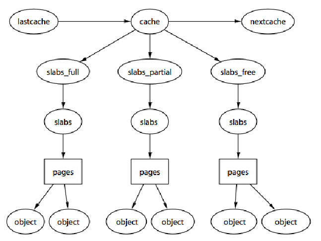

# Memory Implementation in Linux Kernel

## Zones

Kernel uses *zones* to classify pages. 

* Some hardware devices can perform DMA (direct memory access) to only certain memory addresses.
* Some architectures can physically addressing larger amounts of memory than they can virtually address. Consequently, some memory is not permanently mapped into the kernel address space.

Given these constraints, Linux has four primary memory zones:
* `ZONE_DMA` —This zone contains pages that can undergo DMA.
* `ZONE_DMA32` —Like `ZOME_DMA` , this zone contains pages that can undergo DMA. Unlike ZONE_DMA , these pages are accessible only by 32-bit devices. On some architectures, this zone is a larger subset of memory.
* `ZONE_NORMAL` —This zone contains normal, regularly mapped, pages.
* ZONE_HIGHMEM —This zone contains “high memory,” which are pages not permanently mapped into the kernel’s address space.

## Slab

Slab mechanism is used to better manage memory allocation/deallocation through a *free list*, which contains information about used/available memory blocks.

Detailed operations:

* Frequently used data structures tend to be allocated and freed often, so cache them.
* Frequent allocation and deallocation can result in memory fragmentation (the inability to find large contiguous chunks of available memory).To prevent this, the cached free lists are arranged contiguously. 
* If the allocator is aware of concepts such as object size, page size, and total cache size, it can make more intelligent decisions.
* Stored objects can be colored to prevent multiple objects from mapping to the same cache lines.

### Slab Design



* The slab layer divides different objects into groups called caches. 

Cache is defined in `kmem_cache`
```cpp
struct kmem_cache {
    struct array_cache __percpu *cpu_cache;  // To find free mem node info

    unsigned int batchcount;        
    unsigned int limit;             // max supported sizes, sum of all nodes' mem
    unsigned int shared;            
    unsigned int size; // size for every mem block, including user space, pad and kasan
    unsigned int num;             // max num of pages
    unsigned int gfporder;     
    gfp_t allocflags;    

    size_t colour;  
    unsigned int colour_off;
    struct kmem_cache *freelist_cache; // kmem_cache as list
    unsigned int freelist_size;     

    const char *name;  
    int object_size;  // max size available for an object
    int align; 

#ifdef CONFIG_KASAN
    struct kasan_cache kasan_info;  // kasan info, used for invalid mem access checking
#endif

    unsigned int useroffset;    /* Usercopy region offset */
    unsigned int usersize;        /* Usercopy region size */

    struct kmem_cache_node *node[MAX_NUMNODES];  // record mem node info
};


struct kmem_cache_node {
    spinlock_t list_lock;

    struct list_head slabs_partial;  // list of not yet used pages
    struct list_head slabs_full; // list of used pages
    struct list_head slabs_free; // list available pages
    unsigned long total_slabs;    /* length of all slab lists */
    unsigned long free_slabs;    /* length of free slab list only */
    unsigned long free_objects;  
    unsigned int free_limit; 
    unsigned int colour_next;    /* Per-node cache coloring */
    struct array_cache *shared;    // shared mem node
    struct alien_cache **alien;    /* on other nodes */
    unsigned long next_reap;    /* updated without locking */
    int free_touched;        /* updated without locking */
};
```

To get free pages
```cpp
static void *kmem_getpages(struct kmem_cache *cachep, gfp_t flags, int nodeid)
{
	addr = (void*)__get_free_pages(flags, cachep->gfporder);
	page = virt_to_page(addr);
}
```

* The caches are then divided into slabs, which are composed of one or more physically contiguous pages.Typically, slabs are composed of only a single page. Each cache may consist of multiple slabs.

A slab descriptor, `struct slab` , represents each slab:
```cpp
struct slab {
    struct list_head 	list;		// full, partial, or empty list 
    unsigned long		colouroff;	// offset for the slab coloring 
    void				*s_mem;		// first object in the slab 
    unsigned int		inuse;		// allocated objects in the slab 
    kmem_bufctl_t 		free;		// first free object, if any 
};
```

Each slab contains some number of objects, which are the data structures being cached.

### Example of Mem Allocation for A Task

During kernel initialization, in `fork_init()` , defined in `kernel/fork.c` , the cache is created. which stores objects of type `struct task_struct`

```cpp
task_struct_cachep = kmem_cache_create(“task_struct”, sizeof(struct task_struct), ARCH_MIN_TASKALIGN, SLAB_PANIC | SLAB_NOTRACK, NULL);
```

Each time a process calls fork() , a new process descriptor must be created.
```cpp
tsk = kmem_cache_alloc(task_struct_cachep, GFP_KERNEL);
```

After a task dies, if it has no children waiting on it, its process descriptor is freed and returned to the `task_struct_cachep` slab cache.
```cpp
kmem_cache_free(task_struct_cachep, tsk);
```

Because process descriptors are part of the core kernel and always needed, the `task_struct_cachep` cache is never destroyed, hence requiring the below action.
```cpp
err = kmem_cache_destroy(task_struct_cachep);
```

## Page in Linux

### Allocate A Page 

|Method|Description|
|-|-|
|`struct page * alloc_page(gfp_t gfp_mask)`|Allocates a single page and returns a pointer to its|
|`struct page * alloc_pages(gfp_t gfp_mask, unsigned int order)`|This allocates $2^{order}$ (that is, $1$ << order ) contiguous physical pages and returns a pointer to the first page’s page structure; on error it returns `NULL`.|
|`unsigned long __get_free_pages(gfp_t gfp_mask, unsigned int order)`|Allocates a single page and returns a pointer to its logical address|
|`unsigned long get_zeroed_page(unsigned int gfp_mask)`|This function works the same as `__get_free_page()` , except that the allocated page is then zero-filled—every bit of every byte is unset.|
|`void __free_pages(struct page *page, unsigned int order)`|Free allocated pages|

### Page Struct

The `virtual` field is the page’s virtual address. Normally, this is simply the address of
the page in virtual memory. 
```cpp
void *virtual;			/* Kernel virtual address (NULL if not kmapped, ie. highmem) */
```

The `Page` struct is defined as below. 
```cpp
struct address_space;
struct mem_cgroup;

/*
 * Each physical page in the system has a struct page associated with
 * it to keep track of whatever it is we are using the page for at the
 * moment. Note that we have no way to track which tasks are using
 * a page, though if it is a pagecache page, rmap structures can tell us
 * who is mapping it.
 *
 * If you allocate the page using alloc_pages(), you can use some of the
 * space in struct page for your own purposes.  The five words in the main
 * union are available, except for bit 0 of the first word which must be
 * kept clear.  Many users use this word to store a pointer to an object
 * which is guaranteed to be aligned.  If you use the same storage as
 * page->mapping, you must restore it to NULL before freeing the page.
 *
 * If your page will not be mapped to userspace, you can also use the four
 * bytes in the mapcount union, but you must call page_mapcount_reset()
 * before freeing it.
 *
 * If you want to use the refcount field, it must be used in such a way
 * that other CPUs temporarily incrementing and then decrementing the
 * refcount does not cause problems.  On receiving the page from
 * alloc_pages(), the refcount will be positive.
 *
 * If you allocate pages of order > 0, you can use some of the fields
 * in each subpage, but you may need to restore some of their values
 * afterwards.
 *
 * SLUB uses cmpxchg_double() to atomically update its freelist and counters.
 * That requires that freelist & counters in struct slab be adjacent and
 * double-word aligned. Because struct slab currently just reinterprets the
 * bits of struct page, we align all struct pages to double-word boundaries,
 * and ensure that 'freelist' is aligned within struct slab.
 */
#ifdef CONFIG_HAVE_ALIGNED_STRUCT_PAGE
#define _struct_page_alignment	__aligned(2 * sizeof(unsigned long))
#else
#define _struct_page_alignment
#endif

struct page {
	unsigned long flags;		/* Atomic flags, some possibly
					 * updated asynchronously */
	/*
	 * Five words (20/40 bytes) are available in this union.
	 * WARNING: bit 0 of the first word is used for PageTail(). That
	 * means the other users of this union MUST NOT use the bit to
	 * avoid collision and false-positive PageTail().
	 */
	union {
		struct {	/* Page cache and anonymous pages */
			/**
			 * @lru: Pageout list, eg. active_list protected by
			 * lruvec->lru_lock.  Sometimes used as a generic list
			 * by the page owner.
			 */
			union {
				struct list_head lru;
				/* Or, for the Unevictable "LRU list" slot */
				struct {
					/* Always even, to negate PageTail */
					void *__filler;
					/* Count page's or folio's mlocks */
					unsigned int mlock_count;
				};
			};
			/* See page-flags.h for PAGE_MAPPING_FLAGS */
			struct address_space *mapping;
			pgoff_t index;		/* Our offset within mapping. */
			/**
			 * @private: Mapping-private opaque data.
			 * Usually used for buffer_heads if PagePrivate.
			 * Used for swp_entry_t if PageSwapCache.
			 * Indicates order in the buddy system if PageBuddy.
			 */
			unsigned long private;
		};
		struct {	/* page_pool used by netstack */
			/**
			 * @pp_magic: magic value to avoid recycling non
			 * page_pool allocated pages.
			 */
			unsigned long pp_magic;
			struct page_pool *pp;
			unsigned long _pp_mapping_pad;
			unsigned long dma_addr;
			union {
				/**
				 * dma_addr_upper: might require a 64-bit
				 * value on 32-bit architectures.
				 */
				unsigned long dma_addr_upper;
				/**
				 * For frag page support, not supported in
				 * 32-bit architectures with 64-bit DMA.
				 */
				atomic_long_t pp_frag_count;
			};
		};
		struct {	/* Tail pages of compound page */
			unsigned long compound_head;	/* Bit zero is set */

			/* First tail page only */
			unsigned char compound_dtor;
			unsigned char compound_order;
			atomic_t compound_mapcount;
			atomic_t compound_pincount;
#ifdef CONFIG_64BIT
			unsigned int compound_nr; /* 1 << compound_order */
#endif
		};
		struct {	/* Second tail page of compound page */
			unsigned long _compound_pad_1;	/* compound_head */
			unsigned long _compound_pad_2;
			/* For both global and memcg */
			struct list_head deferred_list;
		};
		struct {	/* Page table pages */
			unsigned long _pt_pad_1;	/* compound_head */
			pgtable_t pmd_huge_pte; /* protected by page->ptl */
			unsigned long _pt_pad_2;	/* mapping */
			union {
				struct mm_struct *pt_mm; /* x86 pgds only */
				atomic_t pt_frag_refcount; /* powerpc */
			};
#if ALLOC_SPLIT_PTLOCKS
			spinlock_t *ptl;
#else
			spinlock_t ptl;
#endif
		};
		struct {	/* ZONE_DEVICE pages */
			/** @pgmap: Points to the hosting device page map. */
			struct dev_pagemap *pgmap;
			void *zone_device_data;
			/*
			 * ZONE_DEVICE private pages are counted as being
			 * mapped so the next 3 words hold the mapping, index,
			 * and private fields from the source anonymous or
			 * page cache page while the page is migrated to device
			 * private memory.
			 * ZONE_DEVICE MEMORY_DEVICE_FS_DAX pages also
			 * use the mapping, index, and private fields when
			 * pmem backed DAX files are mapped.
			 */
		};

		/** @rcu_head: You can use this to free a page by RCU. */
		struct rcu_head rcu_head;
	};

	union {		/* This union is 4 bytes in size. */
		/*
		 * If the page can be mapped to userspace, encodes the number
		 * of times this page is referenced by a page table.
		 */
		atomic_t _mapcount;

		/*
		 * If the page is neither PageSlab nor mappable to userspace,
		 * the value stored here may help determine what this page
		 * is used for.  See page-flags.h for a list of page types
		 * which are currently stored here.
		 */
		unsigned int page_type;
	};

	/* Usage count. *DO NOT USE DIRECTLY*. See page_ref.h */
	atomic_t _refcount;

#ifdef CONFIG_MEMCG
	unsigned long memcg_data;
#endif

	/*
	 * On machines where all RAM is mapped into kernel address space,
	 * we can simply calculate the virtual address. On machines with
	 * highmem some memory is mapped into kernel virtual memory
	 * dynamically, so we need a place to store that address.
	 * Note that this field could be 16 bits on x86 ... ;)
	 *
	 * Architectures with slow multiplication can define
	 * WANT_PAGE_VIRTUAL in asm/page.h
	 */
#if defined(WANT_PAGE_VIRTUAL)
	void *virtual;			/* Kernel virtual address (NULL if
					   not kmapped, ie. highmem) */
#endif /* WANT_PAGE_VIRTUAL */

#ifdef LAST_CPUPID_NOT_IN_PAGE_FLAGS
	int _last_cpupid;
#endif
} _struct_page_alignment;
```

`struct address_space` is used to map `struct inode` to `struct page`.
`address_space_operations` has methods operating the inode-mapped file, such as read/write.
```cpp
struct address_space {
 
       struct inode   *host;  /* owner: inode, block_device */
       struct radix_tree_root    page_tree;/* radix tree of all pages */
       rwlock_t        tree_lock;  /* and rwlock protecting it   */
       unsigned int   i_mmap_writable;/* count VM_SHARED mappings */
       struct prio_tree_root      i_mmap;         /* tree of private and shared mappings */
       struct list_head       i_mmap_nonlinear;/*list VM_NONLINEAR mappings */
       spinlock_t              i_mmap_lock; /* protect tree, count, list */
       unsigned int           truncate_count;      /* Cover race condition with truncate */
       unsigned long         nrpages;  /* number of total pages */
       pgoff_t                  writeback_index;/* writeback starts here */
       struct address_space_operations *a_ops;     /* methods  */
       unsigned long         flags;             /* error bits/gfp mask  */
       struct backing_dev_info *backing_dev_info; /* device readahead */
       spinlock_t              private_lock;   /* for use by the address_space */
       struct list_head       private_list;     /* ditto */
       struct address_space     *assoc_mapping;    /* ditto */
} __attribute__((aligned(sizeof(long))));
```

``` cpp
/*
 * Keep mostly read-only and often accessed (especially for
 * the RCU path lookup and 'stat' data) fields at the beginning
 * of the 'struct inode'
 */
struct inode {
	umode_t			i_mode;
	unsigned short		i_opflags;
	kuid_t			i_uid;
	kgid_t			i_gid;
	unsigned int		i_flags;

#ifdef CONFIG_FS_POSIX_ACL
	struct posix_acl	*i_acl;
	struct posix_acl	*i_default_acl;
#endif

	const struct inode_operations	*i_op;
	struct super_block	*i_sb;
	struct address_space	*i_mapping;

#ifdef CONFIG_SECURITY
	void			*i_security;
#endif

	/* Stat data, not accessed from path walking */
	unsigned long		i_ino;
	/*
	 * Filesystems may only read i_nlink directly.  They shall use the
	 * following functions for modification:
	 *
	 *    (set|clear|inc|drop)_nlink
	 *    inode_(inc|dec)_link_count
	 */
	union {
		const unsigned int i_nlink;
		unsigned int __i_nlink;
	};
	dev_t			i_rdev;
	loff_t			i_size;
	struct timespec64	i_atime;
	struct timespec64	i_mtime;
	struct timespec64	i_ctime;
	spinlock_t		i_lock;	/* i_blocks, i_bytes, maybe i_size */
	unsigned short          i_bytes;
	u8			i_blkbits;
	u8			i_write_hint;
	blkcnt_t		i_blocks;

#ifdef __NEED_I_SIZE_ORDERED
	seqcount_t		i_size_seqcount;
#endif

	/* Misc */
	unsigned long		i_state;
	struct rw_semaphore	i_rwsem;

	unsigned long		dirtied_when;	/* jiffies of first dirtying */
	unsigned long		dirtied_time_when;

	struct hlist_node	i_hash;
	struct list_head	i_io_list;	/* backing dev IO list */
#ifdef CONFIG_CGROUP_WRITEBACK
	struct bdi_writeback	*i_wb;		/* the associated cgroup wb */

	/* foreign inode detection, see wbc_detach_inode() */
	int			i_wb_frn_winner;
	u16			i_wb_frn_avg_time;
	u16			i_wb_frn_history;
#endif
	struct list_head	i_lru;		/* inode LRU list */
	struct list_head	i_sb_list;
	struct list_head	i_wb_list;	/* backing dev writeback list */
	union {
		struct hlist_head	i_dentry;
		struct rcu_head		i_rcu;
	};
	atomic64_t		i_version;
	atomic64_t		i_sequence; /* see futex */
	atomic_t		i_count;
	atomic_t		i_dio_count;
	atomic_t		i_writecount;
#if defined(CONFIG_IMA) || defined(CONFIG_FILE_LOCKING)
	atomic_t		i_readcount; /* struct files open RO */
#endif
	union {
		const struct file_operations	*i_fop;	/* former ->i_op->default_file_ops */
		void (*free_inode)(struct inode *);
	};
	struct file_lock_context	*i_flctx;
	struct address_space	i_data;
	struct list_head	i_devices;
	union {
		struct pipe_inode_info	*i_pipe;
		struct cdev		*i_cdev;
		char			*i_link;
		unsigned		i_dir_seq;
	};

	__u32			i_generation;

#ifdef CONFIG_FSNOTIFY
	__u32			i_fsnotify_mask; /* all events this inode cares about */
	struct fsnotify_mark_connector __rcu	*i_fsnotify_marks;
#endif

#ifdef CONFIG_FS_ENCRYPTION
	struct fscrypt_info	*i_crypt_info;
#endif

#ifdef CONFIG_FS_VERITY
	struct fsverity_info	*i_verity_info;
#endif

	void			*i_private; /* fs or device private pointer */
} __randomize_layout;
```

```cpp
typedef struct {
	int counter;
} atomic_t;
```