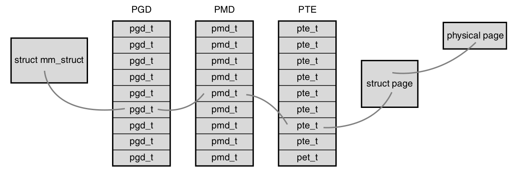

# Page

## Translation Process

The memory management unit (MMU) inside the CPU stores a cache of recently used mappings from the operating system's page table. 
This is called the translation lookaside buffer (TLB), which is an associative cache.

1. If of TLB hit, directly output physical addr
2. If of TLB miss, look up the address mapping in the page table; if found, output physical addr
3. If of page table miss, page fault occurs, and OS establishes the mapping between physical addr and page table

## Page Table

When an application accesses a virtual memory address, it must first be converted to a physical address before the processor can resolve the request. 
Performing this lookup is done via page tables. 
Page tables work by splitting the virtual address into chunks. Each chunk is used as an index into a table.
The table points to either another table or the associated physical page.

Linux implements three-level page table that
1. page global directory (PGD), which consists of an array of `pgd_t` types, that point to entries in the second-level directory, the PMD.
2. page middle directory (PMD), which is an array of `pmd_t` types.The entries in the PMD point to entries in the PTE.
3. the page table and consists of page table entries of type `pte_t` . Page table entries point to physical pages.

Each process has its own page tables (threads share them, of course). The `pgd` field of
the memory descriptor points to the process’s page global directory. Manipulating and
traversing page tables requires the `page_table_lock`.

<div style="display: flex; justify-content: center;">
      
</div>
</br>

This is useful since often the top-most parts and bottom-most parts of virtual memory are used in running a process - the top is often used for text and data segments while the bottom for stack, with free memory in between. 

A typical implementation is $1024$-entry $4$ KB pages that cover $4$ MB of virtual memory ($4$ bytes per one pointer/entry).

$4$ GB ($2^{32}$ bytes) space with a page size of $4$ KB ($2^{12}$ bytes) needs $2^{20}$ pages.

### Strategies

* Use *cache hit rate* and *cache miss rate* to measure the use frequency of data.
* Cache is removed if the last time use is old
* Two lists are employed as the underlying data structures: *active list* maintains frequent use data and *inactive list* maintains non-frequent use data.

### Page Cache Entity

`address_space` is used to manage entries in the cache and page I/O operations.

```cpp
struct address_space {
    struct inode        *host;      /* owning inode */
    struct radix_tree_root page_tree;/* radix tree of all pages */
    spinlock_t          tree_lock;  /* page_tree lock */
    struct prio_tree_root   i_mmap; /* list of all mappings */
    unsigned long       nrpages;    /* total number of pages */
    pgoff_t             writeback_index;/* writeback start offset */
    struct address_space_operations *a_ops;/* operations table */
    unsigned long       flags;      /* gfp_mask and error flags */
    struct backing_dev_info *backing_dev_info;/* read-ahead information */
};
```
where 
* The `i_mmap` field is a priority search tree of all shared and private mappings in this address space.

### Address Space Operations

```cpp
struct address_space_operations {
    int (*writepage)(struct page *, struct writeback_control *);
    int (*readpage) (struct file *, struct page *);
    int (*sync_page) (struct page *);
    int (*writepages) (struct address_space *, struct writeback_control *);
    int (*set_page_dirty) (struct page *);
    int (*readpages) (struct file *, struct address_space *, struct list_head *, unsigned);
    int (*invalidatepage) (struct page *, unsigned long);
};
```

### Flusher Threads

Write operations are deferred in the page cache. When data in the page cache is newer than the data on the backing store, we call that data *dirty*. Dirty pages that accumulate in memory eventually need to be written back to disk. Dirty page writeback occurs in three situations (called *flush*):
* When free memory shrinks below a specified threshold, the kernel writes dirty data back to disk.
* When dirty data grows older than a specific threshold, sufficiently old data is writeback to disk.
* When a user process invokes the `sync()` and `fsync()` system calls, the kernel performs writeback on demand.

In detail, there are the below settings
|Variable|Description|
|-|-|
|dirty_background_ratio|As a percentage of total memory, the number of pages at which the flusher threads begin writeback of dirty data|
|dirty_expire_interval|In milliseconds, how old data must be to be written out the next time a flusher thread wakes to perform periodic writeback.|
|dirty_ratio|As a percentage of total memory, the number of pages a process generates before it begins writeback of dirty data.|
|dirty_writeback_interval|In milliseconds, how often a flusher thread should wake up to write data back out to disk.|
|laptop_mode|A Boolean value controlling laptop mode. See the following section.|

## Page Fault

The page table lookup may fail, triggering a page fault, for two reasons:

*  No translation available for the virtual address, meaning that virtual address is invalid; typically segmentation fault
*  Page is currently not resident in physical memory. 
This will occur if the requested page has been moved out of physical memory to make room for another page (such as stored in disk rather than RAM).
Swap happens.

## Page Cache

*Page Cache* is to minimize disk I/O by storing data in physical memory that would otherwise require disk access.

*Page writeback* refers to the process by which changes to the page cache are propagated back to disk.