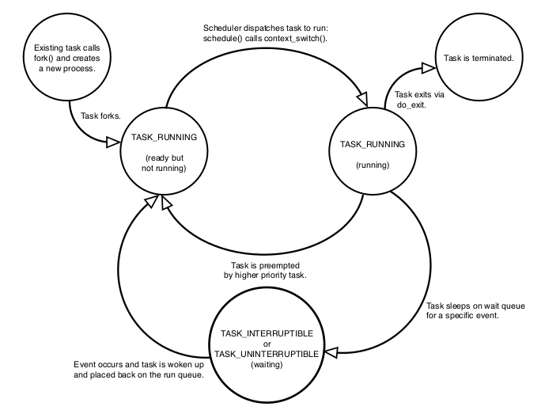
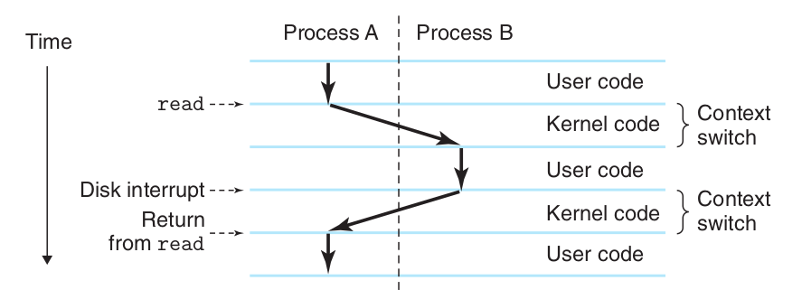

# Linux Process

The kernel stores the list of processes in a circular doubly linked list called the *task list*.
Each element in the task list is a *process descriptor* of the type `struct task_struct` in `<linux/sched.h>`. Slab allocator crates `struct thread_info`, inside which `struct task_struct` is defined.

The state field of the process descriptor describes the current condition of the process

### Process states



* TASK_RUNNING: process is runnable; it is either currently running or on a run-queue waiting to run
* TASK_INTERRUPTIBLE: process is sleeping/blocked, waiting for some conditions to wake up
* TASK_UNINTERRUPTIBLE: state is identical to TASK_INTERRUPTIBLE except that it does not wake up and become runnable if it receives a signal. 

In `top` define the below process statuses:

* D：uninterruptible sleep (usually IO)
* R：running or runnable (on run queue)
* S：interruptible sleep (waiting for an event to complete)
* T：stopped by job control signal
* t：stopped by debugger during the tracing
* W：paging (not valid since the 2.6.xx kernel)
* X：dead (should never be seen)
* Z：defunct ("zombie") process, terminated but not - reaped by its parent

### Process context

Normal program execution occurs in user-space.When a program executes a system call or triggers an exception, it enters kernel-space.
Then, kernel is said to be “executing on behalf of the process” and is in process context.

### Process hierarchy

All processes are descendants of the init process, whose PID is one.The kernel starts init in the last step of the boot process.The init process, in turn, reads the system *initscripts* and executes more programs, eventually completing the boot process.

Each `task_struct` has a pointer to the parent’s task_struct , named *parent* , and a list of children, named *children*.

### Process creation

`fork()` creates a new process by duplicating the calling process, only different on its PID. By *Copy-on-Write* method, only mutable data is copied and read-only data is shared (this method can save copy time and memory, since read-only data do not need to change).

Linux implements `fork()` via `clone()`, taking a number of flags specifying which resources to copy. The detailed implementation is by `do_fork()` that calls `copy_process()`

### Process termination

`exit()` is a system call for process termination. Every `main()` after returned calls `exit()` enforced by system.

Some important steps are
1. It sets the `PF_EXITING` flag in the flags member of the task_struct.
2. It calls `exit_mm()` to release the mm_struct held by this process. 
3. It calls `exit_sem()`. If the process is queued waiting for an IPC (Inter-Process Communication) semaphore, it is dequeued here.
4. It then calls `exit_files()` and `exit_fs()` to decrement the usage count of objects related to file descriptors and filesystem data, respectively. If either usage counts reach zero, the object is no longer in use by any process, and it is destroyed.
5. Set `exit_code` in task_struct
6. `do_eexit()` calls `schedule()` to switch to a new process. Because the process is now not schedulable, this is the last code the task will ever execute.

## Context Switch

A *context switch* is the process of storing the state of a process or thread, so that it can be restored and resume execution at a later point, and then restoring a different, previously saved, state.

Context switches are usually computationally intensive for saving and loading registers and memory maps, updating various tables and lists, etc. Cache might lose during this process. 
Each context switch requires tens of nanoseconds to microseconds of CPU time.

Below example shows user mode switching to kernel mode for I/O waiting. Mode switch is a typical context switch.

I/O work is a typical kernel task, and user mode needs to copy the I/O data from kernel mode to its user space. One salient example is socket programming.

<div style="display: flex; justify-content: center;">
      
</div>
</br>

Some typical reasons of context switch
* The process exits.
* The process uses up its time slice.
* The process requires another resource that is not currently available or needs to wait for I/O to complete.
* A resource has become available for a sleeping process. If there is a higher priority process ready to run, the kernel will run this instead (the current process is preempted).
* The process relinquishes the CPU using a semaphore or similar system call.
* In order to respond quickly to events, hardware interrupt will interrupt the normal scheduling and execution process.

### Thread Context Switch

Thread context switch depends on how much data is shared to the main process, and system call invocation.

* When a process has only one thread, it can be considered that a process is equal to a thread
* When a process has multiple threads, these threads share the same resources such as virtual memory and global variables.
* In addition, threads also have their own private data, such as stacks and registers, which also need to be saved during context switching.

### Context Switch Cost

Direct cost include

1. Load the new process/thread page table
2. Use the new process/thread kernel space stack
3. Hardware context switch
   * ip (instruction pointer) points to its next instruction
   * bp (base pointer) the bottom address of the current function/local environment stack
   * sp (stack pointer) the top address of the current function/local environment stack, will move down as as instructions get executed
   * ...
4. Process scheduler executes code

Indirect cost mainly include CPU cache refresh.

## Code

* `thread_info`

```cpp
struct thread_info {
	struct task_struct	*task;		/* main task structure */
	__u32			flags;		/* low level flags */
	__u32			status;		/* thread synchronous flags */
	__u32			cpu;		/* current CPU */
	int			saved_preempt_count;
	mm_segment_t		addr_limit;
	void __user		*sysenter_return;
	unsigned int		sig_on_uaccess_error:1;
	unsigned int		uaccess_err:1;	/* uaccess failed */
};

```
* `task_struct`

```cpp
struct task_struct {
	volatile long state;	/* -1 unrunnable, 0 runnable, >0 stopped */
	void *stack;
	atomic_t usage;
	unsigned int flags;	/* per process flags, defined below */
	unsigned int ptrace;

#ifdef CONFIG_SMP
	struct llist_node wake_entry;
	int on_cpu;
	unsigned int wakee_flips;
	unsigned long wakee_flip_decay_ts;
	struct task_struct *last_wakee;

	int wake_cpu;
#endif
	int on_rq;

	int prio, static_prio, normal_prio;
	unsigned int rt_priority;
	const struct sched_class *sched_class;
	struct sched_entity se;
	struct sched_rt_entity rt;
#ifdef CONFIG_CGROUP_SCHED
	struct task_group *sched_task_group;
#endif
	struct sched_dl_entity dl;

#ifdef CONFIG_PREEMPT_NOTIFIERS
	/* list of struct preempt_notifier: */
	struct hlist_head preempt_notifiers;
#endif

#ifdef CONFIG_BLK_DEV_IO_TRACE
	unsigned int btrace_seq;
#endif

	unsigned int policy;
	int nr_cpus_allowed;
	cpumask_t cpus_allowed;

#ifdef CONFIG_PREEMPT_RCU
	int rcu_read_lock_nesting;
	union rcu_special rcu_read_unlock_special;
	struct list_head rcu_node_entry;
	struct rcu_node *rcu_blocked_node;
#endif /* #ifdef CONFIG_PREEMPT_RCU */
#ifdef CONFIG_TASKS_RCU
	unsigned long rcu_tasks_nvcsw;
	bool rcu_tasks_holdout;
	struct list_head rcu_tasks_holdout_list;
	int rcu_tasks_idle_cpu;
#endif /* #ifdef CONFIG_TASKS_RCU */

#ifdef CONFIG_SCHED_INFO
	struct sched_info sched_info;
#endif

	struct list_head tasks;
#ifdef CONFIG_SMP
	struct plist_node pushable_tasks;
	struct rb_node pushable_dl_tasks;
#endif

	struct mm_struct *mm, *active_mm;
	/* per-thread vma caching */
	u32 vmacache_seqnum;
	struct vm_area_struct *vmacache[VMACACHE_SIZE];
#if defined(SPLIT_RSS_COUNTING)
	struct task_rss_stat	rss_stat;
#endif
/* task state */
	int exit_state;
	int exit_code, exit_signal;
	int pdeath_signal;  /*  The signal sent when the parent dies  */
	unsigned long jobctl;	/* JOBCTL_*, siglock protected */

	/* Used for emulating ABI behavior of previous Linux versions */
	unsigned int personality;

	unsigned in_execve:1;	/* Tell the LSMs that the process is doing an
				 * execve */
	unsigned in_iowait:1;

	/* Revert to default priority/policy when forking */
	unsigned sched_reset_on_fork:1;
	unsigned sched_contributes_to_load:1;
	unsigned sched_migrated:1;

#ifdef CONFIG_MEMCG_KMEM
	unsigned memcg_kmem_skip_account:1;
#endif
#ifdef CONFIG_COMPAT_BRK
	unsigned brk_randomized:1;
#endif

	unsigned long atomic_flags; /* Flags needing atomic access. */

	struct restart_block restart_block;

	pid_t pid;
	pid_t tgid;

#ifdef CONFIG_CC_STACKPROTECTOR
	/* Canary value for the -fstack-protector gcc feature */
	unsigned long stack_canary;
#endif
	/*
	 * pointers to (original) parent process, youngest child, younger sibling,
	 * older sibling, respectively.  (p->father can be replaced with
	 * p->real_parent->pid)
	 */
	struct task_struct __rcu *real_parent; /* real parent process */
	struct task_struct __rcu *parent; /* recipient of SIGCHLD, wait4() reports */
	/*
	 * children/sibling forms the list of my natural children
	 */
	struct list_head children;	/* list of my children */
	struct list_head sibling;	/* linkage in my parent's children list */
	struct task_struct *group_leader;	/* threadgroup leader */

	/*
	 * ptraced is the list of tasks this task is using ptrace on.
	 * This includes both natural children and PTRACE_ATTACH targets.
	 * p->ptrace_entry is p's link on the p->parent->ptraced list.
	 */
	struct list_head ptraced;
	struct list_head ptrace_entry;

	/* PID/PID hash table linkage. */
	struct pid_link pids[PIDTYPE_MAX];
	struct list_head thread_group;
	struct list_head thread_node;

	struct completion *vfork_done;		/* for vfork() */
	int __user *set_child_tid;		/* CLONE_CHILD_SETTID */
	int __user *clear_child_tid;		/* CLONE_CHILD_CLEARTID */

	cputime_t utime, stime, utimescaled, stimescaled;
	cputime_t gtime;
	struct prev_cputime prev_cputime;
#ifdef CONFIG_VIRT_CPU_ACCOUNTING_GEN
	seqlock_t vtime_seqlock;
	unsigned long long vtime_snap;
	enum {
		VTIME_SLEEPING = 0,
		VTIME_USER,
		VTIME_SYS,
	} vtime_snap_whence;
#endif
	unsigned long nvcsw, nivcsw; /* context switch counts */
	u64 start_time;		/* monotonic time in nsec */
	u64 real_start_time;	/* boot based time in nsec */
/* mm fault and swap info: this can arguably be seen as either mm-specific or thread-specific */
	unsigned long min_flt, maj_flt;

	struct task_cputime cputime_expires;
	struct list_head cpu_timers[3];

/* process credentials */
	const struct cred __rcu *real_cred; /* objective and real subjective task
					 * credentials (COW) */
	const struct cred __rcu *cred;	/* effective (overridable) subjective task
					 * credentials (COW) */
	char comm[TASK_COMM_LEN]; /* executable name excluding path
				     - access with [gs]et_task_comm (which lock
				       it with task_lock())
				     - initialized normally by setup_new_exec */
/* file system info */
	struct nameidata *nameidata;
#ifdef CONFIG_SYSVIPC
/* ipc stuff */
	struct sysv_sem sysvsem;
	struct sysv_shm sysvshm;
#endif
#ifdef CONFIG_DETECT_HUNG_TASK
/* hung task detection */
	unsigned long last_switch_count;
#endif
/* filesystem information */
	struct fs_struct *fs;
/* open file information */
	struct files_struct *files;
/* namespaces */
	struct nsproxy *nsproxy;
/* signal handlers */
	struct signal_struct *signal;
	struct sighand_struct *sighand;

	sigset_t blocked, real_blocked;
	sigset_t saved_sigmask;	/* restored if set_restore_sigmask() was used */
	struct sigpending pending;

	unsigned long sas_ss_sp;
	size_t sas_ss_size;
	int (*notifier)(void *priv);
	void *notifier_data;
	sigset_t *notifier_mask;
	struct callback_head *task_works;

	struct audit_context *audit_context;
#ifdef CONFIG_AUDITSYSCALL
	kuid_t loginuid;
	unsigned int sessionid;
#endif
	struct seccomp seccomp;

/* Thread group tracking */
   	u32 parent_exec_id;
   	u32 self_exec_id;
/* Protection of (de-)allocation: mm, files, fs, tty, keyrings, mems_allowed,
 * mempolicy */
	spinlock_t alloc_lock;

	/* Protection of the PI data structures: */
	raw_spinlock_t pi_lock;

	struct wake_q_node wake_q;

#ifdef CONFIG_RT_MUTEXES
	/* PI waiters blocked on a rt_mutex held by this task */
	struct rb_root pi_waiters;
	struct rb_node *pi_waiters_leftmost;
	/* Deadlock detection and priority inheritance handling */
	struct rt_mutex_waiter *pi_blocked_on;
#endif

#ifdef CONFIG_DEBUG_MUTEXES
	/* mutex deadlock detection */
	struct mutex_waiter *blocked_on;
#endif
#ifdef CONFIG_TRACE_IRQFLAGS
	unsigned int irq_events;
	unsigned long hardirq_enable_ip;
	unsigned long hardirq_disable_ip;
	unsigned int hardirq_enable_event;
	unsigned int hardirq_disable_event;
	int hardirqs_enabled;
	int hardirq_context;
	unsigned long softirq_disable_ip;
	unsigned long softirq_enable_ip;
	unsigned int softirq_disable_event;
	unsigned int softirq_enable_event;
	int softirqs_enabled;
	int softirq_context;
#endif
#ifdef CONFIG_LOCKDEP
# define MAX_LOCK_DEPTH 48UL
	u64 curr_chain_key;
	int lockdep_depth;
	unsigned int lockdep_recursion;
	struct held_lock held_locks[MAX_LOCK_DEPTH];
	gfp_t lockdep_reclaim_gfp;
#endif

/* journalling filesystem info */
	void *journal_info;

/* stacked block device info */
	struct bio_list *bio_list;

#ifdef CONFIG_BLOCK
/* stack plugging */
	struct blk_plug *plug;
#endif

/* VM state */
	struct reclaim_state *reclaim_state;

	struct backing_dev_info *backing_dev_info;

	struct io_context *io_context;

	unsigned long ptrace_message;
	siginfo_t *last_siginfo; /* For ptrace use.  */
	struct task_io_accounting ioac;
#if defined(CONFIG_TASK_XACCT)
	u64 acct_rss_mem1;	/* accumulated rss usage */
	u64 acct_vm_mem1;	/* accumulated virtual memory usage */
	cputime_t acct_timexpd;	/* stime + utime since last update */
#endif
#ifdef CONFIG_CPUSETS
	nodemask_t mems_allowed;	/* Protected by alloc_lock */
	seqcount_t mems_allowed_seq;	/* Seqence no to catch updates */
	int cpuset_mem_spread_rotor;
	int cpuset_slab_spread_rotor;
#endif
#ifdef CONFIG_CGROUPS
	/* Control Group info protected by css_set_lock */
	struct css_set __rcu *cgroups;
	/* cg_list protected by css_set_lock and tsk->alloc_lock */
	struct list_head cg_list;
#endif
#ifdef CONFIG_FUTEX
	struct robust_list_head __user *robust_list;
#ifdef CONFIG_COMPAT
	struct compat_robust_list_head __user *compat_robust_list;
#endif
	struct list_head pi_state_list;
	struct futex_pi_state *pi_state_cache;
#endif
#ifdef CONFIG_PERF_EVENTS
	struct perf_event_context *perf_event_ctxp[perf_nr_task_contexts];
	struct mutex perf_event_mutex;
	struct list_head perf_event_list;
#endif
#ifdef CONFIG_DEBUG_PREEMPT
	unsigned long preempt_disable_ip;
#endif
#ifdef CONFIG_NUMA
	struct mempolicy *mempolicy;	/* Protected by alloc_lock */
	short il_next;
	short pref_node_fork;
#endif
#ifdef CONFIG_NUMA_BALANCING
	int numa_scan_seq;
	unsigned int numa_scan_period;
	unsigned int numa_scan_period_max;
	int numa_preferred_nid;
	unsigned long numa_migrate_retry;
	u64 node_stamp;			/* migration stamp  */
	u64 last_task_numa_placement;
	u64 last_sum_exec_runtime;
	struct callback_head numa_work;

	struct list_head numa_entry;
	struct numa_group *numa_group;

	/*
	 * numa_faults is an array split into four regions:
	 * faults_memory, faults_cpu, faults_memory_buffer, faults_cpu_buffer
	 * in this precise order.
	 *
	 * faults_memory: Exponential decaying average of faults on a per-node
	 * basis. Scheduling placement decisions are made based on these
	 * counts. The values remain static for the duration of a PTE scan.
	 * faults_cpu: Track the nodes the process was running on when a NUMA
	 * hinting fault was incurred.
	 * faults_memory_buffer and faults_cpu_buffer: Record faults per node
	 * during the current scan window. When the scan completes, the counts
	 * in faults_memory and faults_cpu decay and these values are copied.
	 */
	unsigned long *numa_faults;
	unsigned long total_numa_faults;

	/*
	 * numa_faults_locality tracks if faults recorded during the last
	 * scan window were remote/local or failed to migrate. The task scan
	 * period is adapted based on the locality of the faults with different
	 * weights depending on whether they were shared or private faults
	 */
	unsigned long numa_faults_locality[3];

	unsigned long numa_pages_migrated;
#endif /* CONFIG_NUMA_BALANCING */

#ifdef CONFIG_ARCH_WANT_BATCHED_UNMAP_TLB_FLUSH
	struct tlbflush_unmap_batch tlb_ubc;
#endif

	struct rcu_head rcu;

	/*
	 * cache last used pipe for splice
	 */
	struct pipe_inode_info *splice_pipe;

	struct page_frag task_frag;

#ifdef	CONFIG_TASK_DELAY_ACCT
	struct task_delay_info *delays;
#endif
#ifdef CONFIG_FAULT_INJECTION
	int make_it_fail;
#endif
	/*
	 * when (nr_dirtied >= nr_dirtied_pause), it's time to call
	 * balance_dirty_pages() for some dirty throttling pause
	 */
	int nr_dirtied;
	int nr_dirtied_pause;
	unsigned long dirty_paused_when; /* start of a write-and-pause period */

#ifdef CONFIG_LATENCYTOP
	int latency_record_count;
	struct latency_record latency_record[LT_SAVECOUNT];
#endif
	/*
	 * time slack values; these are used to round up poll() and
	 * select() etc timeout values. These are in nanoseconds.
	 */
	unsigned long timer_slack_ns;
	unsigned long default_timer_slack_ns;

#ifdef CONFIG_KASAN
	unsigned int kasan_depth;
#endif
#ifdef CONFIG_FUNCTION_GRAPH_TRACER
	/* Index of current stored address in ret_stack */
	int curr_ret_stack;
	/* Stack of return addresses for return function tracing */
	struct ftrace_ret_stack	*ret_stack;
	/* time stamp for last schedule */
	unsigned long long ftrace_timestamp;
	/*
	 * Number of functions that haven't been traced
	 * because of depth overrun.
	 */
	atomic_t trace_overrun;
	/* Pause for the tracing */
	atomic_t tracing_graph_pause;
#endif
#ifdef CONFIG_TRACING
	/* state flags for use by tracers */
	unsigned long trace;
	/* bitmask and counter of trace recursion */
	unsigned long trace_recursion;
#endif /* CONFIG_TRACING */
#ifdef CONFIG_MEMCG
	struct memcg_oom_info {
		struct mem_cgroup *memcg;
		gfp_t gfp_mask;
		int order;
		unsigned int may_oom:1;
	} memcg_oom;
#endif
#ifdef CONFIG_UPROBES
	struct uprobe_task *utask;
#endif
#if defined(CONFIG_BCACHE) || defined(CONFIG_BCACHE_MODULE)
	unsigned int	sequential_io;
	unsigned int	sequential_io_avg;
#endif
#ifdef CONFIG_DEBUG_ATOMIC_SLEEP
	unsigned long	task_state_change;
#endif
	int pagefault_disabled;
/* CPU-specific state of this task */
	struct thread_struct thread;
/*
 * WARNING: on x86, 'thread_struct' contains a variable-sized
 * structure.  It *MUST* be at the end of 'task_struct'.
 *
 * Do not put anything below here!
 */
};
```

* `copy_process`

```cpp
/*
 * This creates a new process as a copy of the old one,
 * but does not actually start it yet.
 *
 * It copies the registers, and all the appropriate
 * parts of the process environment (as per the clone
 * flags). The actual kick-off is left to the caller.
 */
static struct task_struct *copy_process(unsigned long clone_flags,
					unsigned long stack_start,
					unsigned long stack_size,
					int __user *child_tidptr,
					struct pid *pid,
					int trace,
					unsigned long tls)
{
	int retval;
	struct task_struct *p;

	if ((clone_flags & (CLONE_NEWNS|CLONE_FS)) == (CLONE_NEWNS|CLONE_FS))
		return ERR_PTR(-EINVAL);

	if ((clone_flags & (CLONE_NEWUSER|CLONE_FS)) == (CLONE_NEWUSER|CLONE_FS))
		return ERR_PTR(-EINVAL);

	/*
	 * Thread groups must share signals as well, and detached threads
	 * can only be started up within the thread group.
	 */
	if ((clone_flags & CLONE_THREAD) && !(clone_flags & CLONE_SIGHAND))
		return ERR_PTR(-EINVAL);

	/*
	 * Shared signal handlers imply shared VM. By way of the above,
	 * thread groups also imply shared VM. Blocking this case allows
	 * for various simplifications in other code.
	 */
	if ((clone_flags & CLONE_SIGHAND) && !(clone_flags & CLONE_VM))
		return ERR_PTR(-EINVAL);

	/*
	 * Siblings of global init remain as zombies on exit since they are
	 * not reaped by their parent (swapper). To solve this and to avoid
	 * multi-rooted process trees, prevent global and container-inits
	 * from creating siblings.
	 */
	if ((clone_flags & CLONE_PARENT) &&
				current->signal->flags & SIGNAL_UNKILLABLE)
		return ERR_PTR(-EINVAL);

	/*
	 * If the new process will be in a different pid or user namespace
	 * do not allow it to share a thread group or signal handlers or
	 * parent with the forking task.
	 */
	if (clone_flags & CLONE_SIGHAND) {
		if ((clone_flags & (CLONE_NEWUSER | CLONE_NEWPID)) ||
		    (task_active_pid_ns(current) !=
				current->nsproxy->pid_ns_for_children))
			return ERR_PTR(-EINVAL);
	}

	retval = security_task_create(clone_flags);
	if (retval)
		goto fork_out;

    // 1. It calls dup_task_struct() , which creates a new kernel stack, `thread_info` structure, and task_struct for the new process. The new values are identical to those of the current task.At this point, the child and parent process descriptors are identical.
	retval = -ENOMEM;
	p = dup_task_struct(current);
	if (!p)
		goto fork_out;

	ftrace_graph_init_task(p);

	rt_mutex_init_task(p);

#ifdef CONFIG_PROVE_LOCKING
	DEBUG_LOCKS_WARN_ON(!p->hardirqs_enabled);
	DEBUG_LOCKS_WARN_ON(!p->softirqs_enabled);
#endif
	retval = -EAGAIN;
    // 2. It then checks that the new child will not exceed the resource limits on the number of processes for the current user.
	if (atomic_read(&p->real_cred->user->processes) >=
			task_rlimit(p, RLIMIT_NPROC)) {
		if (p->real_cred->user != INIT_USER &&
		    !capable(CAP_SYS_RESOURCE) && !capable(CAP_SYS_ADMIN))
			goto bad_fork_free;
	}
	current->flags &= ~PF_NPROC_EXCEEDED;

	retval = copy_creds(p, clone_flags);
	if (retval < 0)
		goto bad_fork_free;

	/*
	 * If multiple threads are within copy_process(), then this check
	 * triggers too late. This doesn't hurt, the check is only there
	 * to stop root fork bombs.
	 */
	retval = -EAGAIN;
	if (nr_threads >= max_threads)
		goto bad_fork_cleanup_count;

	delayacct_tsk_init(p);	/* Must remain after dup_task_struct() */
	p->flags &= ~(PF_SUPERPRIV | PF_WQ_WORKER);
	p->flags |= PF_FORKNOEXEC;
	INIT_LIST_HEAD(&p->children);
	INIT_LIST_HEAD(&p->sibling);
	rcu_copy_process(p);
	p->vfork_done = NULL;
	spin_lock_init(&p->alloc_lock);

	init_sigpending(&p->pending);

	p->utime = p->stime = p->gtime = 0;
	p->utimescaled = p->stimescaled = 0;
#ifndef CONFIG_VIRT_CPU_ACCOUNTING_NATIVE
	p->prev_cputime.utime = p->prev_cputime.stime = 0;
#endif
#ifdef CONFIG_VIRT_CPU_ACCOUNTING_GEN
	seqlock_init(&p->vtime_seqlock);
	p->vtime_snap = 0;
	p->vtime_snap_whence = VTIME_SLEEPING;
#endif

#if defined(SPLIT_RSS_COUNTING)
	memset(&p->rss_stat, 0, sizeof(p->rss_stat));
#endif

	p->default_timer_slack_ns = current->timer_slack_ns;

    // 3. clear flags and init accounting
	task_io_accounting_init(&p->ioac);
	acct_clear_integrals(p);

	posix_cpu_timers_init(p);

	p->start_time = ktime_get_ns();
	p->real_start_time = ktime_get_boot_ns();
	p->io_context = NULL;
	p->audit_context = NULL;
	if (clone_flags & CLONE_THREAD)
		threadgroup_change_begin(current);
	cgroup_fork(p);
#ifdef CONFIG_NUMA
	p->mempolicy = mpol_dup(p->mempolicy);
	if (IS_ERR(p->mempolicy)) {
		retval = PTR_ERR(p->mempolicy);
		p->mempolicy = NULL;
		goto bad_fork_cleanup_threadgroup_lock;
	}
#endif
#ifdef CONFIG_CPUSETS
	p->cpuset_mem_spread_rotor = NUMA_NO_NODE;
	p->cpuset_slab_spread_rotor = NUMA_NO_NODE;
	seqcount_init(&p->mems_allowed_seq);
#endif
#ifdef CONFIG_TRACE_IRQFLAGS
	p->irq_events = 0;
	p->hardirqs_enabled = 0;
	p->hardirq_enable_ip = 0;
	p->hardirq_enable_event = 0;
	p->hardirq_disable_ip = _THIS_IP_;
	p->hardirq_disable_event = 0;
	p->softirqs_enabled = 1;
	p->softirq_enable_ip = _THIS_IP_;
	p->softirq_enable_event = 0;
	p->softirq_disable_ip = 0;
	p->softirq_disable_event = 0;
	p->hardirq_context = 0;
	p->softirq_context = 0;
#endif

	p->pagefault_disabled = 0;

#ifdef CONFIG_LOCKDEP
	p->lockdep_depth = 0; /* no locks held yet */
	p->curr_chain_key = 0;
	p->lockdep_recursion = 0;
#endif

#ifdef CONFIG_DEBUG_MUTEXES
	p->blocked_on = NULL; /* not blocked yet */
#endif
#ifdef CONFIG_BCACHE
	p->sequential_io	= 0;
	p->sequential_io_avg	= 0;
#endif

	/* Perform scheduler related setup. Assign this task to a CPU. */
	retval = sched_fork(clone_flags, p);
	if (retval)
		goto bad_fork_cleanup_policy;

	retval = perf_event_init_task(p);
	if (retval)
		goto bad_fork_cleanup_policy;
	retval = audit_alloc(p);
	if (retval)
		goto bad_fork_cleanup_perf;
	/* copy all the process information */
	shm_init_task(p);
	retval = copy_semundo(clone_flags, p);
	if (retval)
		goto bad_fork_cleanup_audit;
	retval = copy_files(clone_flags, p);
	if (retval)
		goto bad_fork_cleanup_semundo;
	retval = copy_fs(clone_flags, p);
	if (retval)
		goto bad_fork_cleanup_files;
	retval = copy_sighand(clone_flags, p);
	if (retval)
		goto bad_fork_cleanup_fs;
	retval = copy_signal(clone_flags, p);
	if (retval)
		goto bad_fork_cleanup_sighand;
	retval = copy_mm(clone_flags, p);
	if (retval)
		goto bad_fork_cleanup_signal;
	retval = copy_namespaces(clone_flags, p);
	if (retval)
		goto bad_fork_cleanup_mm;
	retval = copy_io(clone_flags, p);
	if (retval)
		goto bad_fork_cleanup_namespaces;
	retval = copy_thread_tls(clone_flags, stack_start, stack_size, p, tls);
	if (retval)
		goto bad_fork_cleanup_io;

    // allocate a pid
	if (pid != &init_struct_pid) {
		pid = alloc_pid(p->nsproxy->pid_ns_for_children);
		if (IS_ERR(pid)) {
			retval = PTR_ERR(pid);
			goto bad_fork_cleanup_io;
		}
	}

	p->set_child_tid = (clone_flags & CLONE_CHILD_SETTID) ? child_tidptr : NULL;
	/*
	 * Clear TID on mm_release()?
	 */
	p->clear_child_tid = (clone_flags & CLONE_CHILD_CLEARTID) ? child_tidptr : NULL;
#ifdef CONFIG_BLOCK
	p->plug = NULL;
#endif
#ifdef CONFIG_FUTEX
	p->robust_list = NULL;
#ifdef CONFIG_COMPAT
	p->compat_robust_list = NULL;
#endif
	INIT_LIST_HEAD(&p->pi_state_list);
	p->pi_state_cache = NULL;
#endif
	/*
	 * sigaltstack should be cleared when sharing the same VM
	 */
	if ((clone_flags & (CLONE_VM|CLONE_VFORK)) == CLONE_VM)
		p->sas_ss_sp = p->sas_ss_size = 0;

	/*
	 * Syscall tracing and stepping should be turned off in the
	 * child regardless of CLONE_PTRACE.
	 */
	user_disable_single_step(p);
	clear_tsk_thread_flag(p, TIF_SYSCALL_TRACE);
#ifdef TIF_SYSCALL_EMU
	clear_tsk_thread_flag(p, TIF_SYSCALL_EMU);
#endif
	clear_all_latency_tracing(p);

	/* ok, now we should be set up.. */
	p->pid = pid_nr(pid);
	if (clone_flags & CLONE_THREAD) {
		p->exit_signal = -1;
		p->group_leader = current->group_leader;
		p->tgid = current->tgid;
	} else {
		if (clone_flags & CLONE_PARENT)
			p->exit_signal = current->group_leader->exit_signal;
		else
			p->exit_signal = (clone_flags & CSIGNAL);
		p->group_leader = p;
		p->tgid = p->pid;
	}

	p->nr_dirtied = 0;
	p->nr_dirtied_pause = 128 >> (PAGE_SHIFT - 10);
	p->dirty_paused_when = 0;

	p->pdeath_signal = 0;
	INIT_LIST_HEAD(&p->thread_group);
	p->task_works = NULL;

	/*
	 * Make it visible to the rest of the system, but dont wake it up yet.
	 * Need tasklist lock for parent etc handling!
	 */
	write_lock_irq(&tasklist_lock);

	/* CLONE_PARENT re-uses the old parent */
	if (clone_flags & (CLONE_PARENT|CLONE_THREAD)) {
		p->real_parent = current->real_parent;
		p->parent_exec_id = current->parent_exec_id;
	} else {
		p->real_parent = current;
		p->parent_exec_id = current->self_exec_id;
	}

	spin_lock(&current->sighand->siglock);

	/*
	 * Copy seccomp details explicitly here, in case they were changed
	 * before holding sighand lock.
	 */
	copy_seccomp(p);

	/*
	 * Process group and session signals need to be delivered to just the
	 * parent before the fork or both the parent and the child after the
	 * fork. Restart if a signal comes in before we add the new process to
	 * it's process group.
	 * A fatal signal pending means that current will exit, so the new
	 * thread can't slip out of an OOM kill (or normal SIGKILL).
	*/
	recalc_sigpending();
	if (signal_pending(current)) {
		spin_unlock(&current->sighand->siglock);
		write_unlock_irq(&tasklist_lock);
		retval = -ERESTARTNOINTR;
		goto bad_fork_free_pid;
	}

	if (likely(p->pid)) {
		ptrace_init_task(p, (clone_flags & CLONE_PTRACE) || trace);

		init_task_pid(p, PIDTYPE_PID, pid);
		if (thread_group_leader(p)) {
			init_task_pid(p, PIDTYPE_PGID, task_pgrp(current));
			init_task_pid(p, PIDTYPE_SID, task_session(current));

			if (is_child_reaper(pid)) {
				ns_of_pid(pid)->child_reaper = p;
				p->signal->flags |= SIGNAL_UNKILLABLE;
			}

			p->signal->leader_pid = pid;
			p->signal->tty = tty_kref_get(current->signal->tty);
			list_add_tail(&p->sibling, &p->real_parent->children);
			list_add_tail_rcu(&p->tasks, &init_task.tasks);
			attach_pid(p, PIDTYPE_PGID);
			attach_pid(p, PIDTYPE_SID);
			__this_cpu_inc(process_counts);
		} else {
			current->signal->nr_threads++;
			atomic_inc(&current->signal->live);
			atomic_inc(&current->signal->sigcnt);
			list_add_tail_rcu(&p->thread_group,
					  &p->group_leader->thread_group);
			list_add_tail_rcu(&p->thread_node,
					  &p->signal->thread_head);
		}
		attach_pid(p, PIDTYPE_PID);
		nr_threads++;
	}

	total_forks++;
	spin_unlock(&current->sighand->siglock);
	syscall_tracepoint_update(p);
	write_unlock_irq(&tasklist_lock);

	proc_fork_connector(p);
	cgroup_post_fork(p);
	if (clone_flags & CLONE_THREAD)
		threadgroup_change_end(current);
	perf_event_fork(p);

	trace_task_newtask(p, clone_flags);
	uprobe_copy_process(p, clone_flags);

	return p;

bad_fork_free_pid:
	if (pid != &init_struct_pid)
		free_pid(pid);
bad_fork_cleanup_io:
	if (p->io_context)
		exit_io_context(p);
bad_fork_cleanup_namespaces:
	exit_task_namespaces(p);
bad_fork_cleanup_mm:
	if (p->mm)
		mmput(p->mm);
bad_fork_cleanup_signal:
	if (!(clone_flags & CLONE_THREAD))
		free_signal_struct(p->signal);
bad_fork_cleanup_sighand:
	__cleanup_sighand(p->sighand);
bad_fork_cleanup_fs:
	exit_fs(p); /* blocking */
bad_fork_cleanup_files:
	exit_files(p); /* blocking */
bad_fork_cleanup_semundo:
	exit_sem(p);
bad_fork_cleanup_audit:
	audit_free(p);
bad_fork_cleanup_perf:
	perf_event_free_task(p);
bad_fork_cleanup_policy:
#ifdef CONFIG_NUMA
	mpol_put(p->mempolicy);
bad_fork_cleanup_threadgroup_lock:
#endif
	if (clone_flags & CLONE_THREAD)
		threadgroup_change_end(current);
	delayacct_tsk_free(p);
bad_fork_cleanup_count:
	atomic_dec(&p->cred->user->processes);
	exit_creds(p);
bad_fork_free:
	free_task(p);
fork_out:
	return ERR_PTR(retval);
}
```