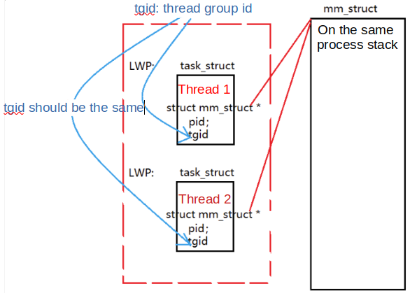

# Thread

The Linux kernel does not provide any special scheduling semantics or data structures to represent threads. Instead, a thread is merely a process that shares certain resources with other processes. Each thread has a unique `task_struct` and appears to the kernel as a normal process (which just happens to share resources, such as an address space, with other processes). Thread launch by `clone()` must at least have the three flags:
```cpp
clone(CLONE_VM | CLONE_SIGHAND | CLONE_THREAD, 0);
```
Besides, `CLONE_PIDFD|CLONE_NEWUSER|CLONE_NEWPID` must not be set when `CLONE_THREAD` is used.

The previous code results in behavior identical to a normal `fork()` , except that the address space, filesystem resources, file descriptors, and signal handlers are shared. 

### Thread Memory Layout

Besides variables' scopes, thread spawned from the same parent process share below resources:
* file descriptor
* signal handling
* PID

Resources unique to threads:
* `errno` error number
* TID thread id
* a group of CPU registers

<div style="display: flex; justify-content: center;">
      
</div>
</br>

### `CLONE_THREAD` Flag

According to https://man7.org/linux/man-pages/man2/clone.2.html:

If `CLONE_THREAD` is set, the child is placed in the same thread group (a set of threads that share a single PID.) as the calling process.

The threads within a group can be distinguished by their (system-wide) unique thread IDs (`TID`), that can be retrieved by ` gettid()`.

### Thread Switch

* Thread switching does not require kernel mode privileges.

* User level threads are fast to create and manage.

* Kernel threads are generally slower to create and manage than the user threads.

### Kernel threads

Kernel threads do not have visible address, since they exist in kernel space that is invisible from user space.

A kernel thread can be created via `kthread_create` and made runnable by `kthread_run`.

### Overhead of Launching A New Thread

