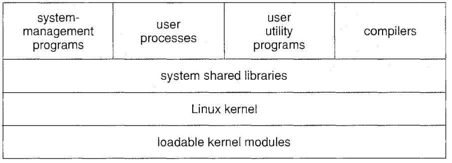

# Linux OS

## Linux Components

###  Kernel

Kernel has below functionalities

* Process Scheduler

* Memory Manager

* VFS (Virtual File System)

* Network

* IPC (Inter-Process Communication)

## Linux Distributions

RedHat, SUSE, Fedora, Debian, Slackware, and Ubuntu.

`DEB` files are installation files for Debian based distributions. `RPM` files are installation files for Red Hat based distributions. Ubuntu is based on Debian’s package manage based on `APT` (apt-get repos) and `DPKG`. Red Hat, CentOS and Fedora are based on the old Red Hat Linux package management system, `RPM`.

### Yum Repos

GNU Privacy Guard (GnuPG or GPG) is a hybrid-encryption software program.

`rpm` utility uses GPG keys to sign packages and its own collection of imported public keys to verify packages. `yum` and `dnf` (successor to `yum`) use repository configuration files to provide pointers to the GPG public key locations and assist in importing the keys so that RPM can verify the packages.

`yum` uses /etc/yum.repos.d to specify a URL for the GPG key used to verify packages in that repository. 

use `rpm -K \path\to\rpm\file` to verify if key digest is valid.

## Linux Is NOT Realtime

A realtime OS mandates that a task must be completed before a deadline, even taking priority over other tasks.

This is done by permitting higher-level priority interrupt handler triggered at anytime during another process's run.

For example, 