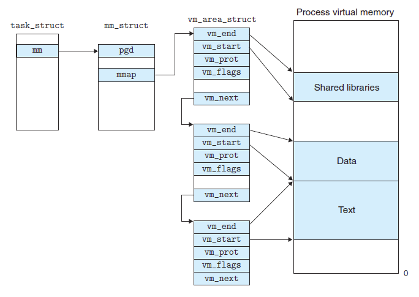

# Malloc and Free Other Discussions

## `malloc` thread safety

`malloc` is thread safe as of C11 implementation, but NOT re-entrant

Being thread safe means that there is no hazard concurrently reaching a critical section; being re-entrant means that the the critical section can be accessed inside concurrently without using mutex/lock.

## `brk` and `sbrk` vs `mmap`

Both are used to manage allocating/deallocating chunks in heap memory.

* `brk` and `sbrk`

Invocation as below, `brk` and `sbrk` are basic memory management system calls, deprecated since 1999, superseded by `mmap`.
```cpp
#include <unistd.h>

int brk(void* end_data_segment);
void *sbrk(intptr_t increment);
```

They change *program break* to control data segment. Increasing the program break has the same effect of allocating memory.

`brk` takes `end_data_segment` to directly set the break addr; `sbrk` takes `increment` that, if positive, increase `increment` amount of memory, if negative, shrink `increment` amount of memory.

The drawback of using `brk` and `sbrk` is that, it creates many fragmented small memory areas when used many `malloc` and `free`, since it only grows monotonously in heap, needs additional action to clean old disposed memory areas.

* `mmap`

`mmap` creates a new mapping in the virtual address space of the calling process to the underlying physical disk. Linux can later collect changes from the mapped dirty pages and write to disk.

Process:
1. (in user space) find contiguous virtual memory and assigns `vm_area_struct` to this memory area.
2. (in kernel space) according to `int fd` from the user process, find `struct file` of the `fd`
3. (in kernel space) through found `file` link `file_operations` invoking kernel's `mmap`
4. (in kernel space) kernel's `mmap` locates the file's inode then the disk addr
5. (in kernel space) invoke `remap_pfn_range` that launches new pages associated with the disk addr
6. (in user space) wait until user process requests accessing the mapped memory
7. (in kernel space) perform some checking, such as page fault error
8. (in kernel space) see if swap cache has the page
9. (in kernel space) return the page-linked disk addr, and write back dirty page to disk (if user process has changed the file)

It can be used to perform kernel-user space memory mapping.


where
* `pgd_t * pgd;` user process's page pointer
* `task_struct` is the user process descriptor

Accordingly, The `munmap()` system call deletes the mappings for the specified
address range, and causes further references to addresses within
the range to generate invalid memory references. 

Function signature:
```cpp
#include <sys/mman.h>

void * mmap(void * addr, size_t length,int prot,int flags,int fd,off_t offset);
```

By running the example below, it can show that `mallocPtr` resides in a process's heap, while `mmapPtr` has its own addr mapping to kernel virtual addr. `&oneInt` is on user process stack.
```cpp
#include <iostream>
#include <sys/mman.h>
#include <stdlib.h>

#ifdef _WIN32
#include <Windows.h>
#else
#include <unistd.h>
#endif

#define MIN_MMAP_LENGTH 4096

int main(){

    int* mmapPtr = (int*)mmap(NULL, MIN_MMAP_LENGTH, 
                        PROT_WRITE|PROT_READ, 
                        MAP_PRIVATE|MAP_ANONYMOUS, 0, 0);

    int* mallocPtr = (int*)malloc(MIN_MMAP_LENGTH);

    int oneInt = 0;

    std::cout << "pid: " << getpid() 
                << std::hex
                << " mmapPtr: " << mmapPtr
                << " mallocPtr: " << mallocPtr
                << " &oneInt: " << &oneInt 
                << std::endl;

    sleep(100);
    munmap(mmapPtr, MIN_MMAP_LENGTH);
    free(mallocPtr);
    
    return 0;
}
```

## `malloc_consolidate`

It collects fastbins' free chunks and sorts them into the unsorted bin as well as initialization.

```cpp
static void malloc_consolidate(mstate av)
{
    mfastbinptr*    fb;                 /* current fastbin being consolidated */
    mfastbinptr*    maxfb;              /* last fastbin (for loop control) */
    mchunkptr       p;                  /* current chunk being consolidated */
    mchunkptr       nextp;              /* next chunk to consolidate */
    mchunkptr       unsorted_bin;       /* bin header */
    mchunkptr       first_unsorted;     /* chunk to link to */

    ...
}
```


`get_max_fast()` can be used to check if the heap `av` is init, and init it if not yet done. After heap init, `clear_fastchunks` can clear some flags (`prev_inuse` to zero) indicating the chunks are not in use.
```cpp
  if (get_max_fast () != 0) {
    clear_fastchunks(av);
  }
  else {
    malloc_init_state(av);
    check_malloc_state(av);
  }
```

Two loops: the each run in the outer loo p derives a fast bin `p` which consists of many same size chunks; inside this bin perform an inner loop that first checks if a chunk in this bin is in use or not by `check_inuse_chunk(av, p);`, then pass next chunk pointer `nextp = p->fd;` 
```cpp
/*
  Remove each chunk from fast bin and consolidate it, placing it
  then in unsorted bin. Among other reasons for doing this,
  placing in unsorted bin avoids needing to calculate actual bins
  until malloc is sure that chunks aren't immediately going to be
  reused anyway.
*/

maxfb = &fastbin (av, NFASTBINS - 1);
fb = &fastbin (av, 0);
do {
  p = atomic_exchange_acq (fb, NULL);
  if (p != 0) {
    do {
      check_inuse_chunk(av, p);
      nextp = p->fd;

    ...

      } while ( (p = nextp) != 0);
  }
} while (fb++ != maxfb);
```

For each chunk, it applies backward merging by `chunk_at_offset(p, -((long) prevsize));` into one bigger chunk, then `unlink` from its bin list 
```cpp
if (!prev_inuse(p)) {
  prevsize = p->prev_size;
  size += prevsize;
  p = chunk_at_offset(p, -((long) prevsize));
  unlink(av, p, bck, fwd);
}
```

For a chunk that is not top chunk, do backward merging and form a bigger chunk then inserted to the unsorted bin;

For a chunk whose `nextchunk` is a top chunk, do forward merging into the top chunk.
```cpp
if (nextchunk != av->top) {
    nextinuse = inuse_bit_at_offset(nextchunk, nextsize);

    if (!nextinuse) {
      size += nextsize;
      unlink(av, nextchunk, bck, fwd);
    } else
      clear_inuse_bit_at_offset(nextchunk, 0);

    first_unsorted = unsorted_bin->fd;
    unsorted_bin->fd = p;
    first_unsorted->bk = p;

    if (!in_smallbin_range (size)) {
      p->fd_nextsize = NULL;
      p->bk_nextsize = NULL;
    }

    set_head(p, size | PREV_INUSE);
    p->bk = unsorted_bin;
    p->fd = first_unsorted;
    set_foot(p, size);
  }

  else {
    size += nextsize;
    set_head(p, size | PREV_INUSE);
    av->top = p;
  }
```

## `sysmalloc`

