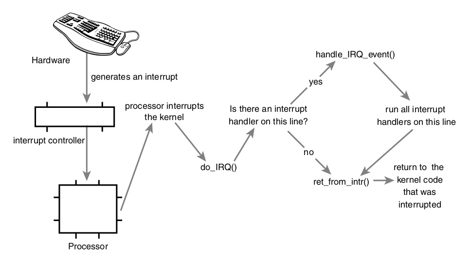

# Linux System Call

System calls are defined for user space to interact with Linux kernel. The separation between user and kernel space services provides protection for kernel and OS.  

Below is an example of `getpid()`
```cpp
SYSCALL_DEFINE0(getpid)
{
    return task_tgid_vnr(current); // returns current->tgid
}
```

* System Call Number

In Linux, each system call is assigned a syscall number.This is a unique number that is used to reference a specific system call.

The kernel keeps a list of all registered system calls in the system call table, stored in `sys_call_table` .This table is architecture; on x86-64 it is defined in `arch/i386/kernel/syscall_64.c`

* System Call Handler

The `system_call()` function checks the validity of the given system call number by comparing it to `NR_syscalls`. If valid, performs
```cpp
call *sys_call_table(,%rax,8);
```

* Argument Validation

The pointer points to a region of memory in user-space. Processes must not be able to trick the kernel into reading data in kernel-space on their behalf.

The pointer points to a region of memory in the process’s address space. The process must not be able to trick the kernel into reading someone else’s data.

If reading, the memory is marked readable. If writing, the memory is marked writable. If executing, the memory is marked executable.The process must not be able to bypass memory access restrictions.

## Write A New System Call

If we want to add a new system call `sys_foo()`...

Add to entry table that adds a `long` system call number to a system call, such as
```cpp
ENTRY(sys_call_table)
   // Some already registered ...
   .long sys_restart_syscall
   .long sys_exit
   .long sys_fork
   .long sys_read
   ...

    // The new `foo`
   .long sys_foo
```

Define the call number if `<asm/unistd.h>` such as
```cpp
#define __NR_sys_restart_syscall 0
#define __NR_sys_exit            1
#define __NR_sys_fork            2
#define __NR_sys_read            3
...
// Suppose there are 387 registered sys calls above
#define __NR_sys_foo             388
```

Define the `sys_foo` implementation detail and compile it into a system kernel image.

For example, the function is related to scheduling, you could define it in `kernel/sched.c`.
```cpp
asmlinkage long sys_foo(void) 
{
    return THREAD_SIZE;
}
```

Finally, invoke the new system call, where the `0` in `__syscall0` means there is zero argument to the system call function. If the value is `1` such as `__syscall1`, that should appends one argument to the system call.
```cpp
#define __NR_foo 283
__syscall0(long, foo)

int main ()
{
  long stack_size;
  stack_size = foo ();
  printf (“The kernel stack size is %ld\n”, stack_size);
  return 0;
}
```

## Interrupt

Interrupt is signal to processor that there is an urgent task required handling.



* IRQ

OS needs to differentiate different interrupts and the method is by assigning unique identifier number. These interrupt values are often called *interrupt request* (IRQ) lines. Each IRQ line is assigned a numeric value.

For example, timer interrupt has $IRQ=0$, and keyboard interrupt has $IRQ=1$.

* ISR

The function the kernel runs in response to a specific interrupt is called an *interrupt handler* or *interrupt service routine* (ISR). Each device that generates interrupts has an associated interrupt handler.

* Top Halves vs Bottom Halves

Interrupt handler has two goals: to execute quickly and perform a large amount of work.

The *top half* is run immediately upon receipt of the interrupt and performs only the work that is time-critical, such as acknowledging a receipt of an interrupt.

Work that can be performed later is deferred until the *bottom half*. 

A typical example would be receiving and handling TCP packets, where receiving packets can be in the top half (hard interrupts), and handling/processing can be in the bottom half (soft interrupt).   

### IRQ

Hardware/driver interrupts are registered in `<linux/interrupt.h>`
```cpp
/* request_irq: allocate a given interrupt line */
int request_irq(unsigned int irq,
              irq_handler_t handler,
              unsigned long flags,
              const char *name,
              void *dev)
```
where
* `irq` is the interrupt number
* `handler` is the function hanlder pointer such as
```cpp
typedef irqreturn_t (*irq_handler_t)(int, void *);
``` 
* `flags` is interrupt flags such as `IRQF_DISABLED` that kernel forbids other interrupts preempting the current running interrupt handler; `IRQF_SHARED` specifies that the interrupt line can be shared among multiple interrupt handlers.
* `name` is just an ASCII text representation
* `dev` is used for shared interrupt lines. When an interrupt handler is freed (discussed later), dev provides a unique cookie to enable the removal of only the desired interrupt handler from the interrupt line.

### Interrupt context

Recall that process context is the mode of operation the kernel is in while it is executing on behalf of a process. 
In process context, the current macro points to the associated task. 
Furthermore, process context can sleep or otherwise invoke the scheduler.

Interrupt context, on the other hand, is not associated with a process.The current macro is not relevant.

Interrupt does not necessarily have its own stack, or has a very small stack, hence interrupt handler must be small and be cautious about what data might be put in.

### Check statistics

By `proc/interrupts`, there are
```bash
            CPU0       CPU1       CPU2       CPU3       
   1:          0        269          0          0          IR-IO-APIC    1-edge      i8042
   8:          0          0          0          0          IR-IO-APIC    8-edge      rtc0
   9:          0         54          0          0          IR-IO-APIC    9-fasteoi   acpi
  12:          0          0          0          8          IR-IO-APIC   12-edge      i8042
  152          0         56        210         14          IR-PCI-MSI 31457280-edge      nvme0q0
```
where, about headers
* The first column is the interrupt line.
* The second column is a counter of the number of interrupts received.
* The third column is the interrupt controller handling this interrupt.
* The last column is the device associated with this interrupt.

where, about interrupt services
* i8042 is a keyboard and mouse controller interrupt
* Interrupt about *Real Time Clocks* (RTCs) that are devices used to track the absolute time in nonvolatile memory, which can be internal to the processor or externally connected through the I2C or SPI bus. 
* acpi refers to *Advanced Configuration and Power Interface* (ACPI) that provides an open standard that operating systems can use to discover and configure computer hardware components, to perform power management 
* nvme0q0 is about nvidia GPU