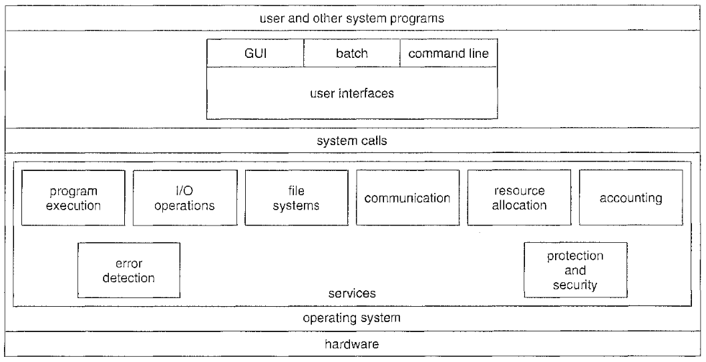
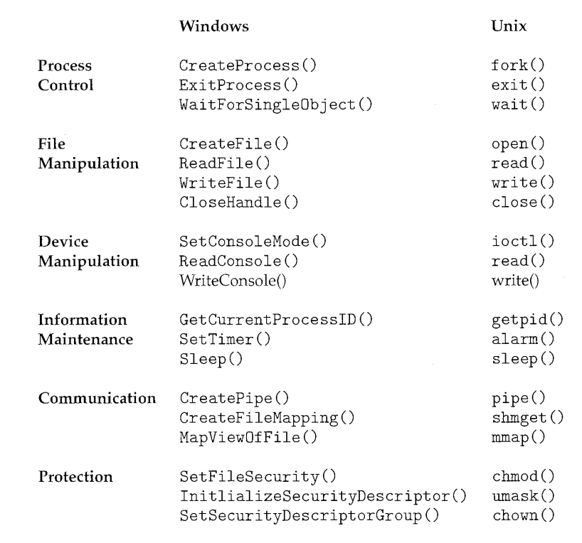

# Operating System

## OS service overview

* support for user interactions, such as *Command Line Interface* (CLI), *Graphic User Interface* (GUI), *Batch Interface* (bat)

* program management, providing system calls and file access services, resource allocation (such as CPU, memory, etc) to requesting processes, accounting for resource usage

* I/O operations, peripheral device interactions (such as keyboard, touchpad, printer.)

* File system management

* Security and fault detection, such as user authentication.

### System calls

