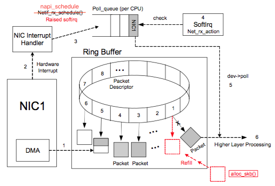

# New API (NAPI)

High-speed networking can create thousands of interrupts per second, all of which tell the system something it already knew: it has lots of packets to process. NAPI allows drivers to run with (some) interrupts disabled during times of high traffic, with a corresponding decrease in system load.

## Retrieve data from NIC



NIC (network interface card)  when system boots registers its info to the system, which assigns a ring buffer for NIC received data packets. Each packet slot is pointed by `struct sk_buff` which is allocated by `alloc_skb`. Inside  `struct sk_buff`is a pointer field `struct net_device *dev;` pointing to this ring buffer memory slot.

Ring buffer has two states (stored in Packet Descriptor) for its slots: ready and used. When data arrives in NIC, DMA searches for next available ready slot and places the data content into this packet descriptor pointed `sk_buff`. Since the search is linear, ring buffer is a FIFO queue.

Once DMA finishes loading data, NIC triggers an interrupt to CPU invoking the process of a interrupt handler. It is cumbersome to trigger interrupt for every arrived packet, and NAPI is the solution to avoid such overhead.

NAPI is a NIC-driver specific embedded system, different depending on hardware. NAPI takes charge of polling NIC if data arrives, and queues up the arrived packets into a `poll_list`, then raises an interrupt to CPU to read/process the collected data packets after a number of polls called "budget". This is advantageous since CPU no longer triggers interrupt handler every time a packet arrives. 

## Device and the buffer ring

The processing of a received packet as it moves from the NIC device driver to the *dev* layer mainly consider the below functions:

* `skb = dev_alloc_skb(pkt_len + 5);`

Allocates an `sk_buff` of the required size prior to transferring the packet
to kernel memory.  Two hardware strategies are commonly used. 

If packets are received directly into system memory owned by the kernel,
the `sk_buff` must be allocated prior to initiating the receive operation.

If packets are first received into NIC buffers and then transferred via DMA to system memory, an `sk_buff` of the exact size needed may be
allocated after the packet has been received but before the DMA transfer is initiated.

* ` skb->protocol = eth_type_trans(skb, dev);`

Determine the packet type which will be used to identify the network
layer handler.

* `netif_rx(skb);`

Used to pass the sk_buff to the generic device layer when a receive operation completes. 

## NAPI related structures

### `softnet_data`

Both the `NET_RX_SOFTIRQ` and `NET_TX_SOFTIRQ` softirqs refer to `softnet_data` structure. 
```cpp
struct softnet_data
{
    int            throttle;
    int            cng_level;
    int            avg_blog;
    struct sk_buff_head    input_pkt_queue;
    struct list_head       poll_list;
    struct net_device      *output_queue;
    struct sk_buff         *completion_queue;
    struct net_device      backlog_dev;
};
```

* `poll_list`

This is a bidirectional list of devices with input frames waiting to be processed

* `output_queue` and `completion_queue`

`output_queue` is the list of devices that have something to transmit, and `completion_queue` is the list of buffers that have been successfully transmitted and therefore can be released. 

### `napi_struct`

```cpp
/*
* Structure for NAPI scheduling similar to tasklet but with weighting
*/
struct napi_struct {
  /* The poll_list must only be managed by the entity which
   * changes the state of the NAPI_STATE_SCHED bit.  This means
   * whoever atomically sets that bit can add this napi_struct
   * to the per-cpu poll_list, and whoever clears that bit
   * can remove from the list right before clearing the bit.
   */
    struct list_head    poll_list;
    unsigned long       state;
    int                 weight;
    unsigned int        gro_count;
    int         (*poll)(struct napi_struct *, int);
  #ifdef CONFIG_NETPOLL
    spinlock_t      poll_lock;
    int         poll_owner;
  #endif
    struct net_device   *dev;

	// Generic Receive Offloading(GRO) List
    struct sk_buff      *gro_list;
    struct sk_buff      *skb;
    struct list_head    dev_list;
  };
```

## NAPI process

1. NIC driver registers `poll` to kernel.
2. NIC driver registers and enables NAPI if driver and OS support NAPI, if not, use the old (the aforementioned method) approach
3. NIC loads data to `sk_buff` through DMA
4. NIC triggers an IRQ to CPU (softirq (`NET_RX_SOFTIRQ`)), that runs NAPI subsystem; `NET_RX_SOFTIRQ`'s interrupt handler is `net_rx_action` running on another thread, that invokes NIV driver registered `napi_struct->poll`
5. NIC does not trigger a new IRQ until `napi_struct->poll` finishes
6. After all finish, NAPI subsystem exits, NIC IRQ is re-enabled
7. go back to the 3rd step  

When NIC triggers IRQ, `ixgbe_msix_clean_rings` is invoked. Finally, `napi_scheduler` adds `napi->poll_list` to `sd->poll_list`, triggering `net_rx_action` software interrupt.

```cpp
static irqreturn_t ixgbe_msix_clean_rings(int irq, void *data)
{
	struct ixgbe_q_vector *q_vector = data;
 
	/* EIAM disabled interrupts (on this vector) for us */
 
	if (q_vector->rx.ring || q_vector->tx.ring)
		napi_schedule_irqoff(&q_vector->napi);
 
	return IRQ_HANDLED;
}

static inline void ____napi_schedule(struct softnet_data *sd,
				     struct napi_struct *napi)
{
	list_add_tail(&napi->poll_list, &sd->poll_list);
	__raise_softirq_irqoff(NET_RX_SOFTIRQ);
}
```

`net_rx_action` first allocates a "budget" that how many times `napi_poll` can keep querying. `budget--;` occurs for every `napi_poll` invocation.

When the budget is used up or `napi_poll` takes more than 2 clock tick, the software interrupt exits.

```cpp
static void net_rx_action(struct softirq_action *h)
{
	struct softnet_data *sd = this_cpu_ptr(&softnet_data);
	unsigned long time_limit = jiffies + 2;
	// The first give software interrupt a budget
	int budget = netdev_budget;
	LIST_HEAD(list);
	LIST_HEAD(repoll);
 
	local_irq_disable();
	list_splice_init(&sd->poll_list, &list);
	local_irq_enable();
 
	for (;;) {
		struct napi_struct *n;
 
		if (list_empty(&list)) {
			if (!sd_has_rps_ipi_waiting(sd) && list_empty(&repoll))
				return;
			break;
		}
 
		n = list_first_entry(&list, struct napi_struct, poll_list);
		budget -= napi_poll(n, &repoll);
 
		/* If softirq window is exhausted then punt.
		 * Allow this to run for 2 jiffies since which will allow
		 * an average latency of 1.5/HZ.
		 */
		// budget used up
		if (unlikely(budget <= 0 ||
			     time_after_eq(jiffies, time_limit))) {
			sd->time_squeeze++;
			break;
		}
	}
 
	__kfree_skb_flush();
	local_irq_disable();
 
    // add this napi to sd->poll_list head, awaiting invocation by the next polling.
	list_splice_tail_init(&sd->poll_list, &list);
	list_splice_tail(&repoll, &list);
	list_splice(&list, &sd->poll_list);
	if (!list_empty(&sd->poll_list))
		__raise_softirq_irqoff(NET_RX_SOFTIRQ);
 
	net_rps_action_and_irq_enable(sd);
}
```

`napi_struct *n` calls `work = n->poll(n, weight);` to perform polling.
```cpp
static int napi_poll(struct napi_struct *n, struct list_head *repoll)
{
	void *have;
	int work, weight;
 
	// delete napi->poll_list
	list_del_init(&n->poll_list);
 
	have = netpoll_poll_lock(n);
 
	// napi poll "budget" named weight 
	weight = n->weight;
 
	/* This NAPI_STATE_SCHED test is for avoiding a race
	 * with netpoll's poll_napi().  Only the entity which
	 * obtains the lock and sees NAPI_STATE_SCHED set will
	 * actually make the ->poll() call.  Therefore we avoid
	 * accidentally calling ->poll() when NAPI is not scheduled.
	 */
	work = 0;
	if (test_bit(NAPI_STATE_SCHED, &n->state)) {
		work = n->poll(n, weight);
		trace_napi_poll(n);
	}
 
	WARN_ON_ONCE(work > weight);
 
	// napi poll weight/budget not used up
	if (likely(work < weight))
		goto out_unlock;
 
	/* Drivers must not modify the NAPI state if they
	 * consume the entire weight.  In such cases this code
	 * still "owns" the NAPI instance and therefore can
	 * move the instance around on the list at-will.
	 */
	if (unlikely(napi_disable_pending(n))) {
		napi_complete(n);
		goto out_unlock;
	}
 
	// poll weight/budget used up, flush data
    // gro_list is a sk_buff list
	if (n->gro_list) {
		/* flush too old packets
		 * If HZ < 1000, flush all packets.
		 */
		napi_gro_flush(n, HZ >= 1000);
	}
 
	/* Some drivers may have called napi_schedule
	 * prior to exhausting their budget.
	 */
	if (unlikely(!list_empty(&n->poll_list))) {
		pr_warn_once("%s: Budget exhausted after napi rescheduled\n",
			     n->dev ? n->dev->name : "backlog");
		goto out_unlock;
	}
 
	// when used up poll weight/budget, in case polling required nevertheless, napi->poll_list re-added to repoll
	list_add_tail(&n->poll_list, repoll);
 
out_unlock:
	netpoll_poll_unlock(have);
 
	return work;
}
```