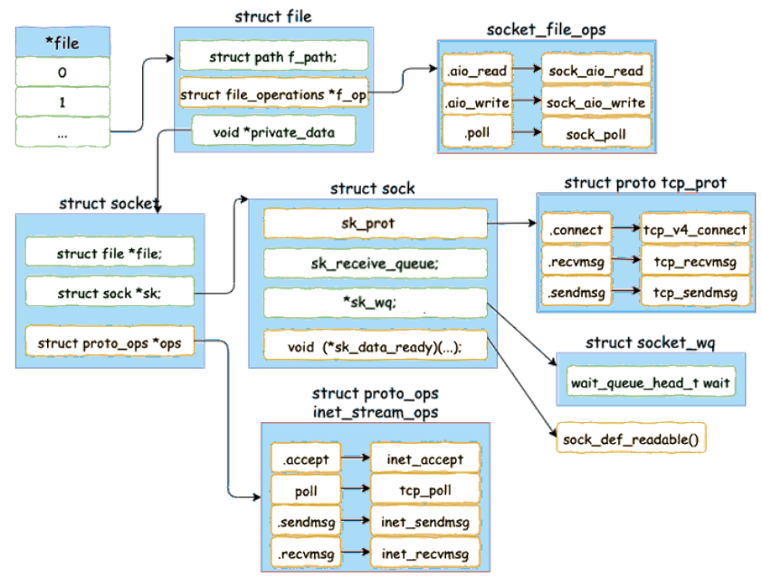

# Epoll Implementation Detail

The biggest performance bottleneck of kernel calling I/O is context switch that for non-epoll methods, such as a traditional `read` every time when I/O receives data, context switch costs about 2-3 microseconds.

Epoll passively receives new data arrival notifications can facilitate reading.

## Preliminaries: `accept` for A New Socket

Socket launch: 

From user process launch `struct task_struct` that contains `struct files_struct *files` that then contains `struct fdtable *fdt`.
The file descriptor table `*fdt` has a list of `fd`, and some of which represent `struct file`, that contains `void *private_date` which is a `struct socket`.

If there are multiple socket connections, associate multiple number of `fd`s.

Below gives a detailed socket structure defined in kernel.
<div style="display: flex; justify-content: center;">
      
</div>
</br>

Inside `socket` there is `sock`, which is the kernel space structure that gets `accept` work by `err = sock->ops->accept(sock, newsock, sock->file->f_flags);`.

Finally, this `socket` with the associated `fd` is passed to user process.

```cpp
void __fd_install(struct files_struct *files, unsigned int fd,
        struct file *file)
{
    ...
    fdt = files_fdtable(files);
    BUG_ON(fdt->fd[fd] != NULL);
    rcu_assign_pointer(fdt->fd[fd], file);
}
```

## `epoll_create` Implementation

When `epoll_create` gets called, kernel creates `struct eventpoll`:
```cpp
// file：fs/eventpoll.c
struct eventpoll {

    //sys_epoll_wait wait queue
    wait_queue_head_t wq;

    // receive ready descriptor list
    struct list_head rdllist;

    // a red-black tree whose elements are epoll item
    struct rb_root rbr;

    ...
}
```

where
* `wq` wait queue
* `rbr` red black tree, used to manager user process's added socket connections
* `rdllist` receives ready descriptor list; when connection is ready, kernel pushes ready connections to this list, so that there is no need of iterate all read-black tree but simply going through this list

## `epoll_ctl` Adds Socket

Whenever using `epoll_ctl` to register a socket, kernel does the three things
1. allocate an `epitem` for this socket connection
2. add a wait event to socket socket wait queue `sk_wq`, and the callback function is named `ep_poll_callback`
3. take this `epitem` to `epoll`'s red-black tree

```cpp
// file：fs/eventpoll.c
SYSCALL_DEFINE4(epoll_ctl, int, epfd, int, op, int, fd,
        struct epoll_event __user *, event)
{
    struct eventpoll *ep;
    struct file *file, *tfile;

    file = fget(epfd);
    ep = file->private_data;

    // find file by fd
    tfile = fget(fd);

    ...

    error = ep_insert(ep, &epds, tfile, fd);

    ...
}
```

where `ep_insert` inits an `epitem` and associates this `epitem` with file `fd`,  
sets socket wait queue: `ep_pqueue`, register callback function and inserts this `epitem` into red-black tree

```cpp
//file: fs/eventpoll.c
static int ep_insert(struct eventpoll *ep, 
                struct epoll_event *event,
                struct file *tfile, int fd)
{
    // memory allocation and init
    struct epitem *epi;
    if (!(epi = kmem_cache_alloc(epi_cache, GFP_KERNEL)))
        return -ENOMEM;

    // associate file to this epitem
    INIT_LIST_HEAD(&epi->pwqlist);
    epi->ep = ep;
    ep_set_ffd(&epi->ffd, tfile, fd);

    // set socket wait queue: ep_pqueue
    struct ep_pqueue epq;
    epq.epi = epi;
    init_poll_funcptr(&epq.pt, ep_ptable_queue_proc);

    // register callback function
    revents = ep_item_poll(epi, &epq.pt);

    ......
    // insert this epitem into red-black tree
    ep_rbtree_insert(ep, epi);
    ......
}
```

An `epitem` is defined as below
```cpp
//file: fs/eventpoll.c
struct epitem {

    // red-black tree node
    struct rb_node rbn;

    // socket fd
    struct epoll_filefd ffd;

    // corresponding eventpoll
    struct eventpoll *ep;

    // wait queue
    struct list_head pwqlist;
}
```

After `epitem` initialization, it configures its corresponding socket's wait queue `sk_wq` that points to `ep_poll_callback`.

Now look at socket pool wait:
```cpp
static inline void sock_poll_wait(struct file *filp,
        wait_queue_head_t *wait_address, poll_table *p)
{
    poll_wait(filp, wait_address, p);
}

static inline void poll_wait(struct file * filp, wait_queue_head_t * wait_address, poll_table *p)
{
    if (p && p->_qproc && wait_address)
        p->_qproc(filp, wait_address, p);
}
```
where `qproc` is a function pointer that points to `ep_poll_callback`. 

## `epoll_wait` Waiting For New Data Arrival

`epoll_wait` simply checks if `eventpoll->rdllist` has any data by `ep_events_available` to see if the list is empty or not.

```cpp
//file: fs/eventpoll.c
static inline int ep_events_available(struct eventpoll *ep)
{
    return !list_empty(&ep->rdllist) || ep->ovflist != EP_UNACTIVE_PTR;
}
```

### Empty `rdllist` Indicating No New Data Arrival

If empty, add the current process `struct task_struct *p` to this epoll event.
Remember, epoll itself is blocking, but epoll releases CPU for blocking CPU has no meaning.

```cpp
//file: include/linux/wait.h
static inline void init_waitqueue_entry(wait_queue_t *q, struct task_struct *p)
{
    q->flags = 0;
    q->private = p;
    q->func = default_wake_function;
}
```

CPU is released to do other work by by kernel scheduling. 
```cpp
//file: kernel/hrtimer.c
int __sched schedule_hrtimeout_range(ktime_t *expires, 
    unsigned long delta, const enum hrtimer_mode mode)
{
    return schedule_hrtimeout_range_clock(
            expires, delta, mode, CLOCK_MONOTONIC);
}

int __sched schedule_hrtimeout_range_clock(...)
{
    schedule();
    ...
}

//file: kernel/sched/core.c
static void __sched __schedule(void)
{
    next = pick_next_task(rq);
    ...
    context_switch(rq, prev, next);
}
```

### `rdllist` Received New Data

Start from TCP receiving data by`tcp_queue_rcv`.
In `sock_init_data` with the defined `sk_data_ready`, sock sets a data reception handling function to `sock_def_readable`, that uses `ep_poll_callback` for epoll callback.

`ep_poll_callback` takes `epitem` from a wait queue to the eventpoll ready list `list_add_tail(&epi->rdllink, &ep->rdllist);`.
Then `ep_poll_callback` checks if the wait queue is in waiting, if so, then wakes it up and sends data to user process; if not, just proceed to sending data.

```cpp
//file: fs/eventpoll.c
static int ep_poll_callback(wait_queue_t *wait, unsigned mode, int sync, void *key)
{
    // get epitem from wait queue
    struct epitem *epi = ep_item_from_wait(wait);

    // get the epitem's corresponding epoll event
    struct eventpoll *ep = epi->ep;

    // add epitem to eventpoll ready list
    list_add_tail(&epi->rdllink, &ep->rdllist);

    // check in eventpoll if there is any waiting queue
    if (waitqueue_active(&ep->wq))
        wake_up_locked(&ep->wq);
}
```

`ep_poll_callback` is invoked from `sock` as a registered callback that tries to wake up the current process so that it can send the data arrival event to this user process.

```cpp
//file:kernel/sched/core.c
int default_wake_function(wait_queue_t *curr, unsigned mode, int wake_flags,
                void *key)
{
    return try_to_wake_up(curr->private, mode, wake_flags);
}
```

```cpp
//file: fs/eventpoll.c
static int ep_poll(struct eventpoll *ep, struct epoll_event __user *events,
             int maxevents, long timeout)
{

    ......
    __remove_wait_queue(&ep->wq, &wait);

    set_current_state(TASK_RUNNING);

check_events:
    // return ready event to user process
    ep_send_events(ep, events, maxevents);
}
```