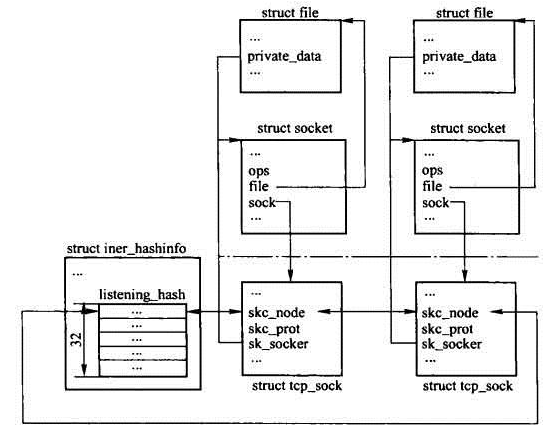

# Listen

listen() marks the socket referred to by sockfd as a passive socket.

```cpp
#include <sys/socket.h>

int listen(int sockfd, int backlog);
```
* `sockfd`: the bound fd, refers to a socket
       of type `SOCK_STREAM` or `SOCK_SEQPACKET`
*  `backlog`: the maximum length to which the
       queue of pending connections for sockfd may grow

## Structure

In `inet_hashinfo` defines `listening_hash`.
```cpp
//path: net/ipv4/tcp_ipv4.c
struct inet_hashinfo __cacheline_aligned tcp_hashinfo;
 
/* This is for listening sockets, thus all sockets which possess wildcards. */
#define INET_LHTABLE_SIZE	32	/* Yes, really, this is all you need. */
 
// `inet_hashinfo` basically is a collection of TCP related hash tables, below only shows listening related definitions
struct inet_hashinfo {
	
	// ...

	/* All sockets in TCP_LISTEN state will be in here.  This is the only
	 * table where wildcard'd TCP sockets can exist.  Hash function here
	 * is just local port number.
	 */
	struct hlist_head		listening_hash[INET_LHTABLE_SIZE];
 
	// read/write lock for listening services
	rwlock_t			lhash_lock ____cacheline_aligned;
	// reference count of uses
	atomic_t			lhash_users;
};
```

This diagram shows that `listening_hash` links `tcp_sock` by each sock's `skc_node`, which inherits from `struct socket`'s `sock`. `struct socket`'s `file` is where tcp data is loaded.

Multiple socks are linked to each other, and are searchable from `listening_hash`. 



## TCP connection Half establishment vs full establishment

* SYN Queue (half established): 

Tcp is on `SYN_RECV`, server on listening waiting for client's `SYN` requests, which will be put into a SYN Queue

SYN Queue is of a `hash` type

When SYN Queue is overflow for too many coming SYN requests, it drops excessive SYN requests

* ACCEPT Queue (full established): 

Tcp is on `ESTABLISHED`, connection established after received `ACK` from client, and server moves this SYN Queue to ACCEPT Queue ready for `accept`

When ACCEPT Queue is overflow for too many SYN Queues awaiting being added to the ACCEPT Queue, depending on `proc/sys/net/ipv4/tcp_abort_on_overflow`, server either waits or just drops the coming SYN Queues

ACCEPT Queue is of a `list` type

## Start of listening

System invocation starts at `__sys_listen`

```cpp
int __sys_listen(int fd, int backlog)
{
	struct socket *sock;
	int err, fput_needed;
	int somaxconn;

    // find the sock associated with the specified fd 
	sock = sockfd_lookup_light(fd, &err, &fput_needed);
	if (sock) {
		somaxconn = sock_net(sock->sk)->core.sysctl_somaxconn;
		if ((unsigned int)backlog > somaxconn)
			backlog = somaxconn;
		err = security_socket_listen(sock, backlog);
		if (!err)
			err = sock->ops->listen(sock, backlog);
		fput_light(sock->file, fput_needed);
	}
	return err;
}
```

Inside `__sys_listen`, since socket on creation is set to TCP, that is `.ops=&int_stream_ops`. This listening action `sock->ops->listen(sock, backlog)` hooks `inet_listen` when invoked.

```cpp
int inet_listen(struct socket *sock, int backlog)
{
	// fast open process
	if ((sysctl_tcp_fastopen & TFO_SERVER_ENABLE) != 0 &&
		inet_csk(sk)->icsk_accept_queue.fastopenq == NULL) 
	{
		if ((sysctl_tcp_fastopen & TFO_SERVER_WO_SOCKOPT1) != 0)
			err = fastopen_init_queue(sk, backlog);
		else if ((sysctl_tcp_fastopen &
				TFO_SERVER_WO_SOCKOPT2) != 0)
			err = fastopen_init_queue(sk,
				((uint)sysctl_tcp_fastopen) >> 16);
		else
			err = 0;
		if (err)
			goto out;
	}


	// listening starts
	if(old_state != TCP_LISTEN) {
	
		err = inet_csk_listen_start(sk, backlog);
	}
	sk->sk_max_ack_backlog =backlog;
	
    // ......
}
```

In `inet_csk_listen_start`, `sk->sk_prot->hash(sk)` of the type `inet_hash`, stores the sock `sk` to the current listen hash table, awaiting a TCP handshake SYN request.
```cpp
int inet_csk_listen_start(struct sock *sk, const int nr_table_entries)
{
	// ......

	// cast socket to `inet_connection_sock *icsk`
	struct inet_connection_sock *icsk = inet_csk(sk);

	// ......

	// nr_table_entries is backlog, allocate the memory for the defined number of SYN request in a queue
	int rc = reqsk_queue_alloc(&icsk->icsk_accept_queue, nr_table_entries);

	// ......

	// delete any existing ACKs in this sock
	inet_csk_delack_init(sk);

	// set socket state to TCP_LISTEN
	sk->sk_state = TCP_LISTEN;

	// Check port from sk proto 
	// if already bound by `bind()`, no execution
	// if not bound, this inits an addr and a port 
	if (!sk->sk_prot->get_port(sk, inet->inet_num)){
		// reset/clear sock dst
		sk_dst_reset(sk);
		// hash this sock, so that this sock can be found by `__inet_lookup_listen`
		sk->sk_prot->hash(sk);
	}

	// if wrong,
	// TCP is set to close
	sk->sk_state = TCP_CLOSE;
	__reqsk_queue_destroy(&icsk->icsk_accept_queue);
	// port not available (in use err -EADDRINUSE)
	return -EADDRINUSE;
}
```

## Listening 

`inet_connection_sock` has a member `request_sock_queue icsk_accept_queue` who has a ACCEPT Queue's head and tail as members `struct request_sock *rskq_accept_head;` and `struct request_sock *rskq_accept_tail;`, and a SYN Queue `listen_sock *listen_opt;`.

```cpp
//file: include/net/inet_connection_sock.h
struct inet_connection_sock {
 /* inet_sock has to be the first member! */
 struct inet_sock   icsk_inet;
 struct request_sock_queue icsk_accept_queue;
 // ......
}

/** struct request_sock_queue - queue of request_socks
 *
 * @rskq_accept_head - FIFO head of established children
 * @rskq_accept_tail - FIFO tail of established children
 * @rskq_defer_accept - User waits for some data after accept()
 * @syn_wait_lock - serializer
 *
 * %syn_wait_lock is necessary only to avoid proc interface having to grab the main
 * lock sock while browsing the listening hash (otherwise it's deadlock prone).
 *
 * This lock is acquired in read mode only from listening_get_next() seq_file
 * op and it's acquired in write mode _only_ from code that is actively
 * changing rskq_accept_head. All readers that are holding the master sock lock
 * don't need to grab this lock in read mode too as rskq_accept_head. writes
 * are always protected from the main sock lock.
 */
struct request_sock_queue {
	struct request_sock	*rskq_accept_head; 
	struct request_sock	*rskq_accept_tail;
	rwlock_t		syn_wait_lock;
	u8			rskq_defer_accept;
	struct listen_sock	*listen_opt; 
};
 
/** struct listen_sock - listen state
 *
 * @max_qlen_log - log_2 of maximal queued SYNs/REQUESTs
 */
struct listen_sock {
	u8			max_qlen_log;
	int			qlen;
	int			qlen_young;
	int			clock_hand;
	u32			hash_rnd;
	u32			nr_table_entries;
	struct request_sock	*syn_table[0];
};
 
/* struct request_sock - mini sock to represent a connection request
 */
struct request_sock {
	struct request_sock		*dl_next;
	u16				mss;
	u8				retrans;
	u8				cookie_ts; 
	u32				window_clamp;
	u32				rcv_wnd;
	u32				ts_recent;
	unsigned long			expires;
	const struct request_sock_ops	*rsk_ops;// tcp registers its operation to this field
	struct sock			*sk;
	u32				secid;
	u32				peer_secid;
};
```

`reqsk_queue_alloc` creates a SYN Queue `queue->listen_opt = lopt` of `request_sock_queue`
```cpp
/*
 * Maximum number of SYN_RECV sockets in queue per LISTEN socket.
 * One SYN_RECV socket costs about 80bytes on a 32bit machine.
 * It would be better to replace it with a global counter for all sockets
 * but then some measure against one socket starving all other sockets
 * would be needed.
 *
 * It was 128 by default. Experiments with real servers show, that
 * it is absolutely not enough even at 100conn/sec. 256 cures most
 * of problems. This value is adjusted to 128 for very small machines
 * (<=32Mb of memory) and to 1024 on normal or better ones (>=256Mb).
 * Note : Dont forget somaxconn that may limit backlog too.
 */
int sysctl_max_syn_backlog = 256;
int reqsk_queue_alloc(struct request_sock_queue *queue,
		      unsigned int nr_table_entries)
{
	size_t lopt_size = sizeof(struct listen_sock);
	struct listen_sock *lopt;
 
	// make the backlog size is greater than 8, but not greater than system allowed max size
	// through `roundup_pow_of_two()` so that nr_table_entries is of the power of 2
	nr_table_entries = min_t(u32, nr_table_entries, sysctl_max_syn_backlog);
	nr_table_entries = max_t(u32, nr_table_entries, 8);
	nr_table_entries = roundup_pow_of_two(nr_table_entries + 1);
    
	// allocate mem for request_sock and its member listen_opt
	lopt_size += nr_table_entries * sizeof(struct request_sock *);
	if (lopt_size > PAGE_SIZE)
		lopt = __vmalloc(lopt_size,
			GFP_KERNEL | __GFP_HIGHMEM | __GFP_ZERO,
			PAGE_KERNEL);
	else
		lopt = kzalloc(lopt_size, GFP_KERNEL);
	if (lopt == NULL)
		return -ENOMEM;
 
	// init max_qlen_log as `pow(nr_table_entries, 2)`
	for (lopt->max_qlen_log = 3;
	     (1 << lopt->max_qlen_log) < nr_table_entries;
	     lopt->max_qlen_log++);
 
	// generate a random var, used to access listen_opt
	get_random_bytes(&lopt->hash_rnd, sizeof(lopt->hash_rnd));

	rwlock_init(&queue->syn_wait_lock);
	// init accept to be empty
	queue->rskq_accept_head = NULL;
	lopt->nr_table_entries = nr_table_entries;
 
	// add `listen_sock *lopt` to `request_sock_queue *queue`
	// tcp_sock.inet_conn.icsk_accept_queue.listen_opt
	write_lock_bh(&queue->syn_wait_lock);
	queue->listen_opt = lopt;
	write_unlock_bh(&queue->syn_wait_lock);
 
	return 0;
}
```

```cpp
void inet_hash(struct sock *sk)
{
	// when on TCP_LISTEN, call `__inet_hash`
	if (sk->sk_state != TCP_CLOSE) {
		local_bh_disable();
		__inet_hash(sk);
		local_bh_enable();
	}
}
 
static void __inet_hash(struct sock *sk)
{
	struct inet_hashinfo *hashinfo = sk->sk_prot->hashinfo;
	struct hlist_head *list;
	rwlock_t *lock;
 
	// return if not on TCP_LISTEN
	if (sk->sk_state != TCP_LISTEN) {
		__inet_hash_nolisten(sk);
		return;
	}
 
	// Given a sock, by hashing this sock, find the corresponding listening_hash, and add socket to the listening_hash list 
	BUG_TRAP(sk_unhashed(sk));
	list = &hashinfo->listening_hash[inet_sk_listen_hashfn(sk)];
	lock = &hashinfo->lhash_lock;
	inet_listen_wlock(hashinfo);
	__sk_add_node(sk, list);

	// in_use reference count
	sock_prot_inuse_add(sk->sk_prot, 1);
	write_unlock(lock);
	wake_up(&hashinfo->lhash_wait);
}
```