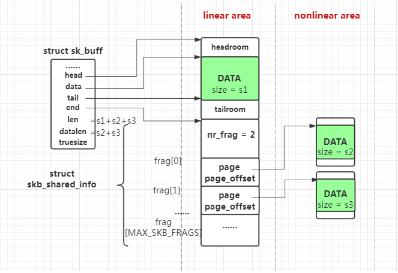

# Summary

## `sk_buff`



A typical `sk_buff` has linear and non-linear areas. Data block `s1` resides in linear area, with size dependent on how it is init. Non-linear areas store data blocks for fragments (`s2`, `s3`, ...). 

Each `sk_buff` is responsible for one tcp packet storage. If the packet data is small, there is no nonlinear area.

`sk_forward_alloc` and `sk_wmem_queued` are responsible for recv and send cache/memory allocation.

If there come many small tcp packets, their data will be put into one `sk_buff`'s linear area data segment by `tcp_try_coalesce`.

```cpp
struct  sk_buff {
        /* These two members must be first. */
        // used for list operation purposes
        struct sk_buff          *next;
        struct sk_buff          *prev;
        
        // timestamp recording
        ktime_t                 tstamp;

        // associate with a socket
        struct sock             *sk;

        struct net_device       *dev;

        /* This is the control buffer. It is free to use for every
         * layer. Please put your private variables there. If you
         * want to keep them across layers you have to do a skb_clone()
         * first. This is owned by whoever has the skb queued ATM.
         */
        // private control buffer, useful for storing sequence number
        char                    cb[48] __aligned(8);

        // linear buffer (length of `skb->len`) and optional page buffer (length of `skb->data_len`)
        unsigned long           _skb_refdst;
#ifdef CONFIG_XFRM
        struct  sec_path        *sp;
#endif
        unsigned int            len,
                                data_len;

        // MAC length, hardware length
        __u16                   mac_len,
                                hdr_len;
     
        // check sum for validation
        union {
                __wsum          csum;
                struct {
                        __u16   csum_start;
                        __u16   csum_offset;
                };
        };
        

        // priorrity index
        __u32                   priority; 
        kmemcheck_bitfield_begin(flags1);
        __u8                    local_df:1,
                                cloned:1,
                                ip_summed:2,
                                nohdr:1,
                                nfctinfo:3;

        // pkt_type might be PACKET_HOST,PACKET_BROADCAST,PACKET_MULTICAST,PACKET_OTHERHOST,
        // PACKET_OUTGOING 
        __u8                    pkt_type:3, // PACKET_OTHERHOST
                                fclone:2,
                                ipvs_property:1,
                                peeked:1,
                                nf_trace:1;
        kmemcheck_bitfield_end(flags1);

        // lower level protocol  
        __be16                  protocol;

        void                    (*destructor)(struct sk_buff *skb);
#if defined(CONFIG_NF_CONNTRACK) || defined(CONFIG_NF_CONNTRACK_MODULE)
        struct nf_conntrack     *nfct;
#endif
#ifdef NET_SKBUFF_NF_DEFRAG_NEEDED
        struct sk_buff          *nfct_reasm;
#endif
#ifdef CONFIG_BRIDGE_NETFILTER
        struct nf_bridge_info   *nf_bridge;
#endif

        int                     skb_iif;
#ifdef CONFIG_NET_SCHED
        __u16                   tc_index;       /* traffic control index */
#ifdef CONFIG_NET_CLS_ACT
        __u16                   tc_verd;        /* traffic control verdict */
#endif
#endif

        __u32                   rxhash;

        __u16                   queue_mapping;
        kmemcheck_bitfield_begin(flags2);
#ifdef CONFIG_IPV6_NDISC_NODETYPE
        __u8                    ndisc_nodetype:2;
#endif
        __u8                    ooo_okay:1;
        __u8                    l4_rxhash:1;
        kmemcheck_bitfield_end(flags2);

        /* 0/13 bit hole */

#ifdef CONFIG_NET_DMA
        dma_cookie_t            dma_cookie;
#endif
#ifdef CONFIG_NETWORK_SECMARK
        __u32                   secmark;
#endif
        union {
                __u32           mark;
                __u32           dropcount;
        };

        __u16                   vlan_tci;    //vlan tag control information
#endif
#ifdef NET_SKBUFF_NF_DEFRAG_NEEDED
        struct sk_buff          *nfct_reasm;
#endif
#ifdef CONFIG_BRIDGE_NETFILTER
        struct nf_bridge_info   *nf_bridge;
#endif

        int                     skb_iif;
#ifdef CONFIG_NET_SCHED
        __u16                   tc_index;       /* traffic control index */
#ifdef CONFIG_NET_CLS_ACT
        __u16                   tc_verd;        /* traffic control verdict */
#endif
#endif

        __u32                   rxhash;

        __u16                   queue_mapping;
        kmemcheck_bitfield_begin(flags2);
#ifdef CONFIG_IPV6_NDISC_NODETYPE
        __u8                    ndisc_nodetype:2;
#endif
        __u8                    ooo_okay:1;
        __u8                    l4_rxhash:1;
        kmemcheck_bitfield_end(flags2);

        /* 0/13 bit hole */

#ifdef CONFIG_NET_DMA
        dma_cookie_t            dma_cookie;
#endif
#ifdef CONFIG_NETWORK_SECMARK
        __u32                   secmark;
#endif
        union {
                __u32           mark;
                __u32           dropcount;
        };

        __u16                   vlan_tci;

        // transmission layer, network layer, datalink layer (max) header
        sk_buff_data_t          transport_header;
        sk_buff_data_t          network_header;
        sk_buff_data_t          mac_header;

        /* These elements must be at the end, see alloc_skb() for details.  */
        // used to manage linear data buffer area, hence must exist in the end of a struct
        sk_buff_data_t          tail;
        sk_buff_data_t          end;
        unsigned char           *head,  *data;

        // real size of this packet, including skb struct size + data buffer
        unsigned int            truesize;

        // reference count, incremented by `skb_get()`, decremented by `kfree_skb()`
        atomic_t                users;
};
```


Inside `skb_shared_info` is `skb_frag_t	frags[MAX_SKB_FRAGS];` which is used to store data. Depending on kernel version, its structure might change. On some newer versions, it is `typedef bio_vec skb_frag_t`.
```cpp
/* This data is invariant across clones and lives at
 * the end of the header data, ie. at skb->end.
 */
struct skb_shared_info {
	unsigned char	nr_frags;
	__u8		tx_flags;
	unsigned short	gso_size;
	/* Warning: this field is not always filled in (UFO)! */
	unsigned short	gso_segs;
	unsigned short  gso_type;
	struct sk_buff	*frag_list;
	struct skb_shared_hwtstamps hwtstamps;
	u32		tskey;
	__be32          ip6_frag_id;

	/*
	 * Warning : all fields before dataref are cleared in __alloc_skb()
	 */
	atomic_t	dataref;

	/* Intermediate layers must ensure that destructor_arg
	 * remains valid until skb destructor */
	void *		destructor_arg;

	/* must be last field, see pskb_expand_head() */
	skb_frag_t	frags[MAX_SKB_FRAGS];
};

typedef bio_vec skb_frag_t;

struct bio_vec {
	struct page	*bv_page;
	unsigned int	bv_len;
	unsigned int	bv_offset;
};
```

## TCP windowing

Linux socket goes to *fast path* if coming tcp packets are in order as predicted, to *slow path* otherwise, such as handling packets out of order or urgent data. 

Operations:

1. Calculate some estimates window values `mss` and space
```cpp
int mss = icsk->icsk_ack.rcv_mss;
int free_space = tcp_space(sk);
int allowed_space = tcp_full_space(sk);
int full_space = min_t(int, tp->window_clamp, allowed_space);
```
2. Window size should be either unchanged or a multiple of mss.
```cpp
 /* Get the largest window that is a nice multiple of mss.
* Window clamp already applied above.
* If our current window offering is within 1 mss of the
* free space we just keep it. This prevents the divide
* and multiply from happening most of the time.
* We also don't do any window rounding when the free space
* is too small.
*/
if (window <= free_space - mss || window > free_space)
    window = (free_space / mss) * mss;
else if (mss == full_space &&
        free_space > window + (full_space >> 1))
    window = free_space;
```

Window operation is defined in `tcp_select_window` as below.

```cpp
/* This function returns the amount that we can raise the
 * usable window based on the following constraints
 *
 * 1. The window can never be shrunk once it is offered (RFC 793)
 * 2. We limit memory per socket
 *
 * RFC 1122:
 * "the suggested [SWS] avoidance algorithm for the receiver is to keep
 *  RECV.NEXT + RCV.WIN fixed until:
 *  RCV.BUFF - RCV.USER - RCV.WINDOW >= min(1/2 RCV.BUFF, MSS)"
 *
 * i.e. don't raise the right edge of the window until you can raise
 * it at least MSS bytes.
 *
 * Unfortunately, the recommended algorithm breaks header prediction,
 * since header prediction assumes th->window stays fixed.
 *
 * Strictly speaking, keeping th->window fixed violates the receiver
 * side SWS prevention criteria. The problem is that under this rule
 * a stream of single byte packets will cause the right side of the
 * window to always advance by a single byte.
 *
 * Of course, if the sender implements sender side SWS prevention
 * then this will not be a problem.
 *
 * BSD seems to make the following compromise:
 *
 *	If the free space is less than the 1/4 of the maximum
 *	space available and the free space is less than 1/2 mss,
 *	then set the window to 0.
 *	[ Actually, bsd uses MSS and 1/4 of maximal _window_ ]
 *	Otherwise, just prevent the window from shrinking
 *	and from being larger than the largest representable value.
 *
 * This prevents incremental opening of the window in the regime
 * where TCP is limited by the speed of the reader side taking
 * data out of the TCP receive queue. It does nothing about
 * those cases where the window is constrained on the sender side
 * because the pipeline is full.
 *
 * BSD also seems to "accidentally" limit itself to windows that are a
 * multiple of MSS, at least until the free space gets quite small.
 * This would appear to be a side effect of the mbuf implementation.
 * Combining these two algorithms results in the observed behavior
 * of having a fixed window size at almost all times.
 *
 * Below we obtain similar behavior by forcing the offered window to
 * a multiple of the mss when it is feasible to do so.
 *
 * Note, we don't "adjust" for TIMESTAMP or SACK option bytes.
 * Regular options like TIMESTAMP are taken into account.
 */
u32 __tcp_select_window(struct sock *sk)
{
	struct inet_connection_sock *icsk = inet_csk(sk);
	struct tcp_sock *tp = tcp_sk(sk);
	/* MSS for the peer's data.  Previous versions used mss_clamp
	 * here.  I don't know if the value based on our guesses
	 * of peer's MSS is better for the performance.  It's more correct
	 * but may be worse for the performance because of rcv_mss
	 * fluctuations.  --SAW  1998/11/1
	 */
	int mss = icsk->icsk_ack.rcv_mss;
	int free_space = tcp_space(sk);
	int allowed_space = tcp_full_space(sk);
	int full_space = min_t(int, tp->window_clamp, allowed_space);
	int window;

	if (mss > full_space)
		mss = full_space;

	if (free_space < (full_space >> 1)) {
		icsk->icsk_ack.quick = 0;

		if (tcp_under_memory_pressure(sk))
			tp->rcv_ssthresh = min(tp->rcv_ssthresh,
					       4U * tp->advmss);

		/* free_space might become our new window, make sure we don't
		 * increase it due to wscale.
		 */
		free_space = round_down(free_space, 1 << tp->rx_opt.rcv_wscale);

		/* if free space is less than mss estimate, or is below 1/16th
		 * of the maximum allowed, try to move to zero-window, else
		 * tcp_clamp_window() will grow rcv buf up to tcp_rmem[2], and
		 * new incoming data is dropped due to memory limits.
		 * With large window, mss test triggers way too late in order
		 * to announce zero window in time before rmem limit kicks in.
		 */
		if (free_space < (allowed_space >> 4) || free_space < mss)
			return 0;
	}

	if (free_space > tp->rcv_ssthresh)
		free_space = tp->rcv_ssthresh;

	/* Don't do rounding if we are using window scaling, since the
	 * scaled window will not line up with the MSS boundary anyway.
	 */
	window = tp->rcv_wnd;
	if (tp->rx_opt.rcv_wscale) {
		window = free_space;

		/* Advertise enough space so that it won't get scaled away.
		 * Import case: prevent zero window announcement if
		 * 1<<rcv_wscale > mss.
		 */
		if (((window >> tp->rx_opt.rcv_wscale) << tp->rx_opt.rcv_wscale) != window)
			window = (((window >> tp->rx_opt.rcv_wscale) + 1)
				  << tp->rx_opt.rcv_wscale);
	} else {
		/* Get the largest window that is a nice multiple of mss.
		 * Window clamp already applied above.
		 * If our current window offering is within 1 mss of the
		 * free space we just keep it. This prevents the divide
		 * and multiply from happening most of the time.
		 * We also don't do any window rounding when the free space
		 * is too small.
		 */
		if (window <= free_space - mss || window > free_space)
			window = (free_space / mss) * mss;
		else if (mss == full_space &&
			 free_space > window + (full_space >> 1))
			window = free_space;
	}

	return window;
}
```