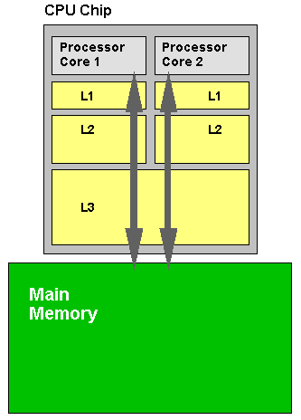
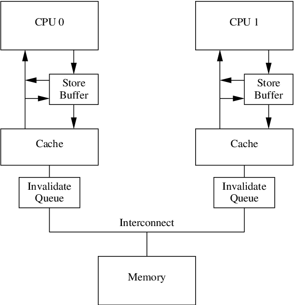

# CPU Cache Sharing Coherence and Memory Model

CPU false cache sharing issue can be traced back to CPU hardware architecture where data update is received from one CPU core's cache but not yet received from other CPU cores.
When running on multi-threading on multiple CPU cores, this can be an issue.

<div style="display: flex; justify-content: center;">
      
</div>
</br>

Do NOT get confused with `volatile` that has the below limitations (in other words, `volatile` cannot solve the CPU false cache sharing issue as data inconsistency happens on CPU core cache level not on RAM level):

* Compiler does not optimize `volatile`-declared variables into CPU registers, but only makes sure every read/write happens in memory.
* `volatile`-declared variables not necessarily on RAM, could be on L1/L2/L3 cache or hardware driver/peripherals

## MESI (modified, Exlusive, Shared, Invalid)

MESI (Modified, Exlusive, Shared, Invalid) protocol is an Invalidate-based cache coherence protocol (how to manage cache sharing among diff processors).

MESI is a design concept with hardware/circuit-level implementation.

Cache sharing unit is based on **one cache line** (typically 64 bytes depending on CPU hardware):

* Modified: The cache line is present only in the current cache, and is dirty (diff rom main memory), should write back to main memory before further read
* Exclusive: The cache line is present only in the current cache, but is clean - it matches main memory. It can be shared.
* Shared: This cache line may be stored in other caches of the machine and is clean - it matches the main memory.
* Invalid: The cache is not used.

### Store Buffer and Invalidate Queue

The most naive implementation of MESI is to broadcast every update to all CPU cores via serial bus, and upon having received ack from other CPU cores then finally acknowledge the update.
This solution is inefficient and here introduces *store buffer* and *invalidate queue* as remediation to the above dilemma.

<div style="display: flex; justify-content: center;">
      
</div>
</br>

Whenever there is a data update from one CPU core, the update is immediately stored in a store buffer before cache.
This store buffer will **async** notify other CPU cores of the update.

Invalidate queue comes into play when there are too many updates that could trigger store buffer overflow, on which condition the invalidate queue immediately responds with "invalidate ack".

This implementation (store buffer and invalidate queue) makes MESI cache sharing incoherent.

## Cache Line Atomicity

As mentioned above, data update notification happens on one cache line level (typically 64 bytes).
If data does not fit into one cache line, there needs to introduce complex control of composing data from different cache lines.

First, have a look at cache address:

* Offset: the position of a byte to access in a cache line, e.g., 64 bytes needs $6 \text{ bits}$ to represent all $64=2^6$ byte positions
* Index: the index of a cache line to select from a CPU cache, e.g., an L1 cache of $128 \text{ KiB}$ has $2048=2^{11}$ cache lines, hence required of $11 \text{ bits}$
* Tag: the remaining bits to represent mappings of main memory blocks, e.g., for a computer with total main memory of $2 \text{ MB}$, where each memory block is of $64 \text{ bytes}$ (one cache line), there needs $15 \text{ bits}$ to represent all mappings cache line vs memory block $2^{15} \times 64 \text{ bytes} = 2 \text{ MB}$

For example,
consider a $16 \text{ KB} = 2^{17} \text{ bits}$ RAM memory indexed by $4096=2^{12}$ memory blocks, mapped to $64=2^6$ cache lines, where each cache line has memory $4 \text{ bytes} = 2^{5} \text{ bits}$ that together have cache memory $256 \text{ bytes} = 2^{11=5+6} \text{ bits}$.

An addr size of minimal $14 \text{ bits}$ is required for the main memory $16 \text{ KB} = 2^{14} \text{ bytes}$.
By the above cache design, the cache line address is $14 \text{ bits}$.

* Offset: 2 bits for $4=2^2$ byte positions
* Index: 6 bits for $64=2^6$ cache lines
* Tag: 6 bits for $64=2^{14-2-6}$ as the address name

<div style="display: flex; justify-content: center;">
      
</div>
</br>

Finally, in the above example, a cache line is consisted of a $14 \text{ bits}$ address and a cache line of $4 \text{ bytes}$, where each cache line maps to a main memory block.

The above cache line vs memory block relationship is named *direct mappings*.
Modern CPU/OS has much more complex mapping designs.

### Best practice: separate atomic operations in one/multiple cache lines

Use compiler directives to force individual aligned to one/multiple cache lines.
This can significantly increase true cache sharing (increase the speed of data loading from/to different CPU cores).

As of `c++17`, L1 cache line size can be retrieved from the macro `__cpp_lib_hardware_interference_size`.

```cpp
#ifdef __cpp_lib_hardware_interference_size
    using std::hardware_constructive_interference_size;
    using std::hardware_destructive_interference_size;
#else
    // 64 bytes on x86-64 │ L1_CACHE_BYTES │ L1_CACHE_SHIFT │ __cacheline_aligned │ ...
    constexpr std::size_t hardware_constructive_interference_size = 64;
    constexpr std::size_t hardware_destructive_interference_size = 64;
#endif
```

Reference: https://en.cppreference.com/w/cpp/thread/hardware_destructive_interference_size

The below example shows that `TwoCacheLiner` sees significant improvement in performance updating atomic `x` and `y` (by atomic `fetch_add(1, std::memory_order_relaxed)`).
By `alignas(...)` to force compiler to include assembly directives whether it should be put in one/multiple cache lines.

```cpp
struct alignas(hardware_constructive_interference_size)
OneCacheLiner // occupies one cache line
{
    std::atomic_uint64_t x{};
    std::atomic_uint64_t y{};
}
oneCacheLiner;
 
struct TwoCacheLiner // occupies two cache lines
{
    alignas(hardware_destructive_interference_size) std::atomic_uint64_t x{};
    alignas(hardware_destructive_interference_size) std::atomic_uint64_t y{};
}
twoCacheLiner;
 
inline auto now() noexcept { return std::chrono::high_resolution_clock::now(); }
 
template<bool xy, typename CacheLiner>
void makeAtomicAdd(CacheLiner& cacheLiner)
{
    const auto start{now()};
    const uint64_t max_write_iterations{100'000'000};
 
    for (uint64_t count{}; count != max_write_iterations; ++count)
        if constexpr (xy)
            cacheLiner.x.fetch_add(1, std::memory_order_relaxed);
        else
            cacheLiner.y.fetch_add(1, std::memory_order_relaxed);
 
    const std::chrono::duration<double, std::milli> elapsed{now() - start};
    std::lock_guard lk{cout_mutex};
    std::cout << "oneCacheLinerThread() spent " << elapsed.count() << " ms\n";
    if constexpr (xy)
        cacheLiner.x = elapsed.count();
    else
        cacheLiner.y = elapsed.count();
}

int main()
{
    ...
 
    int oneCacheLiner_average{0};
    for (auto i{0}; i != max_runs; ++i)
    {
        std::thread th1{oneCacheLinerThread<0, oneCacheLiner>};
        std::thread th2{oneCacheLinerThread<1, oneCacheLiner>};
        th1.join();
        th2.join();
        oneCacheLiner_average += oneCacheLiner.x + oneCacheLiner.y;
    }
    std::cout << "Average T1 time: "
              << (oneCacheLiner_average / max_runs / 2) << " ms\n\n";
 
    int twoCacheLiner_average{0};
    for (auto i{0}; i != max_runs; ++i)
    {
        std::thread th1{twoCacheLinerThread<0, twoCacheLiner>};
        std::thread th2{twoCacheLinerThread<1, twoCacheLiner>};
        th1.join();
        th2.join();
        twoCacheLiner_average += twoCacheLiner.x + twoCacheLiner.y;
    }
    std::cout << "Average T2 time: "
              << (twoCacheLiner_average / max_runs / 2) << " ms\n\n"
              << "Ratio T1/T2:~ "
              << 1.0 * oneCacheLiner_average / twoCacheLiner_average << '\n';
}
```

## Atomicity by Memory Barrier

All above implementations see two issues unresolved:

* Compiler optimization that reorders assembly executions by different threads
* Cache update visibility to other CPU cores

Memory barrier comes into rescue by providing the below directives to force  *trivial copyable* variables be read/write by what order they are visible to other threads that must wait till the variables become available/unlocked for next read/write.

```cpp
typedef enum memory_order {
memory_order_relaxed,
memory_order_consume,
memory_order_acquire,
memory_order_release,
memory_order_acq_rel,
memory_order_seq_cst
} memory_order;
```

Atomicity of updating a variable refers to below operations consistent regardless of what thread taking action in what sequential order.

|Atomic Operations|Memory Order Types|
|-|-|
|read (load)|memory_order_relaxed, memory_order_acquire, memory_order_consume, memory_order_seq_cst|
|write (store)|memory_order_relaxed, memory_order_release, memory_order_seq_cst|
|read-modify-write (test_and_set、exchange、compare_exchange_strong、compare_excahnge_weak、fetch_add、fetch_sub...)|memory_order_relaxed, memory_order_acq_rel, memory_order_seq_cst|

To use memory barrier, first wrap an POD type variable by `std::atomic` such as `std::atomic_uint64_t x{};`, then from the atomic wrapper conduct operation, e.g., `x.fetch_add(1, std::memory_order_relaxed);` included a declared memory order mode.
Here the `fetch_add(...)` has a corresponding assembly instruction consumed only one CPU clock cycle, thereby implemented atomicity.

### Relaxed, Acquire-Release, Data Dependency, and Sequential Consistency

*Relaxed*, *Acquire-Release*, *Data Dependency*, and *Sequential Consistency* are different forms of how strong that threads must be to take order to perform an atomic operation.

#### Relaxed

* The most relaxed control of read/write sequence
* Used with `std::memory_order_relaxed`

For example, compiler is free to optimize and re-order `y += 2;`, e.g., before or after `x.fetch_add(...)`.

```cpp
std::atomic_uint64_t x{0};
std::atomic_uint64_t y{1};
x.fetch_add(1, std::memory_order_relaxed);
y += 2;
```

#### Acquire-Release and Data Dependency

* To guarantee the order of executions before read amd after read not optimized/re-ordered
* Used with `std::memory_order_consume`, `std::memory_order_release` and `std::memory_order_acquire`
* `std::memory_order_release` forces CPU write cache into main memory that made the change visible to other CPU cores
* `std::memory_order_acquire` forces CPU abandon cache but re-read from main memory for a required variable
* `std::memory_order_consume` does NOT enforces setting up memory barrier, but re-order instructions by data dependency analysis, hence, depending on hardware and OS support, it may demote to `std::memory_order_acquire`

For example, when `ThreadFunc1()` and `ThreadFunc2()` run at the same time, it is guaranteed first read from `ThreadFunc1()` then loaded to/read by `ThreadFunc2()`.

```cpp
atomic<int> guard(0);
int payload = 0;

void ThreadFunc1() {
    payload = 42;
    // write cache into main memory
    guard.store(1, std::memory_order_release);
}

void ThreadFunc2() {
    // abandon the current CPU cache but re-read from main memory
    if (guard.load(std::memory_order_acquire) != 0) {
        p = payload;
    }
}
```

#### Sequential Consistency

* Very strict with execution order, hence having low execution speed
* Used with `std::memory_order_seq_cst`

For example, the order of arithmetic add operations on `x` and `y` take place at the exact order of where they are declared in code.

```cpp
std::atomic_uint64_t x{0};
std::atomic_uint64_t y{1};
x.fetch_add(1, std::memory_order_seq_cst);
y += 2;
```
