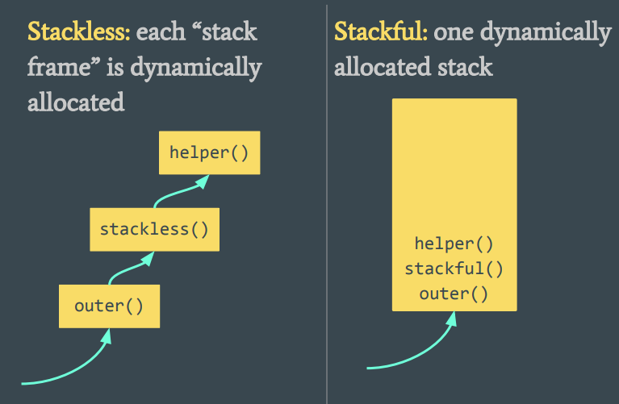

# Coroutine Practices

### Typical Keywords

A function is a coroutine if it contains one of these:
* `co_return` (coroutine return statement)
* `co_await` (await expression)
* `co_yield` (yield expression)

### Use Cases

* implementing generators

Typically in a range, each generated item is stored in the same coroutine frame, so that it saves the cost of rebuilding local environment.

Generators are resumed by the user on demand (need to explicitly indicate by `co_yield` when and where to suspend/resume).

* implementing asynchronous functions, while avoiding callbacks

Callback functions are usually of a new environment, and coroutines can reuse existing callback function local environment.

Asynchronous coroutines are resumed in background, by worker threads (callback automatically invoked when certain conditions reached).

### Stackless vs Stackful

|Stackless|Stackful|
|-|-|
|only local variables are available|all stack frames above are also preserved|
|only top-level coroutine function can be suspended|can suspend from helper functions|

<div style="display: flex; justify-content: center;">
      
</div>
</br>

### Related Keywords 

* `std::suspend_never` is an empty class which can be used to indicate that an await expression **never** suspends and does not produce a value.

Its member function `await_ready()` is hard coded to `false`.
```cpp
constexpr bool await_ready() const noexcept { return false; }
```

* `std::suspend_always` is an empty class which can be used to indicate that an await expression **always** suspends and does not produce a value.


Its member function `await_ready()` is hard coded to `true`.
```cpp
constexpr bool await_ready() const noexcept { return true; }
```

* `std::from_promise` 

Creates a coroutine_handle from the promise object of a coroutine. 
The created `coroutine_handle` refers the coroutine, and `promise()` returns a reference to p.

```cpp
static coroutine_handle from_promise( Promise& p );
```

* `std::coroutine_traits`

```cpp
template< class R, class... Args >
struct coroutine_traits;
```

Determines the promise type from the return type and parameter types of a coroutine.

## Generator Example

The use code should look like  this.
```cpp
Generator sequence() {
  int i = 0;
  while (true) {
    co_await i++;
  }
}

int main() {
  auto generator = sequence();
  for (int i = 0; i < 10; ++i) {
    std::cout << generator.next() << std::endl;
  }
}
```

The generator is defined as (`???` is used represent to-be-explained items)
```cpp
struct Generator {
  struct promise_type {

    // assume value is the promise state, increments every time `.next()` is called
    int value;
    
    // just suspend waiting got next value
    std::suspend_always initial_suspend() { return {}; };

    // no suspension required after finished execution
    std::suspend_never final_suspend() noexcept { return {}; }

    // for simplicity, no handling of exceptions
    void unhandled_exception() { }

    Generator get_return_object() {
      return Generator{???};
    }

    // no return value for `co_return`
    void return_void() { }
  };

  int next() {
    ???.resume();
    return ???;
  }
};
```

where `???.resume()` is about how to resume a coroutine in this generator; `coroutine_handle` is required definition.
Remember that `coroutine_handle` itself is the coroutine function body.

`coroutine_handle` from `std` provides an API `from_promise` to load a `promise`.
```cpp
template <class _Promise>
struct coroutine_handle {
    static coroutine_handle from_promise(_Promise& _Prom) noexcept {
      ...
    }

    ...
}
```

`Generator{???};` can be filled with 
```cpp
Generator get_return_object() {
    return Generator{ std::coroutine_handle<promise_type>::from_promise(*this) };
}

...

// define handle as a member of the generator
std::coroutine_handle<promise_type> handle;

...

// coroutine_handle resumes from the last suspended point
int next() {
  handle.resume();
  return ???;
}
```

`return ???;` basically returns the promise's `value`. Here first obtain a promise through `handle`, from promise get its value.
```cpp
int next() {
  handle.resume();
  return handle.promise().value;
}
```

Then look back at 
```cpp
Generator sequence() {
  int i = 0;
  while (true) {
    co_await i++;
  }
}
```
where `co_await i++;` is an integer rather than an awaiter. In fact, `c++20` compiler will do some extra work to compile `i++` into an awaiter by `await_tranform(int)`.

```cpp
struct promise_type {
    int value;

    ...

    // take value from `co_await i++;` to the promise internal state int value
    std::suspend_always await_transform(int _value) {
      this->value = _value;
      return {};
    }

    ...
  };
```

### `co_yield` To Pass Value

There are issues for the above implementation, where coroutine frame is destroyed prior to generator destructor.
In other words, `generator.next();` might throw error after coroutine has already ended.
If retrieving value after the already destroyed coroutine frame, there is error.

A primitive solution would be `final_suspend` doing some cleaning or generator destructor `~Generator()` handling some coroutine frame destruction.

Another solution would be using `co_yield <expr>` that is identical to `co_await promise.yield_value(expr)`.
Implementation is simply replacing `await_transform` with `yield_value`.

```cpp
struct promise_type {

    ...

    std::suspend_always yield_value(int value) {
        this->value = value;
        is_ready = true;
        return {};
    }
    
    ...

}
```

The advantage of `co_yield` is wrapping `co_await` result and passing it out to the caller function, so that there is no much worries of taking value out when the coroutine frame is destroyed.