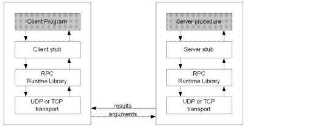

# Remote Procedure Call (RPC)

A *remote procedure call* (RPC) is a communication paradigm used to allow a program to execute code on a remote server as if it were a local procedure call.

The client/requestor sends a TCP/UDP request with contained parameters to a server that execute a function on behalf of the client upon reading the sent parameters.

<div style="display: flex; justify-content: center;">
      
</div>
</br>

RPC is often used in distributed computing.

## gRPC (Google Remote Procedure Call)

gRPC (Google Remote Procedure Call) is an open-source universal RPC framework initially developed by Google.
It features

* HTTP/2 for multiplexing multiple calls over a single connection
* Protocol Buffers (protobuf) to encode request message

### Example

An RPC request is defined by this `proto3` file.

```proto
syntax = "proto3";

package example;

// The greeting service definition.
service Greeter {
  // Sends a greeting
  rpc SayHello (HelloRequest) returns (HelloReply) {}
}

// The request message containing the user's name.
message HelloRequest {
  string name = 1;
}

// The response message containing the greetings.
message HelloReply {
  string message = 1;
}
```

the `proto3` is compiled to cpp code by

```sh
protoc -I=. --grpc_out=. --plugin=protoc-gen-grpc=`which grpc_cpp_plugin` example.proto
protoc -I=. --cpp_out=. example.proto
```

The rpc server `0.0.0.0:50051` waits until received an rpc request, and will invoke `GreeterServiceImpl::SayHello(...)` as to be seen from later client rpc request.

```cpp
#include <iostream>
#include <memory>
#include <string>

#include <grpcpp/grpcpp.h>
#include "rpc_hello.grpc.pb.h"

using grpc::Server;
using grpc::ServerBuilder;
using grpc::ServerContext;
using grpc::Status;
using rpc_hello::Greeter;
using rpc_hello::HelloRequest;
using rpc_hello::HelloReply;

// Logic and data behind the server's behavior.
class GreeterServiceImpl final : public Greeter::Service {
  Status SayHello(ServerContext* context, const HelloRequest* request, HelloReply* reply) override {
    std::string prefix("Hello ");
    reply->set_message(prefix + request->name());
    return Status::OK;
  }
};

void RunServer() {
  std::string server_address("0.0.0.0:50051");
  GreeterServiceImpl service;

  ServerBuilder builder;
  // Listen on the given address without any authentication mechanism.
  builder.AddListeningPort(server_address, grpc::InsecureServerCredentials());
  // Register "service" as the instance through which we'll communicate with
  // clients. In this case, it corresponds to an *synchronous* service.
  builder.RegisterService(&service);
  // Finally assemble the server.
  std::unique_ptr<Server> server(builder.BuildAndStart());
  std::cout << "Server listening on " << server_address << std::endl;

  // Wait for the server to shutdown. Note that some other thread must be
  // responsible for shutting down the server for this call to ever return.
  server->Wait();
}

int main(int argc, char** argv) {
  RunServer();

  return 0;
}
```

The rpc client sends a greeting request via `stub_->SayHello(&context, request, &reply);` to server that will executes `HelloRequest request;`.
The greeting request is constructed by the previously mentioned `proto3` over TCP.

```cpp
#include <iostream>
#include <memory>
#include <string>

#include <grpcpp/grpcpp.h>
#include "rpc_hello.grpc.pb.h"

using grpc::Channel;
using grpc::ClientContext;
using grpc::Status;
using rpc_hello::Greeter;
using rpc_hello::HelloRequest;
using rpc_hello::HelloReply;

class GreeterClient {
 public:
  GreeterClient(std::shared_ptr<Channel> channel)
      : stub_(Greeter::NewStub(channel)) {}

  // Assembles the client's payload, sends it and presents the response back
  std::string SayHello(const std::string& user) {
    // Data we are sending to the server.
    HelloRequest request;
    request.set_name(user);

    // Container for the data we expect from the server.
    HelloReply reply;

    // Context for the client. It could be used to convey extra information to
    // the server and/or tweak certain RPC behaviors.
    ClientContext context;

    // The actual RPC.
    Status status = stub_->SayHello(&context, request, &reply);

    // Act upon its status.
    if (status.ok()) {
      return reply.message();
    } else {
      std::cout << status.error_code() << ": " << status.error_message()
                << std::endl;
      return "RPC failed";
    }
  }

 private:
  std::unique_ptr<Greeter::Stub> stub_;
};

int main(int argc, char** argv) {
  // Instantiate the client. It requires a channel, out of which the actual RPCs
  // are created. This channel models a connection to an endpoint (in this case,
  // localhost at port 50051). We indicate that the channel isn't authenticated
  // (use of InsecureChannelCredentials()).
  GreeterClient greeter(grpc::CreateChannel("localhost:50051", grpc::InsecureChannelCredentials()));
  std::string user("world");
  std::string reply = greeter.SayHello(user);
  std::cout << "Greeter received: " << reply << std::endl;

  return 0;
}
```
