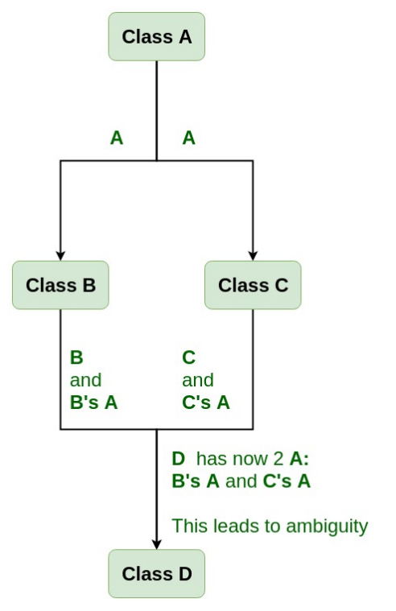

# Garbage Collection, Constructor and Destructor

## `new`

* It allocates enough memory to hold an object of the type requested.
    
* It calls a constructor to initialize an object in the memory that was allocated.

### `operator new`

* Syntax: `void * operator new (size_t size);`
```cpp
	void *pRawMemory = operator new(sizeof(string));
```

* The operator new returns a pointer to a chunk of memory enough to hole a string object.
* The operator new is similar to `malloc` in that it's responsible only for allocating memory. 

## Constructor

After `new` allocating memory, class members are not init (similar to `malloc(sizeof(ClassName))`, need to call class members' constructor, init values, etc).

Constructor is used to initialize some valid values to the data members of an object.

Constructors are also used to locate memory at run time using the new operator.

### No virtual constructor

The virtual mechanism works only when we have a base class pointer to a derived class object. In C++, constructor cannot be virtual, because when constructor of a class is executed there is no virtual table in the memory, means no virtual pointer defined yet.

### Constructors during Inheritance

When having inheritance, derived class must call base class's constructor, default `base()` if not specified. `derived () : base (number) {}` is used to explicitly invoke user defined base constructor.
```cpp
class base {
  public:
  base (int arg) {}
};

class derived : public base {
  public:
  derived () : base (number) {}
};
```

### Virtual base classes

If one base class is inherited from multiple parents, the base constructor is called multiple times as well. 



For example, `GrandParent` is called twice given the below definitions:
```cpp
class Parent1 : public GrandParent {...};
class Parent2 : public GrandParent {...};
```

Compiler throws Ambiguity error for same class member names declared across the chain of inheritance. 

To resolve this ambiguity when class `GrandParent` is inherited in both class `Parent1` and class `Parent2`, use 
```cpp
class Parent1 : virtual public GrandParent
class Parent2 : virtual public GrandParent
```

```cpp
#include <iostream>
using namespace std;

class GrandParent {
public:
	GrandParent(){
		cout << "Inside very first base class" << endl;
	}
};
class Parent1 : virtual public GrandParent{
public:
	Parent1(){
		cout << "Inside first base class" << endl;
	}
};
class Parent2 : virtual public GrandParent{
public:
	Parent2() {
		cout << "Inside second base class" << endl;
	}
};
class Child : public Parent1, public Parent2 {
public:
	Child(){
		cout << "Inside child class" << endl;
	}
};

int main() {
	Child child1;
	return 0;
}  
```

### Init Reference Class Member

If a class has reference class members, they should be init before constructor invocation, otherwise hit reference member initialization compilation error.
```cpp
class Base
{
public:
    Base();
    ~Base(){};
private:
    Foo& foo;
    Bar& bar;
}
```

Should be
```cpp
Base::Base(Foo& foo_, Bar& bar_): foo(foo_), bar(bar_) {};
```
rather than
```cpp
Base::Base(Foo& foo_, Bar& bar_) {
    foo = foo_;
    bar = bar_;
};
```

## Destructor

A `destructor` is a member function that is invoked automatically when the object goes out of scope or is explicitly destroyed by a call to delete. 

1. The class's destructor is called, and the body of the destructor function is executed.

2. Destructors for non-static member objects are called in the reverse order in which they appear in the class declaration. The optional member initialization list used in construction of these members does not affect the order of construction or destruction.

3. Destructors for non-virtual base classes are called in the reverse order of declaration.

4. Destructors for virtual base classes are called in the reverse order of declaration.

### Virtual Destructor

When a pointer object of the base class is deleted that points to the derived class, only the parent class destructor is called due to the early bind by the compiler. 
In this way, it skips calling the derived class' destructor, which leads to memory leaks issue in the program. 
And when we use virtual keyword preceded by the destructor tilde (~) sign inside the base class, it guarantees that first the derived class' destructor is called. Then the base class' destructor is called to release the space occupied by both destructors in the inheritance class.

So that, we need to add `virtual` to base class destructor:
```cpp
virtual ~base(){};
```

### `delete` vs `delete[]`

`delete[]` calls each element's destructor (synonym: array version of a single `delete`)

## Construction and Destruction Execution Order

Construction happens from base to derived; destruction happens from derived to base.

For base destructor, with or without `virtual`, it gets called nevertheless,
because without a declared virtual destructor, the compiler will decide to bind directly to the Base destructor regardless of the values' runtime type.

```cpp
#include <iostream>
class base1
{
	int n;
public:
	base1(int a){
		std::cout<<"constructing base1 class with a number="<<a<<std::endl;
		n=a;
	}
	virtual ~base1(){std::cout<<"destructing base1 class"<< std::endl;}
};
class base2
{
	int n;
public:
	base2(int a){
		std::cout<<"constructing base2 class with a number="<<a<<std::endl;
		n=a;
	}
	~base2(){std::cout<<"destructing base2 class"<< std::endl;}
};
class derive : public base1, public base2
{
	int m;
	public:
	derive(int a,int b) : base1(a), base2(a){
		std::cout <<"constructing derive class with a number="<<b<<std::endl;
	}
	~derive(){std::cout<<"destructing derive class"<<std::endl;}
};
int main()
{
	derive d(1,2);
	return 0;
}
```
that outputs
```
constructing base1 class with a number=1
constructing base2 class with a number=1
constructing derive class with a number=2
destructing derive class
destructing base2 class
destructing base1 class
```

## The Three-Five Rule of Constructor and Destructor

* If defined a destructor, must define copy constructor and copy assignment function
* If defined a copy constructor, must define copy assignment function
* If defined a move constructor, must define move assignment function
* If defined a copy constructor and a copy assignment function, must define move constructor and move assignment function

Reasons:
If used default copy constructor, and there are pointer members, only pointers are copied (called shallow copy).
When one object is called destructor, it frees its pointer members, then other live object would see segmentation fault when accessing their pointer members.
