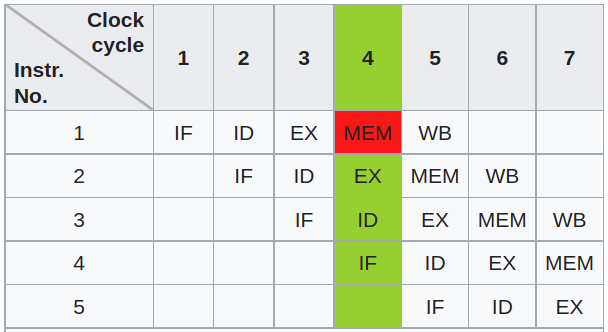

# Optimization

##  `g++` embedded optimization flags

|option|optimization level|execution time|code size|memory usage|compile time|
|-|-|-|-|-|-|
|`-O0`|optimization for compilation time (default)|+|+|-|-|
|`-O1` or `-O`|optimization for code size and execution time|-|-|+|+|
|`-O2`|optimization more for code size and execution time|--||+|++|
|`-O3`|optimization even more for code size and execution time|---||+|+++|
|`-Os`|optimization for code size||--||++|
|`-Ofast`|O3 with fast none accurate math calculations|---||+|+++|

Work from behind

https://gcc.gnu.org/onlinedocs/gcc/Optimize-Options.html

### `-O2` Optimization

`-O2` performs nearly all supported optimizations that do not involve a space-speed tradeoff. 

Some `-O2` included optimization flags are shown as below.

* `inline` optimization: automatically set `inline` to some functions
```bash
-finline-functions 
-finline-small-functions 
```

* Auto detect undefined behavior

```bash
-fisolate-erroneous-paths-dereference
```

For example, `*x` could trigger undefined behavior if `a` is equal to zero
```cpp
int* foo (int a) {
  int *x;
  if (a)      
    x = nullptr; 
  else
    x = new int(5);
  return *x;  // if a == 0, `*x` points to nothing
}
```

Instead, code could be optimized as such
```cpp
int* foo (int a) {
  if (a)
    abort ();
  int* x = 5
  return x;
}
```

* Vectorization

```bash
-fvect-cost-model=very-cheap
-fsimd-cost-model=dynamic
-ftree-vectorize
```

The very cheap model enables vectorization if the scalar iteration count is a multiple of four $(32=4 \times 8)$.
In other words, in a loop, every four elements are retrieved simultaneously and computed. 


Similar to element vectorization in a loop, `-ftree-vectorize` vectorizes tree data structure's elements.

The `model` argument in `-fsimd-cost-model=model` should be one of ‘unlimited’, ‘dynamic’, ‘cheap’. 
They describe how SIMD should be used.

* Bound check : do not check if iterator goes out of bound.

```bash
-ftree-vrp
```

### `-O3`

* Smart adjustment of `for` loop

```bash
-fpeel-loops
-fsplit-loops
```

Peels loops for which there is enough information that they do not roll much (from profile feedback or static.

Split a loop into two if it contains a condition that’s always true for one side of the iteration space and false for the other.


## Return Value 

Compiler can optimize the "copy" return value by such as *placement new*, and it is discouraged using `std::move` as the lifecycle of local memory is not guaranteed.

This method is referred to as *copy elision*: a compiler optimization technique that eliminates unnecessary copying of objects.

```cpp
Widget makeWidget()
{
Widget w;
return w; // "copy" w into return value
}
```
vs
```cpp
Widget makeWidget()
{
Widget w;
return std::move(w);// Moving version of makeWidget
                    // move w into return value
                    // (don't do this as unnecessary)
}
```    

### Default Move On Return Value (Since C++17)

Compiler guarantees copy elision (since c++17).

The code below see no output prints for the copy constructor is not invoked.

```cpp
struct C {
  C() {}
  C(const C&) { std::cout << "A copy was made.\n"; }
};
 
C f() {
  return C(); // Definitely performs copy elision (copy constructor isn't called, no "Copy constructor invoked\n" got printed)
}
C g() {
    C c;
    return c; // May perform copy elision (copy constructor isn't called, no "Copy constructor invoked\n" got printed) depending on c++ standard
}
 
int main() {
  C obj1 = f(); // Copy constructor isn't called
  C obj2 = g(); // Copy constructor isn't called
}
```

### Effective and Ineffective `std::move` in Return

In the code below, see `C g() { ...; return c; }` and `C h() { ...; return std::move(c); }`, 

* `g()` implicitly calls move constructor by copy elision (it is implicit, so that no `"Move constructor invoked\n"` is displayed, but only default is enough).
* The `std::move` in `h()` is unnecessary even negative optimization, that twice constructions happened (one for default, one for move), and this is redundant.

A good optimization should only see one constructor called, hence the `h();` is a bad implementation.

By checking `~C();`, the `h();` would see twice `"Destructor invoked\n"` since it creates two objects.

```cpp
struct C {
  C() { std::cout << "Default constructor invoked\n"; }
  C(const C&) { std::cout << "Copy constructor invoked\n"; }
  C(const C&&) { std::cout << "Move constructor invoked\n"; }
  ~C() { std::cout << "Destructor invoked\n"; }
};
 
C f() {
  return C(); // Definitely performs copy elision (copy constructor isn't called, no "Copy constructor invoked\n" got printed)
}
C g() {
    C c;
    return c; // May perform copy elision (copy constructor isn't called, no "Copy constructor invoked\n" got printed) depending on c++ standard
}
C h() {
    C c;
    return std::move(c); // no need 
}
int main() {
  C obj1 = f(); // print "Default constructor invoked"
  std::cout << "===========\n";
  C obj2 = g(); // print "Default constructor invoked"
  std::cout << "===========\n";
  C obj3 = h(); // print "Default constructor invoked\nMove constructor invoked\nDestructor invoked"
  std::cout << "===========\n";
} // print three times "Destructor invoked\n"
```

* Caution: the below is undefined behavior

```cpp
C&& f(){
    C c;
    return std::move(c);
}
```

* Effective `std::move` in return: class member is not an implicit movable, hence `return` results in calling copy constructor. Explicit move constructor invocation is required.

In the code below `C c;` is a member of `CWrapper`.
In `CWrapper::h();`, the move constructor is only called once, and in `CWrapper::g();` there is no copy elision such that the copy constructor is called.

```cpp
struct C {
  C() { std::cout << "Default constructor invoked\n"; }
  C(const C&) { std::cout << "Copy constructor invoked\n"; }
  C(const C&&) { std::cout << "Move constructor invoked\n"; }
  ~C() { std::cout << "Destructor invoked\n"; }
};

struct CWrapper {
    
  C c;
    
  C f() {
    return C(); 
  }
  C g() {
      return c; 
  }
  C h() {
      return std::move(c); // only called once
  }
};

int main() {
  CWrapper cWrapper; // print "Default constructor invoked"
  std::cout << "===========\n";
  C obj1 = cWrapper.f(); // print "Default constructor invoked"
  std::cout << "===========\n";
  C obj2 = cWrapper.g(); // print "Copy constructor invoked"
  std::cout << "===========\n";
  C obj3 = cWrapper.h(); // print "Move constructor invoked"
  std::cout << "===========\n";
} // print four times "Destructor invoked"
```

## Small String Optimization (SSO)

When a string length is smaller than 20, data is stored on stack rather than on heap, as heap storage requires additional operation costs such as `new`.

However, from user side, a `std::string` works consistently regardless of its length.

## MemCpy Optimization

Write a `memcpy` function that copies data of size `len` from `src` to `dst`, such as 
```cpp
void* memcpy_v1(void* dst, const void* src, size_t len) {
    char* d = (char*) dst;
    const char* s = (const char*) src;
    while (len--)
        *d++ = *s++;
    return dst;
}
```

### CPU Pipeline

CPU running typically follows this order, and can be run parallel:



(IF = Instruction Fetch, ID = Instruction Decode, EX = Execute, MEM = Memory access, WB = Register write back).

```cpp
void* memcpy_v2(void* dst, const void* src, size_t len) {
    char* d = (char*) dst;
    const char* s = (const char*) src;
    
    size_t i = 0;
    for (; i + 4 < len; i += 4, d = d + 4, s = s + 4) {
        *d = *s;
        *(d + 1) = *(s + 1);
        *(d + 2) = *(s + 2);
        *(d + 3) = *(s + 3);
    }
    while (i < len) {
        i++;
        *d++ = *s++;
    }
    return dst;
}
```

### Cast to `int*` rather than `char*`

`char` copy only takes one byte per time, while `int` takes 4 bytes.

```cpp
void* memcpy_v3(void* dst, const void* src, size_t len) {
    int* d = (int*) dst;
    const int* s = (const int*) src;
    
    for (size_t i=0; i < len; i += 4) {
        *d++ = *s++;
    }
    return d;
}
```

## Exception Handling

### Typical `try`/`catch` Cost

Typical error handling overheads are

* try-block

Data and code associated with each try-block or catch clause.

* regular functions

Data and code associated with the normal execution of
functions that would not be needed had exceptions not existed, such as missed
optimization opportunities.

* throw-expression

Data and code associated with throwing an exception.

### Exception Handling Implementation: "code" approach, where code is associated with each try-block

Need to dynamically maintain auxiliary data structures to manage the capture and transfer of the execution contexts, plus other
dynamic data structures involved in tracking the objects that need to be unwound in the
event of an exception.

Overheads (when no exception occurs) are
* Stack the execution context change when entering/leaving the `try`/`catch`
* If a function in `try` has an exception-specification, register it for checking

### Exception Handling Implementation (**Preferred**): “table” approach, which uses compiler-generated static tables

Generate read-only tables for
determining the current execution context, locating catch clauses and tracking objects
needing destruction.

Tables can be placed in ROM or, on hosted systems with virtual memory, can remain swapped out until an exception is actually thrown,
so that there is no overhead if there is no exception occurs.

## Copy Elision

Omits copy and move (since C++11) constructors, resulting in zero-copy pass-by-value semantics.

In the code below, no copy nor move constructor will be called, but only default constructor is called.

```cpp
T f()
{
    return T();
}
 
f(); // only one call to default constructor of T
```

In a return statement or a throw-expression, if the compiler cannot perform copy elision but the conditions for copy elision are met or would be met, except that the source is a function parameter, the compiler will attempt to use the move constructor even if the object is designated by an lvalue.

## Kernel Scheduler Prioritizing handling I/O

### struct padding

## RDMA (Remote Direct Memory Access)

## Overheads Related to Inheritance

A `class` without a `virtual` function requires exactly as much space to represent as a
`struct` with the same data members.

### Representation Overheads of A Polymorphic `class`

* A polymorphic `class` (a `class` that has one or more `virtual` functions) incurs a per-object space overhead of one pointer, plus a per-class space overhead of a “virtual function table”.

* In addition, a per-class space overhead of a “type information object” (also called “run-time type information” or RTTI) is typically about 40 bytes per class, consisting of a name string, a couple of words of other information

### Dynamic Cast

Given a pointer to an object of a polymorphic class, a cast to a pointer to another base
sub-object of the same derived class object can be done using a dynamic_cast . 
In principle, this operation involves finding the virtual function table, through that find the most-derived class object, then adjust the `this` pointer to the newly cast object.

* An up-cast (cast from derived class to base class) can be compiled into a simple
`this` pointer adjustment. An up-cast should be fast.

* A down-cast (from base class to derived class) involves checking the virtual table and adjusting `this` pointer.

* Cross-casts (casts from one branch of a multiple inheritance hierarchy to
another): operations take a down-cast then an up-cast.