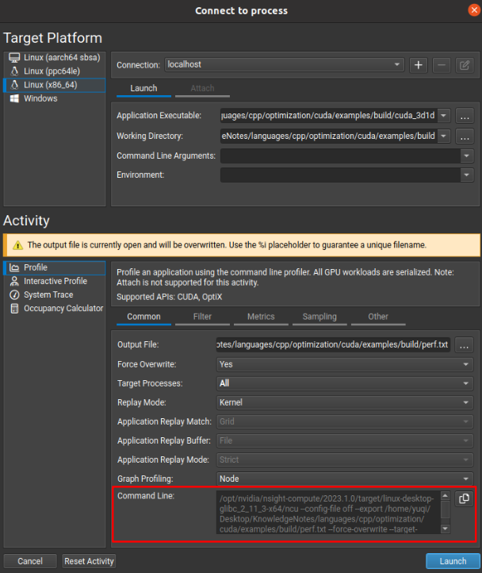
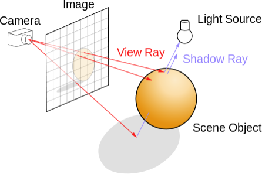
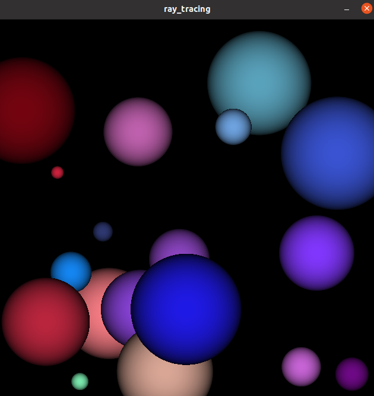
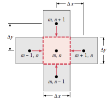

# CUDA practices 

## Install and Quick Start

### Prepares

`lspci | grep -i nvidia` to check hardware

`sudo apt-get install linux-headers-$(uname -r)` to install Linux tools

### Download

```bash
## To get cuda in apt list
distro=ubuntu2004
arch=x86_64
wget https://developer.download.nvidia.com/compute/cuda/repos/$distro/$arch/cuda-keyring_1.0-1_all.deb
sudo dpkg -i cuda-keyring_1.0-1_all.deb
sudo apt-get update

## Actually install cuda, and reboot the system
sudo apt-get install cuda
sudo apt-get install nvidia-gds
sudo reboot
```

### Driver Install

Go to https://www.nvidia.com/download/index.aspx to find your cuda driver version
```bash
# for 1660 Ti
sudo apt-get install cuda-drivers-525
```

### `nvcc` Install

`nvcc` is cuda c++ compiler. 
Run `nvcc --version` to check if `nvcc` is installed,
if not, install it by
```bash
sudo apt install nvidia-cuda-toolkit
```

### CMake Use

In `CMakeLists.txt`, add `project(cuda_proj LANGUAGES CXX CUDA)` to enable cuda.

## Use pinned memory

Use `cudaMallocHost` to make data's memory persistent on host device, rather than `malloc` or `new` operation. For memory discharge, use `cudaFreeHost`, saved the time to copy from pageable host memory to page-locked host memory.

```cpp
int* h_dataA;
cudaMallocHost(&h_dataA, N * sizeof(int));

cudaFreeHost(h_dataA);
```

### Pinned Memory Implementation

Host/CPU usually has pagable memory, while pinned memory works by NO paging this memory nor swapping to disk, hence keeping data persistent in memory.
For GPU knows where to find memory, it uses Direct Memory Access (DMA) to copy from/to host memory (DMA does not need CPU engagement, otherwise CPU might do paging that causes data copy slow down).

## Max of kernel input memory and threads

Given a kernel function:
```cpp
dim3 grid(gridDimX, gridDimY, gridDimZ);
dim3 block(blockDimX, blockDimY, blockDimZ);
MatAdd<<<grid, block>>>(input);
```

There are two hardware conditions to be satisfied

* The total memory size for kernel process should be less than GPU's memory

`gridDimX` $\times$ `gridDimY` $\times$ `gridDimZ` 
$\times$ `blockDimX` $\times$ `blockDimY` $\times$ `blockDimZ` $\le$ `GPU-Mem`

* Each block should have the number of threads less than the number of GPU cores

`blockDimX` $\times$ `blockDimY` $\times$ `blockDimZ` $\le$ `GPU-Core-Number`

## Thread Safety

Similar to a thread for CPU, write to the same addr by multiple threads is forbidden (resulting in undefined behavior).

For read operation, the access data should be consistent throughout the whole kernel function execution by multiple threads.

For example, below code results in undefined behavior, that there are too many threads at the same time accessing the same addr `C[0]`, and `C[0]`'s value is undetermined. 
```cpp
__global__ void setData(int* C)
{
    C[0] = 111;
}

int main()
{
    //...
    dim3 grid( 1<<4, 1<<4, 1<<4 );
    dim3 block( 1<<4, 1<<4, 1<<4 );
    setData<<<grid, block>>>(C);
    //...
}
```

## CUDA Builtin Functions

Cuda has builtin math functions that best utilizes BLAS.

## Nsight Compute Profiling

Nsight is the CUDA performance profiling tool.
It should be installed once user has finished CUDA full installation.

* Make sure rebooting compute once CUDA is finished first time installation
* Set Nsight access privilege (otherwise, use `sudo` to run it)

Simply, put `options nvidia "NVreg_RestrictProfilingToAdminUsers=0"` into `/etc/modprobe.d/nvidia-access.conf`.
```bash
echo 'options nvidia "NVreg_RestrictProfilingToAdminUsers=0"' > /etc/modprobe.d/nvidia-access.conf
```

Nsight GUI should help generate some arguments (`--set full` should be set to catch all performance indicators, although it takes long time to run).
By `sudo` running the command below, should give a performance result file `/home/yuqi/Desktop/KnowledgeNotes/languages/cpp/optimization/cuda/examples/build/perf.ncu-rep`.
```bash
sudo /opt/nvidia/nsight-compute/2023.1.0/target/linux-desktop-glibc_2_11_3-x64/ncu --config-file off --export /home/yuqi/Desktop/KnowledgeNotes/languages/cpp/optimization/cuda/examples/build/perf --force-overwrite --target-processes all --set full --call-stack --nvtx --apply-rules no /home/yuqi/Desktop/KnowledgeNotes/languages/cpp/optimization/cuda/examples/build/cuda_3d1d
```

<div style="display: flex; justify-content: center;">
      
</div>
</br>

## CUDA Event for Performance Measurement

`cudaEvent_t` is essentially a time recorder to measure elapsed time.

```cpp
cudaEvent_t start, stop;

cudaEventCreate(&start);
cudaEventCreate(&stop);

cudaEventRecord(start, 0);

// some work

cudaEventRecord(stop, 0);
```

## CUDA GDB 

CUDA can work with gdb:

1. set debug flags `CMAKE_CUDA_FLAGS` in cmake
```bash
# set your own cuda
set(CMAKE_CUDA_STANDARD 11)
set(CMAKE_CUDA_FLAGS ${CMAKE_CUDA_FLAGS} "-g -G")  # enable cuda-gdb
```

2. in VS Code add this config and change `"program": "${workspaceFolder}/path/to/your/program"` to your own

```json
{
    "version": "0.2.0",
    "configurations": [
        {
            "name": "CUDA C++: Launch",
            "type": "cuda-gdb",
            "request": "launch",
            "program": "${workspaceFolder}/path/to/your/program"
        },
        {
            "name": "CUDA C++: Attach",
            "type": "cuda-gdb",
            "request": "attach"
        }
    ]
}
```

## Ray Tracing Example

Ray tracing is used to generate 2d images from 3d scenes:

Consider a camera/2d image radiating many rays into a 3d world. 
Each ray represents from its pixel origin what it sees in the 3d world (when a ray hits an obstacle, it is assumed that it sees an object).

<div style="display: flex; justify-content: center;">
      
</div>
</br>

Now modelling this scene: ray tracing a sphere.
For simplicity, this example does not concern any fisheye-like distortion, but only each ray representing one pixel parallel to each other, as if each pixel acts as an independent origin shooting out one ray into the 3d world. 

The sphere has centroid `(x,y,z)` and `radius`, and rgb color value `(r,g,b)`. The member function `hit(float ox, float oy, float *n)` means whether a ray from `(ox, oy)` interacts with this sphere object.
```cpp
#define INF 2e10f // if a ray hits nothing

struct Sphere {
    float r,g,b; // sphere rgb color value
    float x,y,z, radius // sphere centroid (x,y,z) and radius

    __device__ float hit(float ox, float oy, float *n) {
        float dx = ox - x;
        float dy = oy - y;
        if (dx*dx + dy*dy < radius*radius ) { 
            float dz = sqrtf(radius*radius - (dx*dx + dy*dy));
            *n = dz / sqrtf(radius*radius);
        }
        else {
            return -INF;
        }
    }
};
```

In host/CPU code run cuda:
there are two arrays of data for CUDA malloc: the whole 2d image data `imgGpuData` and 3d world object `sphGpu`. 
```cpp
uchar* imgGpuData;
Shpere* sphGpu;

cudaMalloc((void**)&imgGpuData, ImageTotalBytes); // cv::Scalar(1,1) is a float
cudaMalloc((void**)&sphGpu, sizeof(Sphere)*SphereNums);
```

Below is the result.

<div style="display: flex; justify-content: center;">
      
</div>
</br>

For `sphGpu` is constant, and make it to `__constant__ Sphere sphGpu[SphereNums];`.

## Heat Transfer Example

Heat flows from high temperature to low temperature.
2d simulation can be simplified to such as below, that the center point $(m,n)$ is considered low temperature, receiving heat from its neighbor points.

<div style="display: flex; justify-content: center;">
      
</div>
</br>

Set $T_{t+1}(m,n)$ as the update temperature at the point $(m,n)$, there is
$$
\begin{align*}
T_{t+1}(m,n) &= T_{t}(m,n) + \\
&\quad k \big(T_{t}(m-1,n)+T_{t}(m+1,n)+T_{t}(m,n-1)+T_{t}(m,n+1)-4T_{t}(m,n) \big)
\end{align*}
$$
where $k$ is the update rate for simulation.

It should be noted that the above update formula does not correctly reflect how actually heat flows, for two reasons:
* there is precision loss when using `float` or `double`
* should simultaneously update $T_{t+1}(m,n)$ as well as its neighbor $T_{t+1}(m\pm 1,n \pm 1)$ by law of conservation of energy (能量守恒); however, $T_{t+1}(m\pm 1,n \pm 1)$ does not see reduction in value after $T_{t+1}(m,n)$ updates.

The use of $T_{t+1}(m\pm 1,n \pm 1)$ provides opportunities of exploiting data localities. `texture` can be applied.

```cpp
texture<float, 2> devTex_inSrc;
texture<float, 2> devTex_outSrc;

cudaChannelFormatDesc descFloat = cudaCreateChannelDesc<float>(); 
cudaBindTexture2D(NULL, devTex_inSrc, dev_inSrc, descFloat, ImageWidth, ImageHeight, ImageWidth*sizeof(float) );
cudaBindTexture2D(NULL, devTex_outSrc, dev_outSrc, descFloat, ImageWidth, ImageHeight, ImageHeight*sizeof(float));

left = tex2D(devTex_inSrc, left_idx, y);
right = tex2D(devTex_inSrc, right_idx, y);
up = tex2D(devTex_inSrc, x, up_idx);
down = tex2D(devTex_inSrc, x, down_idx);
self = tex2D(devTex_inSrc, x, y);

outSrc[offset] = self + K * (left + right + up + down - 4 * self);

cudaUnbindTexture(devTex_inSrc);
cudaUnbindTexture(devTex_outSrc);
```